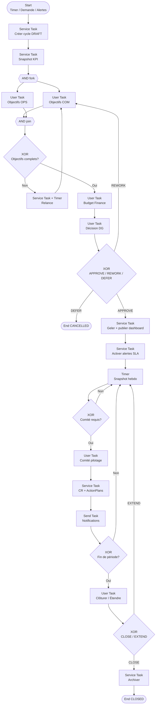

# Processus BPMN 2.0 — Pilotage entreprise

**Identifiant workflow suggéré :** `WF_PILOTAGE_ENTREPRISE_V1`  
**Code processus :** `PROC-PILOT-01`  
**Version :** 1.0  
**Domaine :** Gouvernance & performance opérationnelle  
**Marché cible :** Agences de sécurité privée (Afrique de l’Ouest / Afrique centrale)  
**Niveau :** Conception fonctionnelle SaaS (développeurs & product)

---

## 1. Nom du processus

**Pilotage entreprise** — définition, suivi et arbitrage des objectifs stratégiques et opérationnels, budgets, indicateurs de performance (KPI), comités de direction et tableaux de bord, avec alertes SLA et boucles de décision.

---

## 2. Objectif

Permettre à la direction d’une agence de sécurité privée de :

- fixer et diffuser des objectifs (chiffre d’affaires, couverture sites, taux d’occupation agents, qualité de service, conformité réglementaire) ;
- allouer et suivre les budgets (masse salariale agents, équipements, formation, prospection) ;
- piloter les indicateurs métier en temps quasi réel via tableaux de bord ;
- organiser des comités (hebdomadaires / mensuels / exceptionnels) avec compte-rendu et plans d’action ;
- déclencher des alertes SLA (retard de facturation, sites non couverts, absences critiques, contrats en renouvellement) et engager les actions correctives.

Le processus produit une **instance de cycle de pilotage** (`PilotageCycle`) avec statut final `CLOSED` ou `EXTENDED`.

---

## 3. Déclencheur

| Type | Description |
|------|-------------|
| **Timer Event** `TMR_CYCLE_MENSUEL` | Début de période (J-2 avant le 1er du mois civil ou selon calendrier fiscal de l’agence) |
| **Message Event** `MSG_DIRECTION_DEMANDE` | Demande manuelle du Directeur / DG depuis l’UI « Nouveau cycle de pilotage » |
| **Conditional Event** `COND_ALERTE_CRITIQUE` | Agrégation d’alertes SLA de sévérité `CRITICAL` ≥ seuil configurable (défaut : 3 en 24 h) |

**Payload déclencheur (exemple JSON) :**

```json
{
  "workflowId": "WF_PILOTAGE_ENTREPRISE_V1",
  "trigger": "TMR_CYCLE_MENSUEL",
  "companyId": "uuid",
  "periodStart": "2026-08-01",
  "periodEnd": "2026-08-31",
  "timezone": "Africa/Abidjan",
  "initiatedByUserId": null
}
```

---

## 4. Acteurs (avec Lanes BPMN)

### Pool : Agence de sécurité (`POOL_AGENCE`)

| Lane BPMN | Rôle métier | Responsabilités principales |
|-----------|-------------|----------------------------|
| `LANE_DG` | Directeur Général / PDG | Validation stratégique, arbitrage budgétaire, clôture de comité |
| `LANE_DIR_OPS` | Directeur des opérations | Objectifs opérationnels sites/agents, plans d’action terrain |
| `LANE_DIR_COM` | Directeur commercial | Objectifs CA, pipeline, renouvellements contrats |
| `LANE_RH` | Responsable RH / recrutement | Capacité agents, formation, masse salariale |
| `LANE_FINANCE` | Responsable finance / admin | Budgets, écarts, facturation, trésorerie |
| `LANE_QUALITE` | Responsable qualité / conformité | SLA qualité, audits, agréments |
| `LANE_SYSTEME` | Système SaaS | Calculs KPI, alertes, agrégations, notifications, génération rapports |

### Pool : Système externe (`POOL_EXTERNE`) — optionnel

| Lane | Description |
|------|-------------|
| `LANE_NOTIF` | Gateway WhatsApp / SMS / Email / Push |
| `LANE_BI` | Export vers outil BI externe (si connecté) |

---

## 5. Préconditions

1. L’entreprise (`Company`) est active (`status = ACTIVE`) et le module Pilotage est activé sur le plan SaaS.
2. Au moins un utilisateur avec rôle `ADMIN` ou `MANAGER` (ou équivalent direction) est rattaché à la société.
3. Les référentiels KPI sont configurés (`KpiDefinition` : code, formule, unité, seuil vert/orange/rouge, SLA associé).
4. Le calendrier de periods (`FiscalCalendar`) ou le mode « mois civil » est défini.
5. Les sites, contrats et agents actifs sont synchronisés (données non corrompues, derniers jobs ETL OK).
6. Aucun cycle de pilotage en statut `IN_PROGRESS` pour la même période (unicité `companyId + periodStart + periodEnd`), sauf extension explicitement autorisée.

---

## 6. Description détaillée du processus (paragraphes narratifs + pools)

### Vue d’ensemble

Dans le **Pool Agence**, le cycle démarre par un événement de timer ou une demande direction. Le **Système** (`LANE_SYSTEME`) crée l’instance `PilotageCycle` en statut `DRAFT`, charge les objectifs de la période précédente et calcule un snapshot des indicateurs courants (occupation agents, sites ouverts, CA encaissé vs cible, tickets qualité ouverts, contrats à échéance 30/60/90 jours).

La **Direction commerciale** et la **Direction des opérations** proposent ensuite leurs objectifs (User Tasks). La **Finance** propose le budget consolidé. Le **DG** arbitre : validation, renvoi pour révision, ou report. Une fois les objectifs et budgets gelés (`FROZEN`), le Système publie les tableaux de bord et active les règles d’alertes SLA pour la période.

Pendant la période, des **Timer Events** déclenchent des snapshots hebdomadaires et des rappels de comité. Le comité (User Task multi-participants) produit un compte-rendu et des plans d’action. En fin de période, le Système génère le rapport de clôture ; le DG valide la clôture ou prolonge le cycle.

Les **Message Flows** vers le Pool externe portent les notifications (WhatsApp aux managers terrain pour plans d’action critiques, email au DG pour le rapport, push in-app pour alertes SLA).

### Statuts du cycle (`PilotageCycle.status`)

`DRAFT` → `OBJECTIVES_PROPOSED` → `BUDGET_PROPOSED` → `PENDING_DG_VALIDATION` → `FROZEN` → `IN_PROGRESS` → `COMMITTEE_OPEN` → `CLOSING` → `CLOSED` | `EXTENDED` | `CANCELLED`

### IDs d’activités suggérés

| ID | Type | Lane |
|----|------|------|
| `ST_CREATE_CYCLE` | Service Task | Système |
| `ST_SNAPSHOT_KPI` | Service Task | Système |
| `UT_PROPOSE_OBJ_COM` | User Task | Dir. commerciale |
| `UT_PROPOSE_OBJ_OPS` | User Task | Dir. ops |
| `UT_PROPOSE_BUDGET` | User Task | Finance |
| `UT_VALIDATE_DG` | User Task | DG |
| `ST_PUBLISH_DASHBOARD` | Service Task | Système |
| `ST_EVAL_SLA_ALERTS` | Service Task | Système |
| `TMR_WEEKLY_SNAPSHOT` | Timer Intermediate | Système |
| `UT_COMITE` | User Task | Multi (DG + dirs) |
| `ST_GENERATE_MINUTES` | Service Task | Système |
| `UT_CLOSE_CYCLE` | User Task | DG |
| `ST_ARCHIVE` | Service Task | Système |

---

## 7. Tableau des étapes

| N° | Activité | Responsable | Type BPMN | Entrées | Sorties |
|----|----------|-------------|-----------|---------|---------|
| 1 | Créer cycle de pilotage | Système | Service Task | `companyId`, période, trigger | `PilotageCycle` `DRAFT` |
| 2 | Snapshot KPI initial | Système | Service Task | Définitions KPI, données ops | `KpiSnapshot` |
| 3 | Proposer objectifs commerciaux | Dir. commerciale | User Task | Snapshot, historique CA | `Objective[]` domaine COM |
| 4 | Proposer objectifs opérationnels | Dir. ops | User Task | Snapshot sites/agents | `Objective[]` domaine OPS |
| 5 | Gateway : objectifs complets ? | Système | Exclusive Gateway (XOR) | Flags propositions | Branche Oui / Non |
| 6 | Relance objectifs manquants | Système | Service Task + Timer | Objectifs incomplets | Notification + rappel |
| 7 | Proposer budget consolidé | Finance | User Task | Objectifs, masses salariales | `BudgetPlan` |
| 8 | Soumettre au DG | Système | Service Task | Objectifs + budget | Statut `PENDING_DG_VALIDATION` |
| 9 | Valider / renvoyer / reporter | DG | User Task | Dossier consolidé | Décision `APPROVE` / `REWORK` / `DEFER` |
| 10 | Gateway décision DG | Système | Exclusive Gateway (XOR) | Décision DG | 3 branches |
| 11 | Geler objectifs & budget | Système | Service Task | Décision APPROVE | Statut `FROZEN` |
| 12 | Publier tableaux de bord | Système | Service Task | KPI + objectifs | Dashboards versionnés |
| 13 | Activer alertes SLA période | Système | Service Task | Règles SLA | Jobs alertes actifs |
| 14 | Snapshot hebdomadaire | Système | Timer + Service Task | Données live | `KpiSnapshot` weekly |
| 15 | Détecter alertes critiques | Système | Service Task / Conditional | Seuils | `SlaAlert[]` |
| 16 | Gateway : comité requis ? | Système | Exclusive Gateway (XOR) | Calendrier / alertes | Oui / Non |
| 17 | Conduire comité de pilotage | DG + dirs | User Task | Ordre du jour, KPI | `CommitteeMeeting` |
| 18 | Générer compte-rendu & plans d’action | Système | Service Task | Saisie comité | `ActionPlan[]`, PDF CR |
| 19 | Notifier responsables plans d’action | Système → Ext. | Send Task / Message Flow | ActionPlans | WhatsApp/Email/Push |
| 20 | Clôturer période | DG | User Task | Rapport clôture | `CLOSE` / `EXTEND` |
| 21 | Archiver cycle | Système | Service Task | Cycle finalisé | Archive + audit log |

---

## 8. Liste des décisions (Gateways XOR/AND)

### XOR `GW_OBJECTIVES_COMPLETE`

- **Condition Oui :** toutes les lanes obligatoires (COM, OPS) ont soumis au moins 1 objectif pour la période.
- **Condition Non :** rappel Timer `TMR_OBJ_REMINDER` (J+1, J+2) puis escalade DG.

### XOR `GW_DG_DECISION`

- **APPROVE :** `decision = APPROVE` → geler et publier.
- **REWORK :** `decision = REWORK` → retour étapes 3–7 avec commentaire obligatoire (`reworkReason`).
- **DEFER :** `decision = DEFER` → statut `CANCELLED` ou report période ; notification finance/ops.

### XOR `GW_COMMITTEE_NEEDED`

- **Oui si :** date comité planifiée atteinte **OU** `criticalAlertCount >= threshold` **OU** écart KPI rouge sur ≥ 2 indicateurs stratégiques.
- **Non :** continuer monitoring jusqu’au prochain timer.

### AND `GW_PARALLEL_OBJECTIVES` (optionnel)

- Lancement **parallèle** des User Tasks COM et OPS après le snapshot initial (Parallel Gateway fork/join).

### XOR `GW_CLOSE_OR_EXTEND`

- **CLOSE :** période terminée et DG confirme → `CLOSED`.
- **EXTEND :** prolongation ≤ N jours (paramètre `maxExtensionDays`, défaut 7) → `EXTENDED` puis retour monitoring.

---

## 9. Gestion des exceptions

| Exception | Code | Traitement BPMN | Issue |
|-----------|------|-----------------|-------|
| Données KPI indisponibles | `ERR_KPI_SOURCE` | Boundary Error Event sur `ST_SNAPSHOT_KPI` | Retry 3× (backoff) puis alerte Qualité + cycle en `DRAFT` bloqué |
| Timeout validation DG | `ERR_DG_SLA` | Timer Boundary 72 h sur `UT_VALIDATE_DG` | Escalade email/WhatsApp DG + adjoint ; option auto-`DEFER` si paramètre `autoDeferOnTimeout=true` |
| Conflit unicité période | `ERR_CYCLE_DUPLICATE` | Error Event start | Rejet création, message UI |
| Échec envoi notification | `ERR_NOTIF` | Compensation / retry Send Task | File dead-letter + log ; processus métier non bloqué |
| Annulation direction | `MSG_CANCEL` | Message Event interrupting | Statut `CANCELLED`, conservation snapshots |
| Plan SaaS sans module Pilotage | `ERR_FEATURE_FLAG` | Avant start | 403 / message upgrade |

---

## 10. Données manipulées (entités + attributs clés)

| Entité | Attributs clés |
|--------|----------------|
| `PilotageCycle` | `id`, `companyId`, `periodStart`, `periodEnd`, `status`, `triggerType`, `version`, `frozenAt`, `closedAt` |
| `Objective` | `id`, `cycleId`, `domain` (COM/OPS/RH/QUAL), `code`, `label`, `targetValue`, `unit`, `ownerUserId`, `status` |
| `BudgetPlan` | `id`, `cycleId`, `currency`, `lines[]` (`category`, `amount`, `notes`), `totalAmount`, `status` |
| `KpiDefinition` | `code`, `formula`, `unit`, `thresholdGreen`, `thresholdOrange`, `thresholdRed`, `slaCode` |
| `KpiSnapshot` | `cycleId`, `takenAt`, `granularity` (INIT/WEEKLY/CLOSE), `values{}` |
| `SlaAlert` | `id`, `severity` (INFO/WARN/CRITICAL), `slaCode`, `entityRef`, `openedAt`, `resolvedAt` |
| `CommitteeMeeting` | `id`, `cycleId`, `scheduledAt`, `attendees[]`, `agenda`, `minutesUrl`, `status` |
| `ActionPlan` | `id`, `meetingId`, `title`, `assigneeUserId`, `dueAt`, `priority`, `status` (OPEN/DONE/OVERDUE) |
| `DashboardPublish` | `cycleId`, `publishedAt`, `configVersion`, `audienceRoles[]` |

---

## 11. Notifications envoyées (WhatsApp/SMS/Email/Push)

| Événement | Canal(x) | Destinataires | Contenu type |
|-----------|----------|---------------|--------------|
| Cycle créé | Push + Email | DG, dirs | Lien vers dossier période |
| Objectifs en attente | WhatsApp + Push | COM / OPS | Rappel User Task + deep link |
| Dossier prêt pour DG | Email + Push | DG | Synthèse PDF + CTA valider |
| Rework demandé | WhatsApp | Auteurs objectifs/budget | Motif + deadline |
| Alertes SLA CRITICAL | WhatsApp + SMS + Push | Dir. ops + chef(s) concerné(s) | Code SLA, site/contrat, délai |
| Convocation comité | Email + WhatsApp | Participants | Date, ordre du jour, lien visio/salle |
| Plans d’action assignés | WhatsApp + Push | Assignees | Titre, échéance, priorité |
| Rapport de clôture | Email | DG + Finance | PDF + export Excel KPI |

**Message Flow inter-pool :** `POOL_AGENCE` → `POOL_EXTERNE` / `LANE_NOTIF` via Send Task `ST_SEND_NOTIF` avec payload `{ channel, templateId, to, variables }`.

---

## 12. KPI du processus

| KPI | Définition | Cible indicative |
|-----|------------|------------------|
| Délai gel objectifs | Temps `DRAFT` → `FROZEN` | ≤ 5 jours ouvrés |
| Taux validation DG au 1er passage | % APPROVE sans REWORK | ≥ 70 % |
| Couverture snapshots hebdo | % semaines avec snapshot OK | 100 % |
| Délai traitement alerte CRITICAL | Ouverture → résolution / plan d’action | ≤ 24 h |
| Taux clôture plans d’action à échéance | DONE avant `dueAt` | ≥ 85 % |
| Participation comité | % convoqués présents / confirmés | ≥ 80 % |
| Fraîcheur données dashboard | Latence max agrégation | ≤ 15 min |

---

## 13. Recommandations d’amélioration

1. Pré-remplir les objectifs par IA à partir de la saisonnalité et de l’historique 12 mois.
2. Score de confiance des KPI (qualité des sources GPS / pointages) affiché sur le dashboard.
3. Comité asynchrone (commentaires UI) pour agences multi-villes sans imposer une réunion synchrone.
4. Benchmark anonymisé inter-agences du même groupe (si multi-entreprises).
5. Simulation budgétaire « what-if » (hausse SMIG, perte d’un gros contrat).
6. Lien direct alerte SLA → création automatique d’`ActionPlan` pré-rempli.

---

## 14. Diagramme BPMN ASCII

```
[Start: Timer / Demande DG / Alertes critiques]
                    |
                    v
        +-----------------------+
        | ST: Créer cycle DRAFT |
        +-----------------------+
                    |
                    v
        +-----------------------+
        | ST: Snapshot KPI init |
        +-----------------------+
                    |
          +---------+---------+
          | AND fork (opt.)   |
          +---------+---------+
         /                     \
        v                       v
 +--------------+        +--------------+
 | UT: Obj COM  |        | UT: Obj OPS  |
 +--------------+        +--------------+
         \                     /
          +---------+---------+
                    |
                    v
           <> XOR: Objectifs
              complets ?
             /         \
           Oui          Non
            |            |
            |            v
            |    +------------------+
            |    | ST+TMR: Relance  |
            |    +------------------+
            |            |
            +-----<------+
                    |
                    v
        +-----------------------+
        | UT: Proposer budget   |
        +-----------------------+
                    |
                    v
        +-----------------------+
        | UT: Décision DG       |
        +-----------------------+
                    |
        <> XOR: APPROVE / REWORK / DEFER
       /         |          \
  APPROVE      REWORK       DEFER
     |           |            |
     v           v            v
 +--------+  (retour obj)  [End CANCEL]
 | Geler  |
 +--------+
     |
     v
 +------------------+
 | Publier dashboard|
 | + activer SLA    |
 +------------------+
     |
     v
 +------------------+
 | Loop: monitoring |
 | Timer hebdo KPI  |
 +------------------+
     |
     v
 <> XOR: Comité requis ?
    /        \
  Oui         Non -----> (retour monitoring)
   |
   v
 +------------------+
 | UT: Comité       |
 +------------------+
   |
   v
 +------------------+
 | ST: CR + actions |
 | MSG: Notifier    |
 +------------------+
   |
   v
 <> XOR: Fin période ?
    /        \
  Non         Oui
   |           |
   |           v
   |    +----------------+
   |    | UT: Clôturer / |
   |    |      Étendre   |
   |    +----------------+
   |           |
   |     <> XOR CLOSE/EXTEND
   |      /            \
   |   CLOSE          EXTEND
   |      |              |
   |      v              +--> monitoring
   |  +--------+
   +->| Archive|
      +--------+
           |
           v
         [End CLOSED]
```

---

## 15. Diagramme Mermaid



---

## Compléments conception SaaS

### Règles métier

- Un seul cycle `IN_PROGRESS` ou `FROZEN` par société et période chevauchante.
- Les objectifs gelés ne sont modifiables que via un avenant `ObjectiveAmendment` validé DG (audit trail).
- Les seuils KPI sont versionnés ; un changement en cours de période n’altère pas les snapshots passés.
- Les alertes CRITICAL non traitées en 24 h escaladent au DG automatiquement.
- Devise et timezone = celles de `Company` (ex. XOF, `Africa/Abidjan`).

### Validations

- `targetValue > 0` pour objectifs quantitatifs ; cohérence unité / `KpiDefinition`.
- Somme des lignes budget = `totalAmount` (± 1 unité monétaire).
- Participants comité ∈ utilisateurs actifs de la société (ou groupe si rôle périmètre groupe).
- `dueAt` plan d’action ≥ date comité.

### Contrôles automatiques

- Job nocturne : recalcul KPI + ouverture/fermeture `SlaAlert`.
- Véracité : si taux de pointage GPS < seuil, marquer KPI « couverture sites » comme `LOW_CONFIDENCE`.
- Interdiction de clôturer si plans d’action `CRITICAL` encore `OPEN` (paramétrable).

### Risques opérationnels

- Données terrain incomplètes → pilotage biaisé.
- Surcharge de notifications → fatigue des managers.
- Comité purement formel sans suivi des actions.
- Multi-agences groupe : confusion des périmètres `companyId`.

### Possibilités d’automatisation

- Auto-proposition d’objectifs (régression simple / IA).
- Génération d’ordre du jour à partir des alertes ouvertes.
- Clôture automatique des alertes INFO après N jours sans récurrence.
- Export planifié vers Google Sheets / Excel OneDrive.

### Intégrations

| Intégration | Usage |
|-------------|--------|
| **WhatsApp / SMS / Email / Push** | Convocation, alertes SLA, relances objectifs |
| **API** | Lecture KPI depuis modules Sites, Agents, Contrats, Facturation |
| **IA** | Suggestions d’objectifs, résumé de comité, détection d’anomalies KPI |
| **GPS** | Fiabilité des indicateurs de présence / patrouille (indirect) |
| **BI externe** | Message Flow export snapshots |

**Payload notification type :**

```json
{
  "templateId": "PILOT_SLA_CRITICAL",
  "channel": ["WHATSAPP", "PUSH"],
  "companyId": "uuid",
  "toUserIds": ["uuid"],
  "variables": {
    "slaCode": "SITE_UNCOVERED",
    "siteName": "Entrepôt Vridi",
    "openedAt": "2026-08-12T06:00:00Z",
    "deepLink": "/pilotage/alerts/uuid"
  }
}
```
