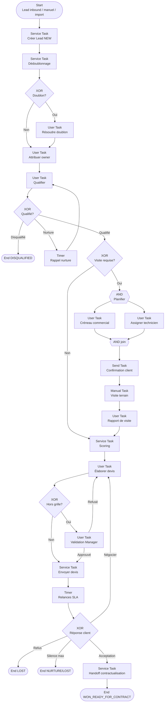

# Processus BPMN 2.0 — Prospection client

**Identifiant workflow suggéré :** `WF_PROSPECTION_CLIENT_V1`  
**Code processus :** `PROC-PROSP-02`  
**Version :** 1.0  
**Domaine :** Commercial & développement clientèle  
**Marché cible :** Agences de sécurité privée (Afrique de l’Ouest / Afrique centrale)  
**Niveau :** Conception fonctionnelle SaaS (développeurs & product)

---

## 1. Nom du processus

**Prospection client** — captation, qualification, visite technique, chiffrage et scoring des leads / prospects pour des prestations de sécurité privée (gardiennage, rondes, télésurveillance, événements).

---

## 2. Objectif

Transformer une opportunité entrante ou sortante en **devis qualifié** prêt pour la négociation / contractualisation, en :

- enregistrant et enrichissant le lead (entreprise, contacts, besoin sécurité) ;
- qualifiant le potentiel (budget, urgence, conformité, taille de site) ;
- planifiant et réalisant une visite technique / audit de risques ;
- produisant un devis structuré (postes, horaires, équipements) ;
- attribuant un **score commercial** pour prioriser le pipeline.

Le processus aboutit typiquement à `WON_READY_FOR_CONTRACT`, `NURTURE`, `LOST` ou `DISQUALIFIED`.

---

## 3. Déclencheur

| Type | Description |
|------|-------------|
| **Message Event** `MSG_LEAD_INBOUND` | Formulaire web, WhatsApp entrant, appel réception, recommandation |
| **User Event** `UT_CREATE_LEAD` | Création manuelle par commercial / agent terrain |
| **Message Event** `MSG_IMPORT_CSV` | Import campagne (salon, listing entreprises) |
| **Signal Event** `SIG_RENEWAL_UPSELL` | Signal depuis contrat existant (upsell / site additionnel) |

**Payload déclencheur (exemple) :**

```json
{
  "workflowId": "WF_PROSPECTION_CLIENT_V1",
  "trigger": "MSG_LEAD_INBOUND",
  "companyId": "uuid",
  "channel": "WHATSAPP",
  "lead": {
    "companyName": "LogiTrans CI",
    "contactPhone": "+2250700000000",
    "needSummary": "Gardiennage entrepôt 24/7",
    "city": "Abidjan"
  },
  "ownerUserId": null
}
```

---

## 4. Acteurs (avec Lanes BPMN)

### Pool : Agence (`POOL_AGENCE`)

| Lane BPMN | Rôle | Responsabilités |
|-----------|------|-----------------|
| `LANE_COMMERCIAL` | Commercial / chargé d’affaires | Qualification, suivi, devis, scoring |
| `LANE_RESP_COM` | Responsable commercial / Manager | Attribution lead, validation devis hors grille, go/no-go |
| `LANE_TECH_OPS` | Responsable technique / ops | Visite site, grille de risques, dimensionnement effectifs |
| `LANE_ADMIN` | Assistant admin | Saisie documents, relances administratives |
| `LANE_SYSTEME` | Système SaaS | Scoring auto, SLA relances, génération PDF devis, dédoublonnage |

### Pool : Client prospect (`POOL_CLIENT`)

| Lane | Rôle |
|------|------|
| `LANE_CONTACT_CLIENT` | Décideur / contact site / achats | Fournit infos, accueille visite, reçoit devis |

### Pool : Externe (`POOL_EXTERNE`)

| Lane | Rôle |
|------|------|
| `LANE_NOTIF` | Passerelles WhatsApp / SMS / Email |

---

## 5. Préconditions

1. Société agence active ; module Commercial / Leads activé.
2. Grille tarifaire de référence (`PriceBook`) ou règles de chiffrage configurées (au moins une).
3. Commercial assignable (rôle AGENT/MANAGER) dans la société ou périmètre groupe.
4. Canal d’entrée identifiable (`source`) pour le reporting.
5. Politique de dédoublonnage définie (téléphone / nom + ville / NINEA-RCCM si connu).

---

## 6. Description détaillée du processus (paragraphes narratifs + pools)

### Vue d’ensemble

Dans le **Pool Agence**, le Système crée un `Lead` en statut `NEW` et tente un dédoublonnage. Si doublon probable, un User Task demande au commercial de fusionner ou de créer quand même. Le **Responsable commercial** attribue le lead (ou auto-assignation round-robin / territoire).

Le **Commercial** qualifie le besoin (BANT adapté sécurité : Budget, Autorité, Need sites, Timing + Conformité). Si disqualifié, fin avec motif. Sinon, planification d’une **visite technique** : Message Flow vers le Client (confirmation WhatsApp). Sur site, le **Tech/Ops** réalise un Manual Task (observation terrain) puis saisit le compte-rendu dans l’UI (User Task).

Le Système propose un **score** ; le commercial émet un **devis**. Si hors grille, validation Manager. Le devis est envoyé au Client (Message Flow). Selon la réponse (acceptation de principe, négociation, silence, refus), le workflow bascule vers contractualisation, nurture (Timer), ou perdu.

### Statuts Lead / Opportunity

`NEW` → `ASSIGNED` → `QUALIFYING` → `QUALIFIED` | `DISQUALIFIED` → `VISIT_SCHEDULED` → `VISIT_DONE` → `QUOTE_DRAFT` → `QUOTE_SENT` → `NEGOTIATION` → `WON_READY_FOR_CONTRACT` | `NURTURE` | `LOST`

### IDs d’activités suggérés

| ID | Activité |
|----|----------|
| `ST_CREATE_LEAD` | Création + enrichissement |
| `ST_DEDUPE` | Dédoublonnage |
| `UT_RESOLVE_DUPLICATE` | Arbitrage doublon |
| `UT_ASSIGN_OWNER` | Attribution |
| `UT_QUALIFY` | Qualification |
| `GW_QUALIFIED` | XOR qualification |
| `UT_SCHEDULE_VISIT` | Planifier visite |
| `MSG_CONFIRM_VISIT` | Message au client |
| `MT_SITE_VISIT` | Visite terrain (Manual) |
| `UT_VISIT_REPORT` | Saisie rapport |
| `ST_COMPUTE_SCORE` | Scoring |
| `UT_BUILD_QUOTE` | Élaboration devis |
| `GW_PRICE_EXCEPTION` | Hors grille ? |
| `UT_VALIDATE_QUOTE` | Validation manager |
| `ST_SEND_QUOTE` | Envoi devis |
| `TMR_FOLLOWUP` | Relances SLA |
| `GW_CLIENT_RESPONSE` | Réponse client |

---

## 7. Tableau des étapes

| N° | Activité | Responsable | Type BPMN | Entrées | Sorties |
|----|----------|-------------|-----------|---------|---------|
| 1 | Créer lead | Système | Service Task | Payload canal | `Lead` `NEW` |
| 2 | Dédoublonner | Système | Service Task | Tél., nom, ville | `duplicateCandidates[]` |
| 3 | Gateway doublon ? | Système | XOR | Score similarité | Oui / Non |
| 4 | Résoudre doublon | Commercial | User Task | Candidats | Merge ou Keep new |
| 5 | Attribuer propriétaire | Resp. com / Système | User Task / Service | Territoire, charge | `ownerUserId`, `ASSIGNED` |
| 6 | Qualifier le besoin | Commercial | User Task | Fiche lead, script | `QualificationForm` |
| 7 | Gateway qualifié ? | Système | XOR | `qualificationResult` | QUALIFIED / DISQUALIFIED / NURTURE |
| 8 | Planifier visite | Commercial + Tech | User Task | Créneaux, site | `SiteVisit` planifiée |
| 9 | Confirmer visite client | Système → Client | Send Task / Message | Date, lieu, contact | Accusé / confirmation |
| 10 | Réaliser visite terrain | Tech / Ops | Manual Task | Checklist risques | Observations brutes |
| 11 | Saisir rapport de visite | Tech / Ops | User Task | Checklist UI | `VisitReport` |
| 12 | Calculer score | Système | Service Task | Qualif + visite + CA estimé | `leadScore` 0–100 |
| 13 | Élaborer devis | Commercial | User Task | PriceBook, rapport | `Quote` `DRAFT` |
| 14 | Gateway hors grille ? | Système | XOR | Écart % vs PriceBook | Oui / Non |
| 15 | Valider devis exception | Resp. commercial | User Task | Devis + motif | Approuvé / Refusé |
| 16 | Envoyer devis | Système | Service Task + Message | PDF, lien acceptation | `QUOTE_SENT` |
| 17 | Attendre réponse / relancer | Système | Timer + Send | SLA J+2, J+5, J+10 | Relances |
| 18 | Gateway réponse client | Système | XOR | Événement message / UI | Accept / Nego / Refuse / Silence |
| 19 | Préparer handoff contrat | Système | Service Task | Lead + Quote | Flag `WON_READY_FOR_CONTRACT` |
| 20 | Classer perdu / nurture | Commercial | User Task | Motif | `LOST` / `NURTURE` |

---

## 8. Liste des décisions (Gateways XOR/AND)

### XOR `GW_DUPLICATE`

- **Oui :** similarité ≥ `dedupeThreshold` (défaut 0.85) → User Task résolution.
- **Non :** poursuivre attribution.

### XOR `GW_QUALIFIED`

- **QUALIFIED :** budget indicatif connu ou estimable, décideur identifié, ≥ 1 site, timing ≤ 90 jours.
- **DISQUALIFIED :** hors zone, besoin non sécuritaire, insolvabilité manifeste, refus agrément client.
- **NURTURE :** intérêt réel mais timing > 90 jours → Timer rappel (30/60 jours).

### XOR `GW_VISIT_REQUIRED`

- **Oui :** montant estimé ≥ seuil **OU** site industriel / événement **OU** client demande audit.
- **Non :** devis desk possible (petit contrat standard) → saut vers élaboration devis.

### XOR `GW_PRICE_EXCEPTION`

- **Oui :** remise > `maxDiscountPercent` ou poste hors catalogue → validation Manager.
- **Non :** envoi direct.

### XOR `GW_CLIENT_RESPONSE`

- **ACCEPT_PRINCIPLE :** → handoff `WF_CONTRACTUALISATION`.
- **NEGOTIATE :** retour élaboration devis (version +1).
- **REFUSE :** `LOST` + motif obligatoire.
- **NO_RESPONSE** après max relances : → `NURTURE` ou `LOST` selon score.

### AND `GW_PREPARE_VISIT`

- En parallèle : réservation créneau commercial **et** affectation technicien visite.

---

## 9. Gestion des exceptions

| Exception | Code | Traitement | Issue |
|-----------|------|------------|-------|
| Échec génération PDF devis | `ERR_QUOTE_PDF` | Boundary Error + retry | Devis reste DRAFT ; alerte admin |
| Client annule visite | `MSG_VISIT_CANCEL` | Message interrupting | Replanifier ou disqualifier |
| No-show visite | `TMR_VISIT_NOSHOW` | Timer après créneau | Relance WhatsApp + reschedule |
| Timeout qualification | `TMR_QUALIF_SLA` | Timer 48 h sur `UT_QUALIFY` | Escalade Manager |
| Lead sans téléphone valide | `ERR_PHONE` | Validation start | Blocage canal WhatsApp ; email only |
| Conflit territoire commerciaux | `ERR_TERRITORY` | XOR attribution | Arbitrage Resp. com |

---

## 10. Données manipulées (entités + attributs clés)

| Entité | Attributs clés |
|--------|----------------|
| `Lead` | `id`, `companyId`, `status`, `source`, `channel`, `legalName`, `tradeName`, `city`, `country`, `ownerUserId`, `leadScore`, `estimatedMrr`, `disqualifyReason` |
| `LeadContact` | `name`, `role`, `phone`, `email`, `isDecisionMaker` |
| `QualificationForm` | `budgetBand`, `authorityConfirmed`, `siteCount`, `timingDays`, `complianceNotes`, `serviceTypes[]` |
| `SiteVisit` | `id`, `leadId`, `scheduledAt`, `address`, `geoLat`, `geoLng`, `technicianUserId`, `status` |
| `VisitReport` | `riskLevel`, `recommendedHeadcount`, `shiftPattern`, `equipmentNeeds[]`, `photos[]`, `notes` |
| `Quote` | `id`, `leadId`, `version`, `currency`, `lines[]`, `discountPercent`, `totalMonthly`, `totalSetup`, `validUntil`, `status` |
| `LeadScoreBreakdown` | `fit`, `urgency`, `value`, `competition`, `total` |

---

## 11. Notifications envoyées (WhatsApp/SMS/Email/Push)

| Événement | Canal(x) | Destinataires |
|-----------|----------|---------------|
| Nouveau lead assigné | Push + WhatsApp | Commercial owner |
| Confirmation visite | WhatsApp + SMS | Contact client |
| Rappel visite J-1 | WhatsApp | Client + Tech |
| Devis envoyé | Email + WhatsApp | Client (PDF / lien) |
| Relance devis | WhatsApp / SMS | Client |
| Devis hors grille à valider | Push + Email | Resp. commercial |
| SLA qualification dépassé | Push | Manager |
| Handoff contractualisation | Push + Email | Commercial + Admin contrats |

---

## 12. KPI du processus

| KPI | Définition | Cible |
|-----|------------|-------|
| Délai 1ère prise de contact | NEW → 1er appel/WhatsApp | ≤ 4 h ouvrées |
| Taux de qualification | QUALIFIED / (QUALIFIED+DISQUALIFIED) | Suivi (pas de cible unique) |
| Taux de visite réalisée | VISIT_DONE / VISIT_SCHEDULED | ≥ 80 % |
| Délai devis après visite | VISIT_DONE → QUOTE_SENT | ≤ 48 h |
| Taux de réponse devis | réponses / QUOTE_SENT | ≥ 40 % |
| Taux conversion ready-contrat | WON_READY / QUALIFIED | ≥ 25 % |
| Score moyen des deals gagnés | moyenne leadScore | Monitoring qualité scoring |

---

## 13. Recommandations d’amélioration

1. Scoring prédictif calibré sur historique local (secteur, ville, taille site).
2. Templates de devis par vertical (entrepôt, banque, résidence, événement).
3. Géofencing pour confirmer la présence technicien sur le lieu de visite (GPS).
4. Chatbot WhatsApp pour qualification L1 hors horaires.
5. Bibliothèque photo annotée des risques (IA classification).
6. Partage de créneaux visite type Calendly adapté mobile money / WhatsApp.

---

## 14. Diagramme BPMN ASCII

```
[Start: Lead inbound / Manuel / Import / Upsell]
                    |
                    v
           +----------------+
           | ST: Créer Lead |
           +----------------+
                    |
                    v
           +----------------+
           | ST: Dédoublon. |
           +----------------+
                    |
            <> XOR: Doublon ?
             /            \
           Oui             Non
            |               |
            v               |
    +---------------+       |
    | UT: Résoudre  |       |
    +---------------+       |
            |               |
            +-------+-------+
                    |
                    v
           +----------------+
           | UT/ST: Assigner|
           +----------------+
                    |
                    v
           +----------------+
           | UT: Qualifier  |
           +----------------+
                    |
      <> XOR: Qualifié / Disqual / Nurture
       /         |            \
  QUALIFIED   DISQUAL      NURTURE
      |          |            |
      |          v            v
      |      [End DISQ]   [Timer nurture]
      |
      v
 <> XOR: Visite requise ?
    /        \
  Oui         Non ----------------+
   |                               |
   v                               |
 +------------------+              |
 | AND: Planifier   |              |
 | créneau + tech   |              |
 +------------------+              |
   |                               |
   v                               |
 +------------------+              |
 | MSG: Confirm client             |
 +------------------+              |
   |                               |
   v                               |
 +------------------+              |
 | MT: Visite terrain              |
 +------------------+              |
   |                               |
   v                               |
 +------------------+              |
 | UT: Rapport visite              |
 +------------------+              |
   |                               |
   +---------------+---------------+
                   |
                   v
          +----------------+
          | ST: Score lead |
          +----------------+
                   |
                   v
          +----------------+
          | UT: Devis      |
          +----------------+
                   |
           <> XOR: Hors grille ?
            /              \
          Oui               Non
           |                 |
           v                 |
   +---------------+         |
   | UT: Valid Mgr |         |
   +---------------+         |
           |                 |
           +--------+--------+
                    |
                    v
           +----------------+
           | ST+MSG: Envoi  |
           | devis client   |
           +----------------+
                    |
                    v
           +----------------+
           | TMR: Relances  |
           +----------------+
                    |
      <> XOR: Réponse client
       /      |       \        \
  Accept   Nego     Refuse   Silence
     |       |         |         |
     v       v         v         v
  Handoff  Retour   [End LOST] Nurture/
  Contrat  devis               LOST
```

---

## 15. Diagramme Mermaid



---

## Compléments conception SaaS

### Règles métier

- Un lead appartient à une `companyId` d’agence ; les rôles groupe peuvent filtrer multi-sociétés.
- Remise max sans validation : paramètre `maxDiscountPercent` (ex. 10 %).
- Devis valide `validUntil` = date envoi + `quoteValidityDays` (défaut 15).
- Score recalculé à chaque changement de qualification / visite / montant devis.
- Interdiction d’envoyer un devis sans au moins une ligne et un contact avec téléphone ou email.

### Validations

- Téléphone E.164 ; email RFC si fourni.
- `scheduledAt` visite dans le futur ; chevauchement technicien contrôlé.
- `totalMonthly` cohérent avec somme des lignes.
- Motif obligatoire pour `LOST` / `DISQUALIFIED`.

### Contrôles automatiques

- SLA première réponse chronométré dès `NEW`.
- Relances devis automatiques (templates WhatsApp).
- Détection doublons async à chaque update téléphone/nom.
- Verrouillage édition devis `SENT` (création version N+1 uniquement).

### Risques opérationnels

- Visites non reportées dans le système → scoring faussé.
- Sous-qualification pour « gagner du temps » → devis irréalistes.
- Concurrence agressive locale non capturée.
- Prospects multi-sites incomplets.

### Possibilités d’automatisation

- Auto-assignation par zone GPS / quartier.
- Pré-devis estimatif après questionnaire WhatsApp.
- OCR carte de visite / RCCM photo.
- Suggestion effectifs selon m² et niveau de risque.

### Intégrations

| Intégration | Usage |
|-------------|--------|
| **WhatsApp** | Lead inbound, confimation visite, envoi devis, relances |
| **SMS / Email** | Fallback et devis PDF |
| **GPS** | Check-in visite technicien, géoloc site prospect |
| **API** | CRM import, PriceBook, handoff vers contractualisation |
| **IA** | Scoring, résumé besoin, extraction entités message WhatsApp |
| **QR Code** | Check-in visite (optionnel) sur feuille de route |

**Payload devis envoyé :**

```json
{
  "quoteId": "uuid",
  "leadId": "uuid",
  "version": 2,
  "totalMonthly": 850000,
  "currency": "XOF",
  "validUntil": "2026-08-31",
  "pdfUrl": "https://...",
  "acceptLink": "https://.../quotes/uuid/accept"
}
```
