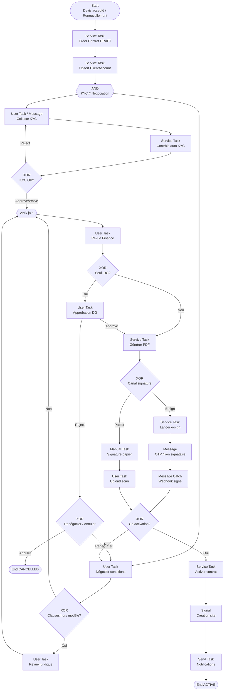

# Processus BPMN 2.0 — Contractualisation client

**Identifiant workflow suggéré :** `WF_CONTRACTUALISATION_CLIENT_V1`  
**Code processus :** `PROC-CONTRAT-03`  
**Version :** 1.0  
**Domaine :** Juridique / Commercial / Administration des ventes  
**Marché cible :** Agences de sécurité privée (Afrique de l’Ouest / Afrique centrale)  
**Niveau :** Conception fonctionnelle SaaS (développeurs & product)

---

## 1. Nom du processus

**Contractualisation client** — négociation finale, constitution du dossier KYC, signature électronique ou papier, activation du contrat de prestations de sécurité et préparation du handoff « création de site ».

---

## 2. Objectif

Sécuriser juridiquement et commercialement la relation en :

- convertissant un devis accepté / opportunité `WON_READY_FOR_CONTRACT` en **contrat actif** ;
- menant la négociation des clauses (durée, préavis, pénalités, révision tarifaire, SLA) ;
- collectant et validant les pièces KYC client (RCCM, pièce dirigeant, attestation fiscale selon pays) ;
- obtenant une signature opposable (e-signature ou paraphe papier scanné) ;
- activant le contrat dans le SaaS et déclenchant les processus aval (création site, facturation, recrutement/affectation si besoin).

Statut cible : `ACTIVE` (ou `SIGNED_PENDING_ACTIVATION` selon paramétrage go-live).

---

## 3. Déclencheur

| Type | Description |
|------|-------------|
| **Message Event** `MSG_QUOTE_ACCEPTED` | Acceptation de principe depuis `WF_PROSPECTION_CLIENT` |
| **User Event** | Démarrage manuel « Nouveau contrat » depuis fiche client existant (avenant / renouvellement) |
| **Signal** `SIG_RENEWAL_DUE` | Renouvellement J-60 / J-30 |

**Payload déclencheur :**

```json
{
  "workflowId": "WF_CONTRACTUALISATION_CLIENT_V1",
  "trigger": "MSG_QUOTE_ACCEPTED",
  "companyId": "uuid",
  "leadId": "uuid",
  "quoteId": "uuid",
  "clientAccountId": null,
  "ownerUserId": "uuid"
}
```

---

## 4. Acteurs (avec Lanes BPMN)

### Pool : Agence (`POOL_AGENCE`)

| Lane BPMN | Rôle | Responsabilités |
|-----------|------|-----------------|
| `LANE_COMMERCIAL` | Commercial | Négociation commerciale, avenants tarifaires |
| `LANE_JURIDIQUE` | Juridique / direction | Clauses, risques contractuels, validation hors modèle |
| `LANE_ADMIN` | Administration des ventes | KYC, génération contrat, archivage, facturation initiale |
| `LANE_FINANCE` | Finance | Conditions de paiement, dépôt de garantie, solvabilité |
| `LANE_DG` | DG / délégataire | Signature agence si seuil dépassé |
| `LANE_SYSTEME` | Système | Génération documents, e-sign, contrôles KYC, activation |

### Pool : Client (`POOL_CLIENT`)

| Lane | Rôle |
|------|------|
| `LANE_SIGNATAIRE_CLIENT` | Représentant légal / délégataire | Fournit KYC, négocie, signe |
| `LANE_ACHATS_CLIENT` | Achats / facility | Relit SLA opérationnels |

### Pool : Prestataire e-sign / Notaire (`POOL_EXTERNE`) — optionnel

| Lane | Rôle |
|------|------|
| `LANE_ESIGN` | DocuSign-like / prestataire local | OTP, certificat, horodatage |
| `LANE_NOTIF` | WhatsApp / Email / SMS |

---

## 5. Préconditions

1. Devis de référence en statut `ACCEPTED` ou `SENT` avec acceptation de principe tracée, **ou** renouvellement d’un contrat existant.
2. Modèle de contrat (`ContractTemplate`) actif pour le pays / type de service.
3. Paramètres KYC du pays configurés (`KycPolicy`).
4. Compte client (`ClientAccount`) créé ou créable à partir du lead.
5. Seuil de signature DG configuré (`signatureThresholdAmount`).
6. Aucun contrat `ACTIVE` en conflit strict sur le même périmètre site+service (sauf avenant explicite).

---

## 6. Description détaillée du processus (paragraphes narratifs + pools)

### Vue d’ensemble

Le **Système** crée un `Contract` en `DRAFT` lié au devis / lead, matérialise le `ClientAccount` si besoin, et ouvre la checklist KYC. L’**Admin** collecte les pièces (Message Flow vers le Client). Le Système (ou un reviewer) valide chaque pièce.

En parallèle (AND), le **Commercial** mène la négociation des conditions ; si clauses hors modèle, le **Juridique** intervient. La **Finance** valide les conditions de paiement. Le contrat PDF est généré ; selon le canal, **e-signature** (Message Flow Pool e-sign) ou **signature papier** (Manual Task + upload scan).

Après signatures bilatérales, contrôle final (KYC OK + signatures OK + montant cohérent). Activation : statut `ACTIVE`, dates d’effet, génération des obligations de facturation, signal vers `WF_CREATION_SITE`. Notifications multi-canal.

### Statuts contrat

`DRAFT` → `KYC_IN_PROGRESS` → `NEGOTIATION` → `PENDING_INTERNAL_APPROVAL` → `READY_TO_SIGN` → `OUT_FOR_SIGNATURE` → `SIGNED` → `ACTIVE` | `REJECTED` | `CANCELLED` | `EXPIRED_UNSIGNED`

### IDs d’activités suggérés

| ID | Activité |
|----|----------|
| `ST_CREATE_CONTRACT` | Création dossier |
| `ST_UPSERT_CLIENT` | Création/MAJ compte client |
| `UT_COLLECT_KYC` | Collecte pièces |
| `ST_VALIDATE_KYC_AUTO` | Contrôles auto (expiration, lisibilité) |
| `UT_VALIDATE_KYC_MANUAL` | Revue humaine |
| `UT_NEGOTIATE_TERMS` | Négociation |
| `GW_CLAUSE_EXCEPTION` | Hors modèle ? |
| `UT_LEGAL_REVIEW` | Revue juridique |
| `UT_FINANCE_REVIEW` | Conditions paiement |
| `UT_DG_APPROVE` | Approbation DG si seuil |
| `ST_GENERATE_PDF` | Génération contrat |
| `GW_SIGN_CHANNEL` | E-sign vs papier |
| `ST_START_ESIGN` | Démarrage e-sign |
| `MT_PAPER_SIGN` | Signature papier |
| `UT_UPLOAD_SCAN` | Dépôt scan |
| `ST_ACTIVATE` | Activation |
| `SIG_SITE_CREATION` | Signal aval |

---

## 7. Tableau des étapes

| N° | Activité | Responsable | Type BPMN | Entrées | Sorties |
|----|----------|-------------|-----------|---------|---------|
| 1 | Créer contrat DRAFT | Système | Service Task | Devis, lead | `Contract` |
| 2 | Créer / lier compte client | Système | Service Task | Données lead | `ClientAccount` |
| 3 | Ouvrir checklist KYC | Système | Service Task | `KycPolicy` | `KycCase` |
| 4 | Demander pièces au client | Admin / Système | Send Task | Liste documents | Message client |
| 5 | Déposer pièces | Client | User Task (portail) / Message | Fichiers | `KycDocument[]` |
| 6 | Contrôle auto KYC | Système | Service Task | Fichiers, métadonnées | Score qualité / flags |
| 7 | Validation KYC humaine | Admin / Juridique | User Task | Pièces + flags | KYC_APPROVED / REJECT |
| 8 | Négocier conditions | Commercial + Client | User Task (+ Message) | Devis, clauses | `ContractTerms` |
| 9 | Gateway clauses hors modèle | Système | XOR | Diff vs template | Oui / Non |
| 10 | Revue juridique | Juridique | User Task | Clauses custom | OK / Modifications |
| 11 | Revue finance | Finance | User Task | Paiement, garantie | OK / KO |
| 12 | Gateway seuil DG | Système | XOR | Montant vs seuil | Oui / Non |
| 13 | Approbation DG | DG | User Task | Dossier consolidé | APPROVE / REJECT |
| 14 | Générer PDF contrat | Système | Service Task | Template + terms | `documentUrl` |
| 15 | Gateway canal signature | Admin | XOR / User | Préférence | ESIGN / PAPER |
| 16a | Lancer e-signature | Système → E-sign | Service + Message | Signataires, PDF | Envelope ID |
| 16b | Signature papier terrain | Parties | Manual Task | Exemplaires | Documents signés |
| 17 | Upload scan / webhook e-sign | Admin / Système | User / Message | Scan ou callback | `SIGNED` |
| 18 | Contrôle final activation | Système | Service Task | KYC + signatures | Go / No-go |
| 19 | Activer contrat | Système | Service Task | Dates d’effet | `ACTIVE` |
| 20 | Notifier + signal création site | Système | Send + Signal | Contrat actif | Notifs + `SIG_CREATE_SITE` |

---

## 8. Liste des décisions (Gateways XOR/AND)

### AND `GW_KYC_AND_NEGOTIATION`

- Collecte KYC **et** négociation commerciale en parallèle après création du draft ; jointure avant génération PDF.

### XOR `GW_KYC_RESULT`

- **APPROVED :** toutes pièces obligatoires valides et non expirées.
- **REJECT :** pièce manquante / illisible / incohérente → retour collecte avec motif.
- **WAIVE :** dérogation documentée (rôle Juridique/DG uniquement, audit).

### XOR `GW_CLAUSE_EXCEPTION`

- **Oui :** au moins une clause `isCustom=true` → revue juridique obligatoire.
- **Non :** chemin standard.

### XOR `GW_DG_THRESHOLD`

- **Oui :** `contractAnnualValue >= signatureThresholdAmount` **OU** clauses pénalités non standard.
- **Non :** signature Manager / délégataire commercial.

### XOR `GW_SIGN_CHANNEL`

- **ESIGN :** client a email/téléphone OTP et feature e-sign active.
- **PAPER :** préférence client, zone low-connectivity, ou exigence légale locale.

### XOR `GW_ACTIVATION_CHECK`

- **Go :** KYC approved + signedByClient + signedByAgency + `startDate` renseignée.
- **No-go :** blocage avec liste d’écarts.

### XOR `GW_RENEGOTIATE_OR_CANCEL`

- Après rejet client / DG : renvoyer négociation **ou** `CANCELLED`.

---

## 9. Gestion des exceptions

| Exception | Code | Traitement | Issue |
|-----------|------|------------|-------|
| KYC expiré en cours de signature | `ERR_KYC_EXPIRED` | Conditional Boundary | Retour collecte |
| Timeout e-sign | `TMR_ESIGN_SLA` | Timer 7–14 j | Relances puis `EXPIRED_UNSIGNED` |
| Webhook e-sign invalide | `ERR_ESIGN_WEBHOOK` | Error Event | Retry + alerte admin |
| Scan illisible | `ERR_SCAN_QUALITY` | Sur upload | Demande nouveau scan |
| Refus client post-négociation | `MSG_CLIENT_REJECT` | Message | `REJECTED` + motif |
| Incohérence montant devis/contrat | `ERR_AMOUNT_MISMATCH` | Avant activation | Blocage + correction commerciale |
| Double activation concurrente | `ERR_CONCURRENCY` | Optimistic lock | Retry / conflit UI |

---

## 10. Données manipulées (entités + attributs clés)

| Entité | Attributs clés |
|--------|----------------|
| `Contract` | `id`, `companyId`, `clientAccountId`, `quoteId`, `status`, `startDate`, `endDate`, `noticeDays`, `currency`, `monthlyAmount`, `annualValue`, `signChannel`, `activatedAt` |
| `ContractTerms` | `slaResponseMinutes`, `penaltyClause`, `priceRevisionIndex`, `paymentTermsDays`, `depositAmount`, `customClauses[]` |
| `ClientAccount` | `legalName`, `registrationNumber`, `taxId`, `billingAddress`, `countryCode`, `status` |
| `KycCase` | `id`, `clientAccountId`, `policyCode`, `status`, `reviewedBy`, `reviewedAt` |
| `KycDocument` | `type` (RCCM, CNI_DIRIGEANT, AT_ID…), `fileUrl`, `expiresAt`, `validationStatus` |
| `SignatureEnvelope` | `provider`, `externalId`, `signers[]`, `status`, `completedAt` |
| `ContractDocument` | `version`, `pdfUrl`, `hashSha256`, `signedPdfUrl` |

---

## 11. Notifications envoyées (WhatsApp/SMS/Email/Push)

| Événement | Canal(x) | Destinataires |
|-----------|----------|---------------|
| Demande pièces KYC | WhatsApp + Email | Signataire client |
| Pièce KYC rejetée | WhatsApp | Client + Admin |
| Contrat prêt à signer | Email + WhatsApp | Signataires |
| OTP e-signature | SMS / WhatsApp | Signataire |
| Relance signature | WhatsApp / Email | Client |
| Contrat activé | Email + Push | Commercial, Ops, Finance |
| Rejet / annulation | Email | Parties internes |

---

## 12. KPI du processus

| KPI | Définition | Cible |
|-----|------------|-------|
| Délai DRAFT → ACTIVE | Cycle time contractualisation | ≤ 10 jours ouvrés |
| Taux KYC validé au 1er passage | APPROVED sans REJECT | ≥ 60 % |
| Taux signature e-sign | ESIGN / total signés | Croissant |
| Délai signature après READY_TO_SIGN | | ≤ 5 jours |
| Taux d’abandon avant signature | CANCELLED+EXPIRED / démarrés | ≤ 20 % |
| Écart devis vs contrat signé | % variation | ≤ 5 % (hors avenant tracé) |

---

## 13. Recommandations d’amélioration

1. Parcours KYC mobile-first (photo WhatsApp → classement auto).
2. Clauses dynamiques par pays (CI, SN, CM…) versionnées.
3. E-sign locale low-bandwidth (OTP SMS + hash document).
4. Checklist go-live ops automatique à l’activation (sites, effectifs).
5. Détection renouvellement et pré-remplissage avenant.
6. Comparateur de versions de clauses (diff juridique).

---

## 14. Diagramme BPMN ASCII

```
[Start: Devis accepté / Renouvellement / Manuel]
                    |
                    v
         +---------------------+
         | ST: Contrat DRAFT   |
         | + ClientAccount     |
         +---------------------+
                    |
          +---------+---------+
          | AND: KYC // Nego  |
          +---------+---------+
         /                     \
        v                       v
 +--------------+        +--------------+
 | Collecte KYC |        | Négociation  |
 | Client+Admin |        | commerciale  |
 +--------------+        +--------------+
        |                       |
        v                       v
 <> XOR KYC OK?          <> XOR hors modèle?
  /      \                 /          \
Reject   OK              Oui          Non
  |       |               |            |
  |       |               v            |
  |       |        +-------------+     |
  |       |        | UT Juridique|     |
  |       |        +-------------+     |
  |       |               |            |
  +------>+------->-------+------------+
                    |
                    v
           +----------------+
           | UT: Finance    |
           +----------------+
                    |
            <> XOR: Seuil DG ?
             /              \
           Oui               Non
            |                 |
            v                 |
    +---------------+         |
    | UT: Approb DG |         |
    +---------------+         |
            |                 |
            +--------+--------+
                     |
                     v
            +----------------+
            | ST: PDF contrat|
            +----------------+
                     |
             <> XOR: E-sign / Papier
              /                \
         ESIGN                 PAPER
            |                    |
            v                    v
   +----------------+    +----------------+
   | ST: Envelope   |    | MT: Signature  |
   | + OTP notif    |    | papier         |
   +----------------+    +----------------+
            |                    |
            v                    v
   +----------------+    +----------------+
   | Webhook signé  |    | UT: Upload scan|
   +----------------+    +----------------+
            \                    /
             +---------+---------+
                       |
                       v
               <> XOR: Go activation ?
                /                  \
              Non                   Oui
               |                     |
               v                     v
        Corriger écarts      +---------------+
                             | ST: ACTIVE    |
                             | Signal Site   |
                             | MSG Notifs    |
                             +---------------+
                                     |
                                     v
                              [End ACTIVE]
```

---

## 15. Diagramme Mermaid



---

## Compléments conception SaaS

### Règles métier

- Un contrat `ACTIVE` a une période `[startDate, endDate]` ; chevauchement contrôlé par site/service.
- Activation impossible si KYC obligatoire incomplet (sauf `WAIVE` audité).
- Toute modification post-signature = avenant (`ContractAmendment`) avec re-signature si clauses matérielles.
- Devise = devise société ou devise contrat explicite (XOF, XAF, etc.).
- Conservation documentaire : durée légale configurable par pays (ex. 10 ans).

### Validations

- `endDate > startDate` ; `noticeDays` ≥ minimum légal paramétré.
- Signataires : identité + qualité (dirigeant / procuration).
- Hash PDF avant/après signature stocké.
- Montants ≥ 0 ; cohérence lignes devis.

### Contrôles automatiques

- Expiration pièces KYC (job quotidien) → alerte si contrat encore non signé.
- Relances signature (J+2, J+5, J+10).
- Verrouillage édition terms dès `OUT_FOR_SIGNATURE`.
- Webhook e-sign authentifié (HMAC).

### Risques opérationnels

- Faux documents KYC.
- Signature par personne non habilitée.
- Activation ops avant signature complète.
- Zones sans connectivité → retards e-sign.

### Possibilités d’automatisation

- Pré-remplissage contrat depuis devis + visite.
- Classification IA des pièces KYC.
- Détection clauses à risque (pénalités excessives).
- Génération auto facture d’acompte à l’activation.

### Intégrations

| Intégration | Usage |
|-------------|--------|
| **Email / WhatsApp / SMS** | KYC, liens signature, OTP, activation |
| **API e-sign** | Envelope, webhooks, certificats |
| **API** | Handoff site, facturation, CRM |
| **IA** | OCR KYC, extraction RCCM, revue clauses |
| **QR Code** | Accès rapide dossier contrat sur mobile terrain (lecture seule) |

**Payload activation :**

```json
{
  "contractId": "uuid",
  "status": "ACTIVE",
  "startDate": "2026-09-01",
  "monthlyAmount": 850000,
  "currency": "XOF",
  "signals": ["SIG_CREATE_SITE"],
  "billingProfileId": "uuid"
}
```
