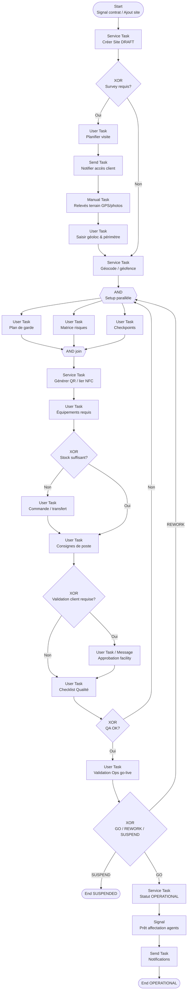

# Processus BPMN 2.0 — Création de site

**Identifiant workflow suggéré :** `WF_CREATION_SITE_V1`  
**Code processus :** `PROC-SITE-04`  
**Version :** 1.0  
**Domaine :** Opérations / Ingénierie de la sécurité  
**Marché cible :** Agences de sécurité privée (Afrique de l’Ouest / Afrique centrale)  
**Niveau :** Conception fonctionnelle SaaS (développeurs & product)

---

## 1. Nom du processus

**Création de site** — paramétrage opérationnel d’un site client à sécuriser : géolocalisation, plan de garde, analyse des risques, checkpoints (rondes), équipements requis, puis mise en service du site dans le SaaS.

---

## 2. Objectif

Rendre un site **opérable** pour le gardiennage et le pilotage terrain en :

- créant la fiche site liée au contrat actif ;
- capturant la géolocalisation précise et le périmètre ;
- définissant le **plan de garde** (effectifs, vacation, horaires, consignes) ;
- évaluant et documentant les **risques** ;
- configurant les **checkpoints** de ronde (GPS / QR / NFC) ;
- listant les **équipements** obligatoires (radio, lampe, registre, vidéosurveillance, etc.) ;
- validant la mise en service avant affectation d’agents.

Statut cible : `OPERATIONAL` (prêt pour `WF_AFFECTATION_AGENT`).

---

## 3. Déclencheur

| Type | Description |
|------|-------------|
| **Signal Event** `SIG_CREATE_SITE` | Émis à l’activation contrat (`WF_CONTRACTUALISATION`) |
| **User Event** | « Ajouter un site » sur compte client / contrat multi-sites |
| **Message Event** | Demande client d’extension de périmètre (avenant) |

**Payload déclencheur :**

```json
{
  "workflowId": "WF_CREATION_SITE_V1",
  "trigger": "SIG_CREATE_SITE",
  "companyId": "uuid",
  "contractId": "uuid",
  "clientAccountId": "uuid",
  "suggestedName": "Entrepôt Vridi — Quai 3",
  "addressHint": "Zone portuaire Vridi, Abidjan"
}
```

---

## 4. Acteurs (avec Lanes BPMN)

### Pool : Agence (`POOL_AGENCE`)

| Lane BPMN | Rôle | Responsabilités |
|-----------|------|-----------------|
| `LANE_OPS` | Directeur / responsable opérations | Validation plan de garde, go-live |
| `LANE_CHEF_SECTOR` | Chef de secteur / superviseur | Recueil consignes, conception rondes |
| `LANE_TECH` | Technicien sécurité / audit | Visite, risques, géoloc, checkpoints |
| `LANE_LOGISTIQUE` | Logistique / moyens | Équipements, dotation |
| `LANE_QUALITE` | Qualité | Conformité consignes / checklist go-live |
| `LANE_SYSTEME` | Système | Géofence, génération plan, contrôles, QR |

### Pool : Client (`POOL_CLIENT`)

| Lane | Rôle |
|------|------|
| `LANE_FACILITY` | Facility / responsable site client | Accès, consignes spécifiques, validation plan |

### Pool : Externe (`POOL_EXTERNE`)

| Lane | Rôle |
|------|------|
| `LANE_MAPS` | Fournisseur cartes / géocodage | Géocode, tuiles carte |
| `LANE_NOTIF` | WhatsApp / SMS / Email / Push | Notifications |

---

## 5. Préconditions

1. Contrat lié en statut `ACTIVE` ou `SIGNED_PENDING_ACTIVATION` autorisant la préparation de site.
2. ClientAccount existant.
3. Types de service du contrat connus (`GUARDING`, `PATROL`, `EVENT`, etc.).
4. Catalogue checkpoints et équipements (`EquipmentCatalog`, `CheckpointType`) configuré.
5. Utilisateur Ops / Tech avec droit `site:create` sur la société.
6. Coordonnées minimales ou adresse exploitable pour géocodage (sinon visite obligatoire avant go-live).

---

## 6. Description détaillée du processus (paragraphes narratifs + pools)

### Vue d’ensemble

Le **Système** crée un `Site` en `DRAFT` rattaché au contrat. Le **Technicien** planifie une visite de paramétrage (souvent distincte de la visite prospection). Sur le terrain (Manual Task), il capture GPS, photos, points d’accès, zones sensibles. Message Flow éventuel vers Maps pour géocodage / reverse geocoding.

Ensuite, conception du **plan de garde** (User Task Chef de secteur + validation Ops) : nombre d’agents par vacation, horaires, consignes permanentes / spécifiques. En parallèle, saisie de la **matrice de risques** et placement des **checkpoints** (QR générés, tags NFC enregistrés, ou rayons GPS). La **Logistique** confirme la disponibilité des équipements.

La **Qualité** exécute la checklist go-live. Le **Client facility** peut valider les consignes (Message Flow). L’**Ops** donne le go `OPERATIONAL` ; le Système émet un signal vers l’affectation d’agents et notifie les parties.

### Statuts site

`DRAFT` → `SURVEY_SCHEDULED` → `SURVEY_DONE` → `SETUP_IN_PROGRESS` → `PENDING_VALIDATION` → `OPERATIONAL` | `SUSPENDED` | `CANCELLED`

### IDs d’activités suggérés

| ID | Activité |
|----|----------|
| `ST_CREATE_SITE` | Création fiche |
| `UT_SCHEDULE_SURVEY` | Planifier visite paramétrage |
| `MT_FIELD_SURVEY` | Relevés terrain |
| `ST_GEOCODE` | Géocodage / géofence |
| `UT_GUARD_PLAN` | Plan de garde |
| `UT_RISK_MATRIX` | Analyse risques |
| `UT_CHECKPOINTS` | Configuration checkpoints |
| `ST_GENERATE_QR` | Génération QR / enregistrement NFC |
| `UT_EQUIPMENT_LIST` | Besoins équipements |
| `UT_LOGISTICS_CONFIRM` | Confirmation stock / achat |
| `UT_CLIENT_VALIDATE_ORDERS` | Validation consignes client |
| `UT_QA_CHECKLIST` | Checklist qualité |
| `UT_OPS_GO_LIVE` | Validation Ops |
| `SIG_READY_ASSIGN` | Signal affectation |

---

## 7. Tableau des étapes

| N° | Activité | Responsable | Type BPMN | Entrées | Sorties |
|----|----------|-------------|-----------|---------|---------|
| 1 | Créer site DRAFT | Système | Service Task | Contrat, adresse | `Site` |
| 2 | Planifier visite paramétrage | Chef secteur / Tech | User Task | Créneaux, accès client | `SiteSurvey` |
| 3 | Notifier client accès | Système | Send Task | Date visite | WhatsApp/Email facility |
| 4 | Réaliser relevés terrain | Tech | Manual Task | Checklist survey | GPS, photos, notes |
| 5 | Saisir géoloc & périmètre | Tech | User Task | Coords, polygone | `geoLat`, `geoLng`, `geofence` |
| 6 | Géocoder / normaliser | Système → Maps | Service Task | Adresse / coords | Adresse normalisée |
| 7 | AND fork conception | Système | Parallel Gateway | Survey done | 3 branches |
| 8a | Définir plan de garde | Chef secteur | User Task | Effectifs contrat, horaires | `GuardPlan` |
| 8b | Matrice de risques | Tech / Qualité | User Task | Observations | `RiskAssessment` |
| 8c | Configurer checkpoints | Tech | User Task | Plan site | `Checkpoint[]` |
| 9 | Générer QR / lier NFC | Système | Service Task | Checkpoints | Codes, UIDs |
| 10 | Liste équipements requis | Logistique + Tech | User Task | Risques + plan | `SiteEquipmentNeed[]` |
| 11 | Gateway stock suffisant ? | Système | XOR | Stock vs besoins | Oui / Non |
| 12 | Lancer commande / transfert | Logistique | User Task | Besoins | `ProcurementRequest` |
| 13 | Rédiger / joindre consignes | Chef secteur | User Task | Input client | `StandingOrders` |
| 14 | Valider consignes côté client | Facility client | User Task / Message | Consignes | Approbation |
| 15 | Checklist qualité go-live | Qualité | User Task | Grille QA | Score / écarts |
| 16 | Gateway QA OK ? | Système | XOR | Résultat QA | Oui / Non |
| 17 | Validation Ops mise en service | Ops | User Task | Dossier site complet | `OPERATIONAL` |
| 18 | Publier site + signal affectation | Système | Service + Signal | Site | Notifs + `SIG_READY_ASSIGN` |

---

## 8. Liste des décisions (Gateways XOR/AND)

### XOR `GW_SURVEY_NEEDED`

- **Oui :** pas de géoloc fiable **OU** premier site du contrat **OU** risque élevé estimé.
- **Non :** paramétrage desk à partir du rapport de visite prospection (réutilisation `VisitReport`).

### AND `GW_SETUP_PARALLEL`

- Fork : plan de garde **+** risques **+** checkpoints en parallèle après survey ; join avant équipements / QA.

### XOR `GW_EQUIPMENT_STOCK`

- **Oui :** tous items `REQUIRED` disponibles → continuer.
- **Non :** création demande achat/transfert ; Timer suivi livraison ; go-live possible en `CONDITIONAL` si paramètre `allowGoLiveWithoutOptionalEquipment=true` (équipements CRITICAL toujours bloquants).

### XOR `GW_CLIENT_ORDERS_VALIDATION`

- **Requis si :** contrat impose validation client des consignes.
- **Sinon :** skip.

### XOR `GW_QA_PASS`

- **Oui :** aucun item CRITICAL ouvert dans checklist.
- **Non :** retour branches concernées (plan / checkpoints / équipements).

### XOR `GW_OPS_DECISION`

- **GO :** `OPERATIONAL`.
- **REWORK :** retour setup.
- **SUSPEND :** site créé mais non exploité (`SUSPENDED`).

---

## 9. Gestion des exceptions

| Exception | Code | Traitement | Issue |
|-----------|------|------------|-------|
| Accès site refusé | `MSG_ACCESS_DENIED` | Message | Replanifier survey |
| GPS imprécis / indoor | `ERR_GPS_ACCURACY` | Sur saisie | Forcer QR/NFC ; warning géofence |
| Échec génération QR | `ERR_QR` | Boundary Error | Retry ; impression différée |
| Tag NFC déjà lié autre site | `ERR_NFC_CONFLICT` | Validation | Rejeter UID |
| Client refuse consignes | `MSG_ORDERS_REJECT` | Message | Rework consignes |
| Contrat suspendu pendant setup | `COND_CONTRACT` | Conditional | Pause / `CANCELLED` |
| Timeout go-live | `TMR_GOLIVE_SLA` | Timer 7 j après SIGNED | Escalade Ops |

---

## 10. Données manipulées (entités + attributs clés)

| Entité | Attributs clés |
|--------|----------------|
| `Site` | `id`, `companyId`, `contractId`, `clientAccountId`, `name`, `address`, `city`, `geoLat`, `geoLng`, `geofencePolygon`, `timezone`, `status`, `riskLevel` |
| `SiteSurvey` | `scheduledAt`, `technicianUserId`, `completedAt`, `photoUrls[]`, `notes` |
| `GuardPlan` | `siteId`, `shifts[]` (`name`, `startTime`, `endTime`, `headcount`, `profileRequired[]`), `weeklyPattern`, `version` |
| `RiskAssessment` | `siteId`, `items[]` (`hazard`, `likelihood`, `impact`, `mitigation`), `overallLevel` |
| `Checkpoint` | `id`, `siteId`, `code`, `label`, `type` (GPS/QR/NFC), `geoLat`, `geoLng`, `radiusMeters`, `nfcUid`, `qrPayload`, `sequence` |
| `StandingOrders` | `siteId`, `permanentOrders`, `specificOrders`, `emergencyContacts[]`, `clientApprovedAt` |
| `SiteEquipmentNeed` | `equipmentCode`, `quantity`, `criticality` (CRITICAL/OPTIONAL), `status` |
| `QaGoLiveChecklist` | `items[]`, `score`, `blockerCount`, `reviewedBy` |

---

## 11. Notifications envoyées (WhatsApp/SMS/Email/Push)

| Événement | Canal(x) | Destinataires |
|-----------|----------|---------------|
| Visite paramétrage planifiée | WhatsApp + Email | Facility client + Tech |
| Consignes à valider | Email + WhatsApp | Client |
| Écarts QA | Push | Chef secteur |
| Stock équipement insuffisant | Push + Email | Logistique |
| Site OPERATIONAL | Push + WhatsApp | Ops, Chef secteur, Commercial |
| SLA go-live dépassé | WhatsApp + Email | Ops + DG ops |

---

## 12. KPI du processus

| KPI | Définition | Cible |
|-----|------------|-------|
| Délai DRAFT → OPERATIONAL | Cycle time création site | ≤ 5 jours ouvrés post-signature |
| Taux QA au 1er passage | Pass sans rework | ≥ 75 % |
| Couverture checkpoints | Sites OPERATIONAL avec ≥ N checkpoints | 100 % si service PATROL |
| Précision géoloc | Accuracy moyenne relevée | ≤ 20 m (outdoor) |
| Taux validation consignes client < 48 h | | ≥ 80 % |
| Sites bloqués équipements CRITICAL | Nombre | → 0 avant J0 service |

---

## 13. Recommandations d’amélioration

1. Import plan de garde depuis devis / visit report.
2. Carte interactive mobile pour poser checkpoints hors ligne (sync ultérieure).
3. Impression lot de QR plastifiés liée au site.
4. Matrice de risques par vertical (banque, entrepôt, chantier).
5. Jumeau simple du site (photo 360 + pins).
6. Simulation charge agents avant go-live (lien affectation).

---

## 14. Diagramme BPMN ASCII

```
[Start: Signal contrat / Ajout site / Avenant]
                    |
                    v
           +----------------+
           | ST: Site DRAFT |
           +----------------+
                    |
            <> XOR: Survey requis ?
             /                  \
           Oui                   Non
            |                     |
            v                     |
   +-----------------+            |
   | UT: Planifier   |            |
   | MSG: Accès client            |
   +-----------------+            |
            |                     |
            v                     |
   +-----------------+            |
   | MT: Relevés GPS |            |
   | photos, accès   |            |
   +-----------------+            |
            |                     |
            v                     |
   +-----------------+            |
   | UT+ST: Géoloc   |            |
   | géofence/maps   |            |
   +-----------------+            |
            |                     |
            +----------+----------+
                       |
                       v
            +----------+----------+
            | AND: Setup parallèle|
            +----------+----------+
           /           |          \
          v            v           v
  +------------+ +-----------+ +-------------+
  | Plan garde | | Risques   | | Checkpoints |
  +------------+ +-----------+ +-------------+
          \            |          /
           \           |         /
            +----------+--------+
                       |
                       v
              +----------------+
              | ST: QR / NFC   |
              +----------------+
                       |
                       v
              +----------------+
              | UT: Équipements|
              +----------------+
                       |
               <> XOR: Stock OK ?
                /              \
              Non               Oui
               |                 |
               v                 |
      +----------------+         |
      | UT: Commande / |         |
      | transfert      |         |
      +----------------+         |
               |                 |
               +--------+--------+
                        |
                        v
              +----------------+
              | UT: Consignes  |
              +----------------+
                        |
                <> XOR: Valid client ?
                 /                 \
               Oui                  Non (skip)
                |                    |
                v                    |
       +----------------+            |
       | MSG/UT Client  |            |
       +----------------+            |
                |                    |
                +---------+----------+
                          |
                          v
                 +----------------+
                 | UT: Checklist  |
                 | Qualité        |
                 +----------------+
                          |
                  <> XOR: QA OK ?
                   /            \
                 Non             Oui
                  |               |
                  v               v
            Rework setup   +-------------+
                           | UT: Ops GO  |
                           +-------------+
                                 |
                         <> XOR: GO/REWORK/SUSPEND
                          /      |         \
                       GO     REWORK     SUSPEND
                        |        |          |
                        v        |          v
               +--------------+  |    [End SUSPENDED]
               | ST: OPERAT.  |<-+
               | Signal affect|
               | Notifs       |
               +--------------+
                        |
                        v
                 [End OPERATIONAL]
```

---

## 15. Diagramme Mermaid



---

## Compléments conception SaaS

### Règles métier

- Un site appartient à un `contractId` et une `companyId` ; multi-sites par contrat autorisé.
- Passage `OPERATIONAL` interdit si aucun `GuardPlan` version active.
- Service `PATROL` : au moins 1 checkpoint ; recommandation ≥ 3.
- Équipements `CRITICAL` manquants bloquent le go-live (sauf override Ops audité).
- Modification majeure du plan de garde après go-live = nouvelle version + notification affectations.

### Validations

- Coordonnées dans bornes pays ; polygone géofence simple non auto-intersectant.
- Horaires shifts sans trou non justifié sur couverture 24/7 contractualisée.
- `nfcUid` unique global ; `qrPayload` signé (HMAC) pour anti-fraude.
- `headcount` shift ≤ plafond contractuel sauf avenant.

### Contrôles automatiques

- Job : sites `SETUP_IN_PROGRESS` > SLA → alerte.
- Vérification périodique lisibilité QR (retours terrain).
- Alerte si géofence trop large (> X m) par rapport au type de site.

### Risques opérationnels

- Plan de garde sous-dimensionné → non-qualité / litiges.
- Checkpoints mal placés → rondes fictives.
- Consignes non validées par le client → incidents.
- Équipements livrés en retard → démarrage partiel dangereux.

### Possibilités d’automatisation

- Suggestion effectifs selon surface + riskLevel.
- Auto-placement checkpoints le long d’un parcours dessiné.
- Génération PDF plan de poste + QR sheet.
- Sync offline survey mobile.

### Intégrations

| Intégration | Usage |
|-------------|--------|
| **GPS** | Relevés, géofence, checkpoints GPS |
| **QR Code** | Checkpoints rondes, fiches consignes |
| **NFC** | Checkpoints anti-fraude |
| **WhatsApp / Email / SMS / Push** | Accès visite, validation consignes, go-live |
| **API cartes** | Géocodage, affichage plan |
| **IA** | Classification risques à partir de photos, suggestion parcours |
| **API** | Signal affectation, stock logistique |

**Payload checkpoint QR :**

```json
{
  "checkpointId": "uuid",
  "siteId": "uuid",
  "type": "QR",
  "qrPayload": "CHK:siteId:checkpointId:sig",
  "sequence": 3,
  "label": "Entrée quai sud"
}
```
