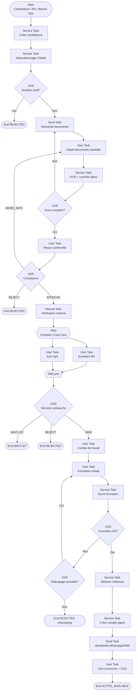

# Processus BPMN 2.0 — Recrutement agent

**Identifiant workflow suggéré :** `WF_RECRUTEMENT_AGENT_V1`  
**Code processus :** `PROC-RH-05`  
**Version :** 1.0  
**Domaine :** RH / Conformité agents de sécurité  
**Marché cible :** Agences de sécurité privée (Afrique de l’Ouest / Afrique centrale)  
**Niveau :** Conception fonctionnelle SaaS (développeurs & product)

---

## 1. Nom du processus

**Recrutement agent** — parcours de candidature, vérification documentaire (CNI, casier judiciaire, agrément / carte professionnelle selon réglementation locale), formation initiale, attribution de matricule et création du compte agent dans le SaaS.

---

## 2. Objectif

Intégrer un agent de sécurité **conforme et opérationnel** en :

- collectant la candidature et les compétences (garde, SSIAP équivalent local, permissive armes si applicable, langues, zones) ;
- contrôlant les **pièces obligatoires** et leur validité ;
- organisant entretiens et éventuels tests physiques / écrits ;
- assurant la **formation** (consignes, usage app mobile, rondes QR/NFC, éthique) ;
- générant un **matricule** unique et un **compte utilisateur** agent (rôle terrain) ;
- rendant l’agent disponible pour `WF_AFFECTATION_AGENT`.

Statut cible : `ACTIVE_AVAILABLE` (apte à affectation) ou `ACTIVE_TRAINING` selon politique.

---

## 3. Déclencheur

| Type | Description |
|------|-------------|
| **Message Event** `MSG_APPLICATION` | Candidature WhatsApp / formulaire / salon emploi |
| **User Event** | Saisie RH « Nouvelle candidature » |
| **Signal** `SIG_STAFFING_NEED` | Besoin urgent depuis Ops / affectation (vivier prioritaire) |

**Payload déclencheur :**

```json
{
  "workflowId": "WF_RECRUTEMENT_AGENT_V1",
  "trigger": "MSG_APPLICATION",
  "companyId": "uuid",
  "channel": "WHATSAPP",
  "applicant": {
    "fullName": "Kouassi Yao",
    "phone": "+2250700000001",
    "city": "Abidjan",
    "experienceYears": 3
  }
}
```

---

## 4. Acteurs (avec Lanes BPMN)

### Pool : Agence (`POOL_AGENCE`)

| Lane BPMN | Rôle | Responsabilités |
|-----------|------|-----------------|
| `LANE_RH` | Responsable RH / recrutement | Pilotage dossier, entretien, décision d’embauche |
| `LANE_OPS` | Ops / chef de secteur | Avis opérationnel, besoins profils |
| `LANE_FORMATION` | Formateur | Formation initiale, évaluation |
| `LANE_CONFORMITE` | Conformité / qualité | Validation agrément, casier, conformité légale |
| `LANE_ADMIN_RH` | Admin RH | Matricule, dossier papier, contrat de travail |
| `LANE_SYSTEME` | Système | OCR docs, alertes expiration, compte, notifications |

### Pool : Candidat / Agent (`POOL_CANDIDAT`)

| Lane | Rôle |
|------|------|
| `LANE_CANDIDAT` | Candidat puis agent | Dépose pièces, entretiens, formation, activation app |

### Pool : Autorité / externe (`POOL_EXTERNE`)

| Lane | Rôle |
|------|------|
| `LANE_AUTORITE` | Police / ministère / organisme agrément | Vérification externe (si intégrée ou manuelle) |
| `LANE_NOTIF` | WhatsApp / SMS / Email / Push | Notifications |

---

## 5. Préconditions

1. Module RH / Agents activé ; politique documentaire `AgentCompliancePolicy` définie pour le pays (`countryCode`).
2. Liste des documents obligatoires paramétrée (ex. CI : CNI, casier, certificat médical, photo, attestations ; variante par pays).
3. Générateur de matricule configuré (`matriculePattern`, ex. `AG-{YEAR}-{SEQ}`).
4. Rôle applicatif `agent` / terrain existant ; licence sièges agents disponible sur le plan SaaS (si applicable).
5. Pas de doublon téléphone / CNI déjà `ACTIVE` dans la société (contrôle dédoublonnage).

---

## 6. Description détaillée du processus (paragraphes narratifs + pools)

### Vue d’ensemble

Le **Système** crée une `AgentApplication` en `NEW`. Le candidat dépose son dossier (Message Flow / portail mobile). Le Système exécute des contrôles automatiques (lisibilité, dates d’expiration, dédoublonnage CNI). La **Conformité** valide ou rejette les pièces ; certaines vérifications restent **Manual Tasks** (dépôt physique casier, contrôle agrément auprès de l’autorité).

La **RH** conduit l’entretien (User Task) ; l’**Ops** peut donner un avis. XOR décision : refuse, liste d’attente, ou embauche conditionnelle. L’**Admin RH** prépare le contrat de travail (hors ou dans le SaaS). Le **Formateur** anime la formation initiale et saisit le résultat. En cas de succès, le Système attribue le **matricule**, crée le **User** agent, envoie les identifiants (WhatsApp/SMS), et place l’agent en `ACTIVE_AVAILABLE`.

### Statuts candidature / agent

**Application :** `NEW` → `DOCS_PENDING` → `DOCS_UNDER_REVIEW` → `INTERVIEW` → `PENDING_DECISION` → `HIRED` | `REJECTED` | `WAITLIST` | `WITHDRAWN`

**Agent (après embauche) :** `ONBOARDING` → `IN_TRAINING` → `ACTIVE_AVAILABLE` | `ACTIVE_ASSIGNED` | `SUSPENDED` | `TERMINATED`

### IDs d’activités suggérés

| ID | Activité |
|----|----------|
| `ST_CREATE_APPLICATION` | Création candidature |
| `ST_DEDUPE_AGENT` | Dédoublonnage CNI/tél. |
| `UT_UPLOAD_DOCS` | Dépôt documents (candidat) |
| `ST_OCR_VALIDATE` | Contrôles auto / OCR |
| `UT_COMPLIANCE_REVIEW` | Revue conformité |
| `MT_EXTERNAL_CHECK` | Vérif. autorité / casier physique |
| `UT_INTERVIEW_RH` | Entretien RH |
| `UT_OPS_ADVISORY` | Avis Ops (optionnel) |
| `GW_HIRE_DECISION` | Décision embauche |
| `UT_EMPLOYMENT_CONTRACT` | Contrat de travail |
| `UT_TRAINING` | Formation |
| `ST_EVAL_TRAINING` | Score formation |
| `ST_ASSIGN_MATRICULE` | Matricule |
| `ST_CREATE_USER_ACCOUNT` | Compte SaaS |
| `MSG_CREDENTIALS` | Envoi identifiants |

---

## 7. Tableau des étapes

| N° | Activité | Responsable | Type BPMN | Entrées | Sorties |
|----|----------|-------------|-----------|---------|---------|
| 1 | Créer candidature | Système | Service Task | Payload | `AgentApplication` |
| 2 | Dédoublonner CNI / téléphone | Système | Service Task | Identifiants | Doublon oui/non |
| 3 | Gateway doublon actif ? | Système | XOR | Match | Blocage / suite |
| 4 | Demander documents | Système | Send Task | Checklist pays | Notif candidat |
| 5 | Déposer documents | Candidat | User Task | Fichiers + métadonnées | `AgentDocument[]` |
| 6 | Contrôle auto OCR / dates | Système | Service Task | Documents | Flags validation |
| 7 | Revue conformité | Conformité | User Task | Docs + flags | APPROVE / REJECT / MORE_INFO |
| 8 | Vérification externe | Conformité / Agent | Manual Task | Agrément, casier | Preuve vérif |
| 9 | Planifier entretien | RH | User Task | Créneaux | `Interview` |
| 10 | Conduire entretien | RH | User Task | Grille évaluation | Score + notes |
| 11 | Avis opérationnel | Ops | User Task (opt.) | Profil vs besoins | Avis |
| 12 | Gateway décision embauche | RH | XOR | Scores, docs | HIRE / REJECT / WAITLIST |
| 13 | Préparer contrat travail | Admin RH | User Task / Manual | Conditions | `EmploymentContract` |
| 14 | Signature contrat travail | RH + Candidat | User / Manual | Contrat | Signé |
| 15 | Session formation initiale | Formateur | User Task (+ Manual terrain) | Module formation | Présence |
| 16 | Évaluer formation | Formateur / Système | User + Service | Quiz / pratique | `trainingScore` |
| 17 | Gateway formation OK ? | Système | XOR | Score ≥ seuil | Oui / Non |
| 18 | Attribuer matricule | Système | Service Task | Pattern | `matricule` |
| 19 | Créer compte agent | Système | Service Task | Profil, rôle | `User` + `AgentProfile` |
| 20 | Envoyer accès + welcome | Système | Send Task | Login temporaire | WhatsApp/SMS |
| 21 | Première connexion / acceptation CGU | Agent | User Task | App mobile | `ACTIVE_AVAILABLE` |

---

## 8. Liste des décisions (Gateways XOR/AND)

### XOR `GW_DUPLICATE_ACTIVE`

- **Oui :** CNI ou téléphone lié à agent `ACTIVE_*` → rejet ou fusion exception RH.
- **Non :** continuer.

### XOR `GW_DOCS_COMPLETE`

- **Oui :** tous `required` présents et non expirés.
- **Non :** retour dépôt + Timer relance.

### XOR `GW_COMPLIANCE`

- **APPROVE :** conformité OK.
- **MORE_INFO :** pièces complémentaires.
- **REJECT :** fin `REJECTED` (motif légal / qualité).

### AND `GW_INTERVIEW_AND_OPS`

- Entretien RH et avis Ops en parallèle si `opsAdvisoryRequired=true`.

### XOR `GW_HIRE_DECISION`

- **HIRE :** docs OK + score entretien ≥ seuil + avis Ops non bloquant.
- **WAITLIST :** profil intéressant sans poste / quota.
- **REJECT :** motif obligatoire.

### XOR `GW_TRAINING_PASS`

- **Oui :** `trainingScore >= trainingPassScore` (défaut 70) et présence complète.
- **Non :** session de rattrapage (max N) puis rejet onboarding.

### XOR `GW_ARMED_PROFILE`

- **Oui si** profil armé : documents supplémentaires (autorisation) avant `ACTIVE_AVAILABLE`.
- **Non :** chemin standard.

---

## 9. Gestion des exceptions

| Exception | Code | Traitement | Issue |
|-----------|------|------------|-------|
| Document expiré avant fin process | `ERR_DOC_EXPIRED` | Conditional | Retour conformité |
| Candidat injoignable | `TMR_NO_SHOW` | Timer entretien | Replanifier / abandon |
| Échec création compte (licence) | `ERR_SEAT_LIMIT` | Error Boundary | File d’attente sièges + alerte admin |
| Collision matricule | `ERR_MATRICULE` | Retry sequence | Régénération |
| Échec envoi WhatsApp credentials | `ERR_NOTIF` | Fallback SMS/Email | Compte créé quand même |
| Retrait candidat | `MSG_WITHDRAW` | Message | `WITHDRAWN` |
| Signalement casier incompatible | `ERR_CRIMINAL_RECORD` | Interrupt | `REJECTED` immédiat |

---

## 10. Données manipulées (entités + attributs clés)

| Entité | Attributs clés |
|--------|----------------|
| `AgentApplication` | `id`, `companyId`, `status`, `channel`, `fullName`, `phone`, `email`, `city`, `experienceYears`, `skills[]`, `decisionReason` |
| `AgentDocument` | `type` (CNI, CRIMINAL_RECORD, MEDICAL, LICENSE, PHOTO, OTHER), `fileUrl`, `number`, `issuedAt`, `expiresAt`, `validationStatus` |
| `Interview` | `scheduledAt`, `interviewerUserId`, `score`, `notes`, `recommendation` |
| `EmploymentContract` | `startDate`, `contractType`, `wage`, `currency`, `signedAt`, `documentUrl` |
| `TrainingSession` | `moduleCode`, `trainerUserId`, `startedAt`, `completedAt`, `score`, `passed` |
| `AgentProfile` | `userId`, `matricule`, `status`, `skills[]`, `certifications[]`, `homeGeoLat`, `homeGeoLng`, `available` |
| `User` | `id`, `role=agent`, `phone`, `email`, `mustResetPassword`, `companyId` |

---

## 11. Notifications envoyées (WhatsApp/SMS/Email/Push)

| Événement | Canal(x) | Destinataires |
|-----------|----------|---------------|
| Demande de pièces | WhatsApp | Candidat |
| Relance documents | WhatsApp / SMS | Candidat |
| Convocation entretien | WhatsApp + SMS | Candidat |
| Décision (embauche / refus) | WhatsApp | Candidat |
| Convocation formation | WhatsApp | Candidat / agent |
| Identifiants app | WhatsApp + SMS | Agent |
| Document bientôt expiré | Push + WhatsApp | Agent + RH |
| Quota sièges atteint | Email | Admin société |

---

## 12. KPI du processus

| KPI | Définition | Cible |
|-----|------------|-------|
| Délai candidature → décision | NEW → HIRE/REJECT | ≤ 10 jours ouvrés |
| Taux complétude docs au 1er dépôt | | ≥ 50 % |
| Taux réussite formation | passed / formés | ≥ 85 % |
| Délai HIRE → ACTIVE_AVAILABLE | | ≤ 5 jours |
| Taux no-show entretien | | ≤ 15 % |
| % agents avec docs à jour à J0 | | 100 % |
| Time-to-fill besoin Ops urgent | Signal → agent disponible | Suivi prioritaire |

---

## 13. Recommandations d’amélioration

1. Vivier géolocalisé (agents proches des sites en tension).
2. OCR + extraction auto numéro CNI / dates.
3. Parcours 100 % WhatsApp pour candidats low-smartphone-storage (liens légers).
4. Badges compétences scannables (QR matricule).
5. Alerte J-30 avant expiration casier / agrément.
6. Tests de situation en e-learning court (consignes incendie, escalade).

---

## 14. Diagramme BPMN ASCII

```
[Start: Candidature / Saisie RH / Besoin Ops]
                    |
                    v
          +-------------------+
          | ST: Application   |
          | ST: Dédoublonnage |
          +-------------------+
                    |
            <> XOR: Doublon actif ?
             /                  \
           Oui                   Non
            |                     |
            v                     v
      [End REJECT]      +------------------+
                        | MSG: Demande docs|
                        +------------------+
                                  |
                                  v
                        +------------------+
                        | UT: Dépôt docs   |
                        | (Candidat)       |
                        +------------------+
                                  |
                                  v
                        +------------------+
                        | ST: OCR / dates  |
                        +------------------+
                                  |
                          <> XOR: Docs OK ?
                           /            \
                         Non             Oui
                          |               |
                          v               v
                    Relance docs   +--------------+
                                   | UT: Conform. |
                                   +--------------+
                                          |
                                  <> XOR: Compliance
                                   /      |       \
                              MORE     APPROVE    REJECT
                                |         |         |
                                v         v         v
                            Retour   +----------+ [End]
                            docs     | MT: Vérif|
                                     | externe  |
                                     +----------+
                                          |
                                +---------+---------+
                                | AND opt: RH // Ops|
                                +---------+---------+
                               /                     \
                              v                       v
                     +--------------+         +--------------+
                     | UT Entretien |         | UT Avis Ops  |
                     +--------------+         +--------------+
                               \                     /
                                +---------+---------+
                                          |
                                  <> XOR: Embauche ?
                                   /      |       \
                              HIRE   WAITLIST   REJECT
                                |        |         |
                                v        v         v
                     +--------------+  [End]    [End]
                     | Contrat trav.|
                     +--------------+
                                |
                                v
                     +--------------+
                     | Formation    |
                     +--------------+
                                |
                        <> XOR: Formation OK ?
                         /                  \
                       Non                   Oui
                        |                     |
                        v                     v
                 Rattrapage /          +--------------+
                 rejet onboarding      | ST: Matricule|
                                       | ST: Compte   |
                                       | MSG: Accès   |
                                       +--------------+
                                              |
                                              v
                                       +--------------+
                                       | UT: 1ère     |
                                       | connexion    |
                                       +--------------+
                                              |
                                              v
                                    [End ACTIVE_AVAILABLE]
```

---

## 15. Diagramme Mermaid



---

## Compléments conception SaaS

### Règles métier

- Matricule unique par `companyId` (ou groupe si paramétré).
- Agent `ACTIVE_AVAILABLE` uniquement si documents obligatoires valides à date.
- Expiration d’un document CRITICAL → bascule auto `SUSPENDED` (job) + retrait des affectations futures.
- Un téléphone = un compte agent actif.
- Formation initiale obligatoire avant première affectation (paramètre `trainingMandatoryBeforeAssignment`).

### Validations

- CNI : format pays, date expiration > today.
- Téléphone E.164.
- Score entretien et formation numériques bornés 0–100.
- Photo d’identité présente pour badge.

### Contrôles automatiques

- Relances docs J+1, J+3, J+7.
- Job quotidien expirations documents.
- Détection doublons async.
- Verrouillage embauche si siège licence insuffisant.

### Risques opérationnels

- Faux casiers / agréments.
- Agents formés trop vite → erreurs consignes.
- Fuite d’identifiants sur WhatsApp partagé.
- Non-respect des délais légaux d’embauche locaux.

### Possibilités d’automatisation

- Pré-qualification chatbot WhatsApp.
- Planification entretiens auto.
- E-learning + quiz débloquant la suite du workflow.
- Génération badge PDF (photo + matricule + QR).

### Intégrations

| Intégration | Usage |
|-------------|--------|
| **WhatsApp / SMS / Email** | Candidature, docs, convocations, identifiants |
| **Push** | Alertes expiration docs, formation |
| **QR Code** | Badge agent, émargement formation |
| **GPS** | Domicile agent pour matching sites (aval) |
| **IA** | OCR pièces, détection document flou, scoring CV |
| **API** | Autorités (si disponibles), paie externe |
| **NFC** | Badge physique optionnel |

**Payload création compte :**

```json
{
  "agentProfileId": "uuid",
  "matricule": "AG-2026-0142",
  "user": {
    "role": "agent",
    "phone": "+2250700000001",
    "companyId": "uuid",
    "mustResetPassword": true
  },
  "status": "ACTIVE_AVAILABLE",
  "skills": ["GUARDING", "PATROL", "ACCESS_CONTROL"]
}
```
