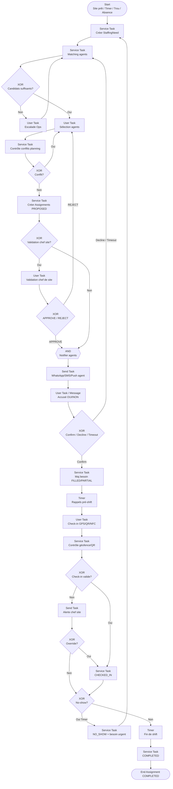

# Processus BPMN 2.0 — Affectation agent

**Identifiant workflow suggéré :** `WF_AFFECTATION_AGENT_V1`  
**Code processus :** `PROC-AFFEC-06`  
**Version :** 1.0  
**Domaine :** Opérations / Planning terrain  
**Marché cible :** Agences de sécurité privée (Afrique de l’Ouest / Afrique centrale)  
**Niveau :** Conception fonctionnelle SaaS (développeurs & product)

---

## 1. Nom du processus

**Affectation agent** — matching compétences / disponibilité / proximité avec un site et un vacation (shift), construction du planning, validation par le chef de site (ou chef de secteur), notification de l’agent et confirmation de prise de poste.

---

## 2. Objectif

Garantir la **couverture opérationnelle** des sites en :

- identifiant les besoins ouverts issus du `GuardPlan` (postes non pourvus) ;
- proposant des agents via un **moteur de matching** (compétences, certifications, distance, historique, fatigue / heures déjà planifiées) ;
- créant des **affectations** et un **planning** cohérent (anti-chevauchement) ;
- obtenant la **validation** du chef de site / secteur ;
- **notifiant** l’agent (WhatsApp/SMS/Push) et recueillant l’accusé ;
- suivant la prise de poste (check-in GPS / QR) au démarrage du shift.

Statuts cibles d’une affectation : `CONFIRMED` puis `IN_PROGRESS` / `COMPLETED`, ou `DECLINED` / `CANCELLED` / `NO_SHOW`.

---

## 3. Déclencheur

| Type | Description |
|------|-------------|
| **Signal Event** `SIG_READY_ASSIGN` | Site passé `OPERATIONAL` (`WF_CREATION_SITE`) |
| **Timer Event** `TMR_PLANNING_CYCLE` | Génération hebdomadaire / mensuelle du planning |
| **Conditional Event** | Détection trou de couverture (`uncoveredShift`) |
| **User Event** | Affectation manuelle par Ops / chef de secteur |
| **Message Event** | Absence / maladie agent → remplacement urgent |

**Payload déclencheur :**

```json
{
  "workflowId": "WF_AFFECTATION_AGENT_V1",
  "trigger": "COND_UNCOVERED_SHIFT",
  "companyId": "uuid",
  "siteId": "uuid",
  "guardPlanShiftId": "uuid",
  "slotStart": "2026-08-21T06:00:00+00:00",
  "slotEnd": "2026-08-21T18:00:00+00:00",
  "requiredHeadcount": 2,
  "requiredSkills": ["GUARDING", "ACCESS_CONTROL"],
  "urgency": "HIGH"
}
```

---

## 4. Acteurs (avec Lanes BPMN)

### Pool : Agence (`POOL_AGENCE`)

| Lane BPMN | Rôle | Responsabilités |
|-----------|------|-----------------|
| `LANE_OPS` | Responsable opérations | Arbitrage couverture, priorités multi-sites |
| `LANE_CHEF_SECTOR` | Chef de secteur | Proposition planning zone |
| `LANE_CHEF_SITE` | Chef de site | Validation finale affectations site |
| `LANE_PLANNING` | Planificateur (si distinct) | Saisie / ajustement planning |
| `LANE_AGENT` | Agent de sécurité | Accusé réception, check-in, exécution |
| `LANE_SYSTEME` | Système | Matching, conflits, notifications, géofence check-in |

### Pool : Client (`POOL_CLIENT`) — optionnel

| Lane | Rôle |
|------|------|
| `LANE_FACILITY` | Facility client | Information nominative agents si clause contractuelle |

### Pool : Externe (`POOL_EXTERNE`)

| Lane | Rôle |
|------|------|
| `LANE_NOTIF` | WhatsApp / SMS / Email / Push | Notifications |
| `LANE_MAPS` | Distance Matrix / géoloc | Calcul proximité |

---

## 5. Préconditions

1. Site en statut `OPERATIONAL` avec `GuardPlan` actif.
2. Au moins un agent `ACTIVE_AVAILABLE` ou `ACTIVE_ASSIGNED` avec capacité horaire restante (selon règles fatigue).
3. Documents CRITICAL de l’agent non expirés.
4. Fenêtre de planning connue (`slotStart`, `slotEnd`) dans la timezone du site.
5. Droits `assignment:create` pour le lanceur ; chef de site désigné (`site.supervisorUserId`) ou fallback chef de secteur.
6. Paramètres matching configurés (`MatchingPolicy` : poids compétences, distance max, repos minimum).

---

## 6. Description détaillée du processus (paragraphes narratifs + pools)

### Vue d’ensemble

Le **Système** matérialise un `StaffingNeed` (besoin de couverture). Il exécute le **matching** : requête agents éligibles, score, liste ordonnée. Le **Planificateur / Chef de secteur** sélectionne les agents (User Task) ou accepte la proposition auto si `autoAssign=true` et score ≥ seuil.

Création des `Assignment` en `PROPOSED`. **XOR** : validation chef de site obligatoire ou non. Après validation (`VALIDATED`), Send Task notifie l’agent. L’agent **confirme** ou **décline** (User Task mobile / WhatsApp quick reply). Si déclin / timeout, boucle de rematching. Un **Timer** avant le shift envoie un rappel. Au démarrage, l’agent fait un **check-in** (GPS dans géofence et/ou scan QR poste). No-show déclenche remplacement urgent (nouveau sous-processus).

Message Flows : notifications agent ; éventuellement information client facility.

### Statuts

**StaffingNeed :** `OPEN` → `PARTIALLY_FILLED` → `FILLED` | `ESCALATED` | `CANCELLED`

**Assignment :** `PROPOSED` → `PENDING_SITE_VALIDATION` → `VALIDATED` → `NOTIFIED` → `CONFIRMED` | `DECLINED` → `CHECKED_IN` → `COMPLETED` / `NO_SHOW` / `CANCELLED`

### IDs d’activités suggérés

| ID | Activité |
|----|----------|
| `ST_CREATE_NEED` | Créer besoin |
| `ST_RUN_MATCHING` | Moteur matching |
| `UT_SELECT_AGENTS` | Sélection humaine |
| `ST_CREATE_ASSIGNMENTS` | Créer affectations |
| `GW_SITE_VALIDATION_REQUIRED` | Validation chef site ? |
| `UT_VALIDATE_SITE` | Validation chef de site |
| `ST_NOTIFY_AGENT` | Notification agent |
| `UT_AGENT_ACK` | Confirmation agent |
| `TMR_ACK_SLA` | Timeout accusé |
| `TMR_SHIFT_REMINDER` | Rappel pré-shift |
| `UT_CHECKIN` | Prise de poste |
| `ST_GEOFENCE_CHECK` | Contrôle GPS |
| `GW_NOSHOW` | No-show ? |
| `ST_CLOSE_ASSIGNMENT` | Clôture |

---

## 7. Tableau des étapes

| N° | Activité | Responsable | Type BPMN | Entrées | Sorties |
|----|----------|-------------|-----------|---------|---------|
| 1 | Créer besoin de couverture | Système | Service Task | Site, shift, effectif | `StaffingNeed` `OPEN` |
| 2 | Exécuter matching | Système | Service Task | Policy, agents, distance | `MatchCandidate[]` scorés |
| 3 | Gateway candidats suffisants ? | Système | XOR | Count vs required | Oui / Non |
| 4 | Escalade Ops | Système + Ops | Send + User Task | Besoin critique | Élargir critères / heures sup |
| 5 | Sélectionner agents | Chef secteur / Planning | User Task | Liste matchée | Agents retenus |
| 6 | Contrôler conflits planning | Système | Service Task | Planning existant | OK / conflits |
| 7 | Créer affectations PROPOSED | Système | Service Task | Sélection | `Assignment[]` |
| 8 | Gateway valid. chef site ? | Système | XOR | Paramètre site | Oui / Non |
| 9 | Valider affectations | Chef de site | User Task | Détails agents | APPROVE / REJECT |
| 10 | Notifier agents | Système | Send Task | Template planning | WhatsApp/SMS/Push |
| 11 | Accuser réception | Agent | User Task / Message | Proposition | CONFIRM / DECLINE |
| 12 | Gateway timeout ack ? | Système | XOR + Timer | SLA ack | Relance / rematch |
| 13 | Mettre à jour besoin | Système | Service Task | Confirmations | FILLED / PARTIAL |
| 14 | Rappel pré-prise de poste | Système | Timer + Send | T-2h / T-30min | Notif agent |
| 15 | Check-in prise de poste | Agent | User Task | GPS / QR / NFC | `CHECKED_IN` |
| 16 | Contrôle géofence / QR | Système | Service Task | Position, scan | Valid / Invalid |
| 17 | Gateway no-show | Système | XOR + Timer | Absence à T+grace | Remplacement |
| 18 | Informer client si requis | Système | Send Task | Noms agents | Message facility |
| 19 | Clôturer shift | Système | Service Task / Timer fin | Assignment | `COMPLETED` |
| 20 | Feedback express (opt.) | Chef site | User Task | Note qualité | Score agent |

---

## 8. Liste des décisions (Gateways XOR/AND)

### XOR `GW_CANDIDATES_OK`

- **Oui :** `eligibleCount >= requiredHeadcount` (après filtres durs).
- **Non :** élargir rayon / skills optionnels **ou** escalade Ops **ou** ouvrir vacation intérim / heures sup.

### XOR `GW_PLANNING_CONFLICT`

- **Conflit :** chevauchement horaire, repos min non respecté, double site → imposer autre agent.
- **OK :** créer assignment.

### XOR `GW_SITE_VALIDATION_REQUIRED`

- **Oui si :** `site.requireSupervisorValidation=true` **OU** urgence HIGH **OU** agent nouveau sur site.
- **Non :** passage direct notification.

### XOR `GW_SUPERVISOR_DECISION`

- **APPROVE :** → notification.
- **REJECT :** motif + retour sélection (blacklist temporaire agent/site optionnelle).

### XOR `GW_AGENT_RESPONSE`

- **CONFIRM :** `CONFIRMED`.
- **DECLINE :** motif + rematch pour le slot.
- **NO_ACK** après `ackSlaMinutes` : relance puis treat as DECLINE soft.

### AND `GW_MULTI_AGENT_NOTIFY`

- Notification parallèle de tous les agents du même need (fork/join sur acks).

### XOR `GW_CHECKIN_VALID`

- **Oui :** dans géofence **ou** QR/NFC poste valide dans fenêtre [start−δ, start+grace].
- **Non :** check-in rejeté ; alerte chef site ; possibilité override manuel.

### XOR `GW_NOSHOW`

- **No-show :** pas de check-in à `start+grace` → `NO_SHOW` + nouveau besoin urgent.
- **OK :** flux normal.

---

## 9. Gestion des exceptions

| Exception | Code | Traitement | Issue |
|-----------|------|------------|-------|
| Aucun agent éligible | `ERR_NO_CANDIDATE` | Escalade | `StaffingNeed.ESCALATED` |
| Conflit optimistic planning | `ERR_CONFLICT` | Retry | Resélection |
| Agent docs expirés entre-temps | `COND_DOC` | Avant notif | Retrait candidat |
| Échec notification | `ERR_NOTIF` | Retry + canal fallback | SMS si WhatsApp down |
| Check-in hors zone | `ERR_GEOFENCE` | Reject + alerte | Override chef site |
| Annulation client site | `MSG_SITE_CLOSED` | Interrupt | Cancel assignments |
| Agent malade J-1 | `MSG_AGENT_SICK` | Message | Remplacement urgent |
| Timer fin de shift | `TMR_SHIFT_END` | Auto | `COMPLETED` si checked-in |

---

## 10. Données manipulées (entités + attributs clés)

| Entité | Attributs clés |
|--------|----------------|
| `StaffingNeed` | `id`, `siteId`, `shiftId`, `slotStart`, `slotEnd`, `requiredHeadcount`, `requiredSkills[]`, `urgency`, `status`, `filledCount` |
| `MatchCandidate` | `agentId`, `score`, `scoreBreakdown` (skills, distanceKm, fatigue, siteFamiliarity), `rank` |
| `Assignment` | `id`, `needId`, `siteId`, `agentId`, `slotStart`, `slotEnd`, `status`, `validatedBy`, `confirmedAt`, `checkInAt`, `checkInMethod`, `declineReason` |
| `PlanningLock` | `agentId`, `slotStart`, `slotEnd`, `assignmentId` (anti-chevauchement) |
| `CheckInEvent` | `assignmentId`, `geoLat`, `geoLng`, `accuracyM`, `qrPayload`, `nfcUid`, `result` |
| `MatchingPolicy` | `maxDistanceKm`, `minRestHours`, `maxHoursPerWeek`, `weights{}`, `autoAssignThreshold` |
| `AgentAvailability` | `agentId`, `blackoutPeriods[]`, `preferredZones[]` |

---

## 11. Notifications envoyées (WhatsApp/SMS/Email/Push)

| Événement | Canal(x) | Destinataires |
|-----------|----------|---------------|
| Nouveau besoin urgent | Push + WhatsApp | Chef secteur / Ops |
| Affectation à valider | Push | Chef de site |
| Proposition de vacation | WhatsApp + SMS + Push | Agent |
| Relance accusé | WhatsApp / SMS | Agent |
| Rappel T-2h / T-30min | Push + WhatsApp | Agent |
| Check-in OK | Push | Chef de site (digest) |
| No-show / check-in KO | WhatsApp + SMS + Push | Chef site + Ops |
| Planning confirmé (opt.) | Email / WhatsApp | Facility client |
| Escalade non couverture | WhatsApp + Email | Ops / DG ops |

**Exemple corps WhatsApp agent :**

> Bonjour {prenom}, vacation confirmée le {date} de {heureDebut} à {heureFin} — Site {siteName}. Répondez OUI pour confirmer ou NON pour décliner. Détails : {deepLink}

---

## 12. KPI du processus

| KPI | Définition | Cible |
|-----|------------|-------|
| Taux de couverture shifts | filled / required (heures) | ≥ 98 % |
| Délai besoin → CONFIRMED | | ≤ 4 h (standard), ≤ 30 min (urgent) |
| Taux acceptation agent | CONFIRM / NOTIFIED | ≥ 80 % |
| Taux no-show | NO_SHOW / CONFIRMED | ≤ 3 % |
| Ponctualité check-in | check-in ≤ start+grace | ≥ 95 % |
| Distance moyenne domicile-site | km | Monitoring coût / fatigue |
| % auto-assign acceptés | | Croissant si qualité matching |

---

## 13. Recommandations d’amélioration

1. Matching multi-objectifs (coût transport, équité heures, familiarité site).
2. Bourse de vacations (agents volontaires push sur créneaux ouverts).
3. Prédiction absences (historique no-show / maladie).
4. Mode offline de consultation du planning agent.
5. Remplacement en 1 clic depuis alerte no-show.
6. Carte chaleur couverture réseau de sites pour Ops.

---

## 14. Diagramme BPMN ASCII

```
[Start: Site prêt / Timer planning / Trou / Manuel / Absence]
                        |
                        v
              +-------------------+
              | ST: StaffingNeed  |
              |      OPEN         |
              +-------------------+
                        |
                        v
              +-------------------+
              | ST: Matching      |
              | scores agents     |
              +-------------------+
                        |
                <> XOR: Assez de candidats ?
                 /                        \
               Non                         Oui
                |                           |
                v                           |
       +----------------+                   |
       | Escalade Ops   |                   |
       | élargir / HS   |                   |
       +----------------+                   |
                |                           |
                +-------------+-------------+
                              |
                              v
                     +----------------+
                     | UT: Sélection  |
                     | agents         |
                     +----------------+
                              |
                              v
                     +----------------+
                     | ST: Conflits   |
                     | planning       |
                     +----------------+
                              |
                      <> XOR: Conflit ?
                       /              \
                     Oui               Non
                      |                 |
                      v                 |
               Retour sélection         v
                               +----------------+
                               | ST: Assignments|
                               | PROPOSED       |
                               +----------------+
                                        |
                                <> XOR: Valid. chef site ?
                                 /                      \
                               Oui                       Non
                                |                         |
                                v                         |
                       +----------------+                 |
                       | UT: Chef site  |                 |
                       | APPROVE/REJECT |                 |
                       +----------------+                 |
                          /           \                   |
                     REJECT         APPROVE               |
                        |              |                   |
                        v              +---------+---------+
                  Retour sélection               |
                                                 v
                                        +----------------+
                                        | AND: Notifier  |
                                        | chaque agent   |
                                        +----------------+
                                                 |
                                                 v
                                        +----------------+
                                        | UT/MSG: Ack    |
                                        | OUI / NON      |
                                        +----------------+
                                                 |
                                   <> XOR: Confirm / Decline / Timeout
                                    /         |          \
                               CONFIRM     DECLINE     TIMEOUT
                                  |           |           |
                                  v           v           v
                           Besoin MAJ    Rematch     Relance puis
                           FILLED/PART   slot        rematch
                                  |
                                  v
                           +--------------+
                           | TMR: Rappels |
                           | pré-shift    |
                           +--------------+
                                  |
                                  v
                           +--------------+
                           | UT: Check-in |
                           | GPS/QR/NFC   |
                           +--------------+
                                  |
                          <> XOR: Check-in valide ?
                           /                    \
                         Non                     Oui
                          |                       |
                          v                       v
                   Alerte + override      +---------------+
                   possible               | En poste      |
                                          +---------------+
                                                  |
                                          <> XOR: No-show timer ?
                                           /                  \
                                      No-show                  OK
                                         |                      |
                                         v                      v
                                  Remplacement           TMR fin shift
                                  urgent                 COMPLETED
```

---

## 15. Diagramme Mermaid



---

## Compléments conception SaaS

### Règles métier

- Un agent ne peut pas avoir deux `Assignment` chevauchants (`PlanningLock`).
- Repos minimum entre shifts : `minRestHours` (ex. 8 h) sauf dérogation Ops auditée.
- Documents CRITICAL expirés → exclusion matching.
- Skills : filtres durs (`requiredSkills`) vs souples (bonus score).
- `autoAssign` seulement si meilleur score ≥ `autoAssignThreshold` et pas de conflit.
- Remplacement urgent hérite de l’`urgency=CRITICAL` et SLA ack réduit.

### Validations

- `slotEnd > slotStart` ; durée ≤ max shift (ex. 12 h) sauf paramètre événement.
- Agent `companyId` compatible (ou groupe selon scope).
- Check-in : précision GPS ≤ seuil **ou** preuve QR/NFC.
- Confirmation agent dans la fenêtre ; après timeout, slot libérable.

### Contrôles automatiques

- Job détection trous de couverture (comparaison GuardPlan vs Assignments CONFIRMED).
- Anti-fatigue : plafond heures semaine / mois.
- Alertes no-show automatiques.
- Recalcul distance via API Maps (cache).

### Risques opérationnels

- Sur-affectation des « bons » agents → burn-out.
- Faux check-in (GPS spoof) → mitiger par QR/NFC + contrôles aléatoires.
- Non-réponse WhatsApp → canaux fallback.
- Validation chef site goulot d’étranglement.
- Conflits sociaux si planning opaque.

### Possibilités d’automatisation

- Auto-assign + confirmation tacite (paramètre) pour vacations récurrentes.
- Rematch instantané au DECLINE.
- Optimisation planning hebdo (solveur contraintes).
- Suggestion covoiturage / agents du même quartier.

### Intégrations

| Intégration | Usage |
|-------------|--------|
| **WhatsApp / SMS / Push** | Proposition, ack, rappels, no-show |
| **Email** | Planning semaine, info client |
| **GPS** | Distance matching, check-in, géofence |
| **QR Code / NFC** | Preuve de présence poste / checkpoint lié |
| **API Maps** | Distance Matrix, ETA |
| **IA** | Prédiction acceptation, détection anomalies présence |
| **API** | Paie (heures planifiées/réalisées), Ops dashboards |

**Payload notification affectation :**

```json
{
  "templateId": "ASSIGNMENT_PROPOSAL",
  "channel": ["WHATSAPP", "PUSH", "SMS"],
  "assignmentId": "uuid",
  "toUserId": "uuid-agent",
  "variables": {
    "siteName": "Entrepôt Vridi — Quai 3",
    "slotStartLocal": "21/08/2026 06:00",
    "slotEndLocal": "21/08/2026 18:00",
    "deepLink": "/agent/assignments/uuid",
    "ackSlaMinutes": 60
  }
}
```

**Payload check-in :**

```json
{
  "assignmentId": "uuid",
  "method": "GPS_QR",
  "geoLat": 5.256,
  "geoLng": -3.996,
  "accuracyM": 12,
  "qrPayload": "CHK:siteId:poste-entree:sig",
  "capturedAt": "2026-08-21T05:58:00Z"
}
```
