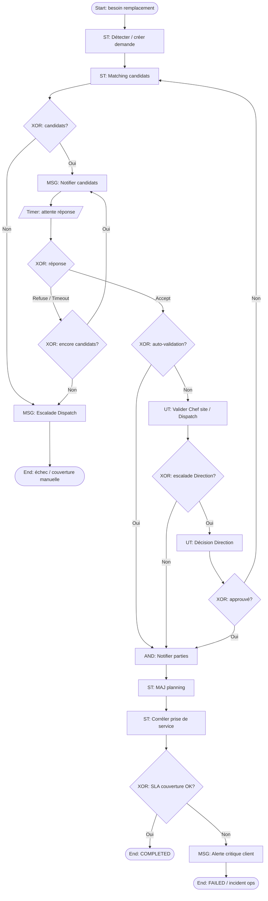

# 07 – Remplacement d’agent

**ID workflow :** `ops.remplacement-agent.v1`  
**Pool :** Agence de sécurité privée  
**Version :** 1.0  
**Domaine :** Opérations / Dispatch

---

## 1. Nom du processus

Remplacement d’agent (absence, retard, indisponibilité soudaine)

## 2. Objectif

Assurer la continuité du service de sécurité sur un poste / site lorsqu’un agent affecté est absent, en retard au-delà du seuil SLA, ou déclaré indisponible, en identifiant rapidement un remplaçant éligible, en validant le remplacement, en notifiant les parties prenantes et en mettant à jour le planning opérationnel.

## 3. Déclencheur

| Type | Description |
|------|-------------|
| **Message** | Signal d’absence validée (`absence.approved`) ou d’indisponibilité agent |
| **Timer / Signal** | Retard de prise de service dépassant le seuil configurable (ex. 15 min après heure planifiée) |
| **Manuel** | Demande de remplacement initiée par le Chef de site ou le Dispatch |
| **Service** | Détection automatique d’un trou de couverture (planning vs pointage) |

**Start Event :** `MessageStart` / `TimerStart` / `ManualStart` selon le cas.

## 4. Acteurs (Lanes)

| Lane | Responsabilités |
|------|-----------------|
| **Agent absent / concerné** | Signale l’indisponibilité si possible ; confirme réception du remplacement |
| **Opérations / Dispatch** | Recherche, propose et affecte le remplaçant ; pilote le SLA |
| **Chef de site** | Valide l’adéquation terrain (compétences, arme, site sensible) |
| **Agent remplaçant** | Accepte / refuse la mission ; se prépare à la prise de service |
| **Direction / Pilotage** | Validation exceptionnelle (heures supp., site VIP, coût majoré) |
| **Système** | Matching candidats, notifications, mise à jour planning, audit |

**Pools externes (Message Flow) :** Client site (notification couverture), éventuellement Autorité (poste réglementé).

## 5. Préconditions

- Contrat client et poste actifs (`siteId`, `postId`, `shiftId`).
- Affectation initiale existante pour le créneau concerné.
- Catalogue agents avec compétences, certifications, disponibilité, distance GPS, historique.
- Paramètres SLA remplacement configurés (délai max couverture, rayon géographique, overtime).
- Canaux de notification opérationnels (WhatsApp / SMS / Push).
- Agent déclencheur non déjà remplacé sur le même créneau (idempotence).

## 6. Description détaillée

1. **Détection du besoin** : le Système ou un acteur humain constate une absence de couverture (absence validée, non-pointage, appel du chef de site).
2. **Création dossier remplacement** : enregistrement `ReplacementRequest` lié au shift, motif, criticité du site, heure limite de couverture.
3. **Recherche candidats** : Service Task de matching (compétences, badge/autorisation site, repos légal, distance, charge horaire, note qualité).
4. **Proposition / relance** : envoi séquentiel ou parallèle (paramétrable) aux candidats ; Timer d’attente de réponse.
5. **Acceptation** : le premier agent éligible qui accepte est réservé ; les autres propositions sont annulées (XOR).
6. **Validation** : Chef de site (ou auto-validation si règles OK) ; escalade Direction si coût / site VIP.
7. **Notifications** : agent remplacé (si applicable), remplaçant, chef de site, client (si contrat le prévoit).
8. **Mise à jour planning** : réaffectation shift, historique, impact paie / heures.
9. **Suivi jusqu’à prise de service** : corrélation avec processus `08-prise-de-service` ; alerte si le remplaçant ne pointe pas.

## 7. Tableau des activités

| N° | Activité | Responsable | Type BPMN | Entrées | Sorties |
|----|----------|-------------|-----------|---------|---------|
| 1 | Détecter besoin de remplacement | Système / Chef de site | Service Task / User Task | Shift, pointage, absence | Événement `replacement.needed` |
| 2 | Créer demande de remplacement | Système | Service Task | Motif, shiftId, criticité | `ReplacementRequest` (DRAFT→PENDING) |
| 3 | Calculer liste candidats | Système | Service Task | Compétences, GPS, dispos | Liste scorée candidats |
| 4 | Notifier candidats | Système | Intermediate Message | Candidats, créneau | Messages WhatsApp/SMS/Push |
| 5 | Attendre réponse | Système | Intermediate Timer | SLA réponse (ex. 5–10 min) | Timeout ou acceptation |
| 6 | Accepter / refuser mission | Agent remplaçant | User Task | Proposition | Acceptation / refus |
| 7 | Valider remplacement | Chef de site / Dispatch | User Task / XOR | Candidat, contraintes site | APPROVED / REJECTED |
| 8 | Escalader si VIP / overtime | Direction | User Task | Dossier + coût | Décision exception |
| 9 | Notifier parties prenantes | Système | Intermediate Message | Remplacement validé | Accusés notification |
| 10 | Mettre à jour planning | Système | Service Task | Affectation nouvelle | Shift réaffecté, audit |
| 11 | Corréler prise de service | Système | Service Task | shiftId, agentId | Lien processus 08 |
| 12 | Clôturer dossier | Système | Service Task | Statut final | `COMPLETED` / `FAILED` |

## 8. Décisions (Gateways)

| Gateway | Type | Condition | Sorties |
|---------|------|-----------|---------|
| GW1 – Source du besoin | XOR | Absence vs retard vs manuel | Branches initiation |
| GW2 – Candidats trouvés ? | XOR | `candidates.length > 0` | Oui → proposition ; Non → escalade manuelle |
| GW3 – Réponse agent | XOR | Accept / Refuse / Timeout | Accept → validation ; sinon relance suivant |
| GW4 – Auto-validation possible ? | XOR | Règles site + compétences OK | Auto-approve / validation humaine |
| GW5 – Escalade Direction ? | XOR | Site VIP, overtime >, coût > seuil | Oui / Non |
| GW6 – Couverture assurée avant SLA ? | XOR | `now < coverageDeadline` | OK clôture ; sinon alerte critique |
| GW7 – Relances restantes ? | XOR | File candidats non vide | Relance / échec couverture |

**AND (optionnel) :** notification parallèle Agent + Chef de site + Client après validation.

## 9. Gestion des exceptions

| Exception | Boundary / Event | Traitement |
|-----------|------------------|------------|
| Aucun candidat disponible | Error End / Escalation | Alerte Dispatch + Direction ; proposition agent en repos avec majoration ; éventuelle demande client report |
| Tous refus / timeouts | Timer boundary | Élargir rayon / assouplir critères ; appel manuel |
| Remplaçant annule après acceptation | Message compensation | Relancer processus ; compensation planning |
| Double affectation concurrente | Error technique | Verrou optimiste sur `shiftId` ; rollback |
| Client refuse le profil | Message | Nouvelle recherche avec contraintes client |
| Connectivité agent faible | Fallback | SMS + appel IVR ; confirmation vocale loguée |
| Dépassement SLA couverture | Escalation | Incident opérationnel lié ; notification client obligatoire |

## 10. Données manipulées

| Data Object / Store | Description |
|---------------------|-------------|
| `ReplacementRequest` | id, shiftId, siteId, motif, criticité, deadline, statut |
| `Shift` / `Assignment` | Affectation agent → poste / créneau |
| `AgentProfile` | compétences, certifications, repos, rating |
| `CandidateScore` | score matching, distanceKm, overtimeRisk |
| `NotificationLog` | canal, destinataire, template, statut livraison |
| `AuditLog` | qui / quand / décision |
| `ClientContractRules` | obligation d’informer le client, profils autorisés |

## 11. Notifications

| Destinataire | Canal | Moment | Contenu type |
|--------------|-------|--------|--------------|
| Candidats | WhatsApp / SMS / Push | Proposition | Créneau, site, prime éventuelle, bouton Accepter |
| Dispatch | Push / WhatsApp | Timeout / échec | Escalade couverture |
| Chef de site | WhatsApp / Push | Validation requise / confirmée | Identité remplaçant, ETA |
| Agent remplacé | SMS | Si applicable | Confirmation prise en charge |
| Client (si prévu) | WhatsApp / Email | Après validation | Maintien couverture, nom badge si autorisé |
| Direction | Push / Email | Escalade VIP | Coût et justification |

## 12. KPI

| KPI | Cible indicative | Mesure |
|-----|------------------|--------|
| Temps moyen de couverture (MTTC) | < 30 min (urbain) | `validatedAt - neededAt` |
| Taux de couverture avant début shift | ≥ 95 % | Remplacements OK / total besoins |
| Taux d’acceptation 1ʳᵉ proposition | ≥ 60 % | Accept / propositions |
| Taux d’échec couverture | < 2 % | FAILED / total |
| Satisfaction chef de site | ≥ 4/5 | Feedback post-shift |
| Coût moyen overtime remplacement | Suivi mensuel | Paie liée |

## 13. Recommandations d’amélioration

- Pool de « volants » pré-qualifiés par zone géographique.
- Scoring IA prédictif (probabilité d’acceptation selon historique et distance).
- Mode offline : file d’attente SMS pour zones à faible data.
- Contrats cadres de disponibilité (astreinte payée).
- Simulation « what-if » avant validation overtime.
- Lien automatique avec processus Absences (12) et Pointage (09).

## 14. Diagramme BPMN ASCII

```
POOL: Agence de sécurité
═══════════════════════════════════════════════════════════════════════════════

Lane SYSTÈME
  (o)──►[ST Détecter besoin]──►[ST Créer demande]──►[ST Matching candidats]
         │                                              │
         │                                         ◇ GW2 candidats?
         │                                         │oui          │non
         │                                         ▼             ▼
         │                              [MSG Notifier candidats] [MSG Escalade]
         │                                         │
         │                                    ⏱ Timer réponse
         │                                         │
Lane AGENT REMPLAÇANT
         │                              [UT Accepter/Refuser]──►◇ GW3
         │                                         accept│  refus/timeout
         │                                               │       │
Lane CHEF SITE / DISPATCH                                ▼       └──► (relance)
         │                              [UT Valider]──►◇ GW4/GW5
         │                                      approve│    reject/escalade
         │                                             ▼
Lane DIRECTION (si besoin)
         │                              [UT Décision exception]
         │                                             │
Lane SYSTÈME                                           ▼
         │                    ┌──────── AND ────────┐
         │                    ▼          ▼          ▼
         │              [MSG Agent] [MSG Site] [MSG Client?]
         │                    └──────────┬──────────┘
         │                               ▼
         │                    [ST MAJ Planning]──►[ST Corréler PDS]
         │                               │
         │                          ◇ GW6 SLA OK?
         │                         oui│        │non
         │                            ▼        ▼
         │                         (●) OK   [MSG Alerte]──►(●) FAILED
═══════════════════════════════════════════════════════════════════════════════
Légende: (o) Start  (●) End  [UT] User Task  [ST] Service Task  [MSG] Message
         ⏱ Timer  ◇ XOR  AND Parallel
```

## 15. Diagramme Mermaid flowchart TB



---

## Compléments conception SaaS

### Règles métier

- Un shift ne peut avoir qu’un agent principal actif à la fois (contrainte unique `shiftId` + statut `ACTIVE`).
- Respect du repos minimum légal / interne avant proposition (configurable par pays).
- Priorité : même site > même zone > même compétences critiques (arme, cynophile, VIP).
- Sites sensibles : validation Chef de site obligatoire, même si matching parfait.
- Remplacement anticipé (absence planifiée) vs urgence (retard) : SLA et canaux distincts.

### Validations

- Zod / DTO : `motif` enum, `deadline` > `now`, `agentId` ≠ agent remplacé, compétences requises présentes.
- Vérifier certificats non expirés à la date du shift.
- Géofence optionnelle : distance max au site pour proposition.

### Contrôles automatiques

- Job périodique : shifts sans check-in après T+seuil → `replacement.needed`.
- Verrou Redis/DB sur réservation candidat (anti double-booking).
- Annulation auto des propositions concurrentes dès première acceptation validée.

### Risques

| Risque | Mitigation |
|--------|------------|
| Poste découvert | Astreinte + élargissement critères + alerte client |
| Fraude acceptation puis no-show | Pénalité score + relance + corrélation PDS |
| Surcoût overtime | Seuils + validation Direction |
| Notification non livrée | Fallback SMS → IVR |

### Automatisation

- Worker matching + ranking.
- Timers Camunda / scheduler pour relances.
- Webhooks vers processus Prise de service et Absences.

### Intégrations

| Intégration | Usage |
|-------------|-------|
| **WhatsApp / SMS** | Propositions, confirmations, escalades |
| **Email** | Synthèse quotidienne remplacements |
| **GPS** | Distance agent–site pour scoring |
| **QR / NFC** | Non direct ; corrélé à la prise de service du remplaçant |
| **API** | Cartographie, RH disponibilité, paie heures supp. |
| **IA** | Prédiction acceptation, suggestion pool volants, détection patterns absences récurrentes |
| **Push** | Alertes Dispatch temps réel |
