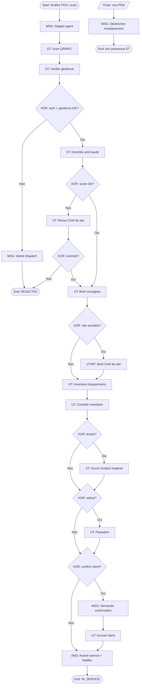

# 08 – Prise de service

**ID workflow :** `ops.prise-de-service.v1`  
**Pool :** Agence de sécurité privée  
**Version :** 1.0  
**Domaine :** Opérations terrain / Chef de site

---

## 1. Nom du processus

Prise de service (arrivée site, authentification, brief, inventaire, confirmation)

## 2. Objectif

Garantir qu’un agent affecté démarre son service de façon conforme : présence vérifiée sur site (QR/NFC/GPS), brief reçu, inventaire des équipements effectué, consignes client prises en compte, et confirmation enregistrée pour la traçabilité contractuelle et la paie.

## 3. Déclencheur

| Type | Description |
|------|-------------|
| **Timer** | Ouverture de la fenêtre de prise de service (ex. H-30 min avant début de shift) |
| **Message** | Agent arrive et scanne QR/NFC site ou poste |
| **Manuel** | Chef de site démarre la PDS pour un agent (mode dégradé) |

**Start Event :** `TimerStart` (fenêtre) + `MessageStart` (scan agent) corrélés sur `shiftId`.

## 4. Acteurs (Lanes)

| Lane | Responsabilités |
|------|-----------------|
| **Agent de sécurité** | Arrivée, scan, brief, inventaire, signature confirmation |
| **Chef de site** | Brief oral/écrit, contrôle inventaire, validation PDS, mode dégradé |
| **Opérations / Dispatch** | Supervision multi-sites, relance si non-PDS |
| **Client (pool externe)** | Accusé réception / signature consignes si prévu au contrat |
| **Système** | Géofence, validation QR/NFC, timers, notifications, journal |

## 5. Préconditions

- Shift et affectation actifs (`agentId`, `siteId`, `postId`, `shiftId`).
- Site paramétré : points QR/NFC, géofence, liste équipements, checklist brief.
- Agent authentifié sur l’app mobile (token session).
- Fenêtre temporelle PDS ouverte (configurable : H-30 / H+15).
- Équipements du poste inventoriés en référence (armement, radio, lampes, registres, etc.).

## 6. Description détaillée

1. **Ouverture fenêtre** : le Système active le shift pour PDS et envoie un rappel à l’agent.
2. **Arrivée & authentification** : l’agent scanne le QR/NFC du site ou du poste ; le Système vérifie la géofence GPS et l’identité.
3. **Contrôle anti-fraude** : photo selfie optionnelle, liveness, cohérence deviceId.
4. **Brief** : consultation des consignes du jour (User Task) ; validation lecture ; brief oral Chef de site si site sensible.
5. **Inventaire équipements** : checklist items (OK / manquant / endommagé) avec photo si anomalie.
6. **Passation** : si relève, échange avec agent sortant (ack bilatéral).
7. **Confirmation client** : si règle contrat, notification / signature électronique client ou gardiennage réception.
8. **Clôture PDS** : statut shift `IN_SERVICE` ; corrélation pointage check-in ; fin processus.

En cas d’échec authentification ou hors géofence : rejet + alerte Dispatch ; éventuel déclenchement Remplacement (07).

## 7. Tableau des activités

| N° | Activité | Responsable | Type BPMN | Entrées | Sorties |
|----|----------|-------------|-----------|---------|---------|
| 1 | Ouvrir fenêtre PDS | Système | Intermediate Timer / Service Task | Shift planifié | `PDS_WINDOW_OPEN` |
| 2 | Rappeler agent | Système | Intermediate Message | Agent, horaires | WhatsApp/SMS/Push |
| 3 | Scanner QR/NFC site | Agent | User Task | Token site, device | Scan event |
| 4 | Vérifier GPS / géofence | Système | Service Task | Lat/Lng, site fence | OK / HORS_ZONE |
| 5 | Contrôle anti-fraude | Système | Service Task | Selfie, deviceId | Score fraude |
| 6 | Lire / valider brief | Agent | User Task | Consignes jour | Ack brief |
| 7 | Brief oral site sensible | Chef de site | Manual Task / User Task | Consignes VIP | BriefSigné |
| 8 | Inventorier équipements | Agent | User Task | Checklist équipements | Inventaire + photos |
| 9 | Contrôler inventaire | Chef de site | User Task | Inventaire agent | Validé / écarts |
| 10 | Passation relève | Agent entrant / sortant | User Task | État poste | Double ack |
| 11 | Confirmer auprès client | Système / Client | Intermediate Message / User Task | Règles contrat | Confirmation client |
| 12 | Activer service | Système | Service Task | PDS complète | Shift `IN_SERVICE` |
| 13 | Relancer si retard PDS | Système | Intermediate Timer | Seuil non-scan | Alerte / remplacement |

## 8. Décisions (Gateways)

| Gateway | Type | Condition | Sorties |
|---------|------|-----------|---------|
| GW1 – Authentification OK ? | XOR | QR/NFC valide + agent = affecté | Oui / Non (rejet) |
| GW2 – Dans géofence ? | XOR | Distance ≤ rayon + précision GPS | Oui / Hors zone (retry ou override) |
| GW3 – Score fraude acceptable ? | XOR | score < seuil | Oui / Revue Chef de site |
| GW4 – Site sensible ? | XOR | flag `sensitiveSite` | Brief oral obligatoire / brief app seul |
| GW5 – Écarts inventaire ? | XOR | items manquants/endommagés | Incident matériel + poursuite / OK |
| GW6 – Relève en cours ? | XOR | Agent sortant encore present | Passation / PDS solo |
| GW7 – Confirmation client requise ? | XOR | Règle contrat | Message client / skip |
| GW8 – Override Chef de site ? | XOR | Mode dégradé autorisé | PDS manuelle / refus |

**AND :** après inventaire OK → (activer service) **et** (notifier Dispatch) en parallèle.

## 9. Gestion des exceptions

| Exception | Traitement |
|-----------|------------|
| QR/NFC illisible / tag HS | Saisie code secours + photo façade + validation Chef de site |
| GPS imprécis (indoor) | Tolérance élargie + Wi-Fi/cell ; override supervisé |
| Agent non affecté scanne | Rejet + log sécurité |
| Brief non lu avant timeout | Blocage activation service |
| Équipement critique manquant | Ouverture incident matériel ; décision poursuivre ou remplacer |
| Client injoignable | Timer + preuve tentative ; PDS quand même si règle « best effort » |
| No-show agent | Timer → processus Remplacement (07) |
| App offline | File locale chiffrée ; sync dès réseau ; marquage `SYNC_PENDING` |

## 10. Données manipulées

| Data Object | Description |
|-------------|-------------|
| `ServiceTakeover` | id, shiftId, startedAt, method (QR/NFC/GPS/MANUAL), statut |
| `GeoCheck` | coords, accuracy, insideFence |
| `BriefAck` | version consignes, timestamp, agentId |
| `EquipmentInventory` | items[], photos[], écarts |
| `HandoverRecord` | agentOut, agentIn, remarks |
| `ClientConfirmation` | canal, signedAt, signataire |
| `FraudCheck` | score, signals |
| `Shift` | statut `IN_SERVICE` |

## 11. Notifications

| Destinataire | Canal | Moment | Contenu |
|--------------|-------|--------|---------|
| Agent | Push / WhatsApp | H-30, H-10 | Rappel PDS + lien deep-link |
| Chef de site | Push | Scan reçu / écart inventaire | Détail agent & poste |
| Dispatch | Push / WhatsApp | Non-PDS à H+seuil | Risque trou de couverture |
| Client | WhatsApp / Email | Si requis | Confirmation présence agent |
| RH / Paie | Event interne | PDS OK | Base heures |

## 12. KPI

| KPI | Cible | Mesure |
|-----|-------|--------|
| Taux PDS conforme à l’heure | ≥ 98 % | PDS dans fenêtre / shifts |
| Délai moyen PDS (scan → IN_SERVICE) | < 10 min | Timestamps |
| Taux override manuel | < 5 % | MANUAL / total PDS |
| Taux écarts inventaire | Suivi | Écarts / inventaires |
| Taux fraude suspecte | < 1 % | Reviews / PDS |
| Taux sync offline réussie | ≥ 99 % | SYNC_PENDING résolus |

## 13. Recommandations d’amélioration

- Checklists dynamiques par type de poste (accès, banque, chantier, résidence).
- Brief multimédia (audio/vidéo courte) pour agents peu alphabétisés.
- Jumeau numérique inventaire (NFC sur chaque équipement critique).
- Mode « PDS express » pour postes basiques vs « PDS renforcée » VIP.
- Tableau de bord temps réel multi-sites pour le Dispatch.

## 14. Diagramme BPMN ASCII

```
POOL: Agence                          ║  POOL: Client (externe)
══════════════════════════════════════╬══════════════════════════
Lane SYSTÈME                          ║
  (o)⏱ Fenêtre PDS──►[MSG Rappel]     ║
         │                            ║
Lane AGENT                            ║
         ▼                            ║
  [UT Scan QR/NFC]──►[ST Géofence]──◇ GW1/GW2
         │                    OK│  KO│
         ▼                      │    └──►[MSG Alerte]──►(●) Reject
  [ST Anti-fraude]──◇ GW3       │
         │OK                    │
         ▼                      │
  [UT Brief app]──◇ GW4 site sensible?
         │non          │oui
         │             ▼
         │      [MT/UT Brief Chef site]
         ▼             │
         └──────►──────┘
                 │
          [UT Inventaire]──►[UT Contrôle Chef]──◇ GW5 écarts?
                 │                         oui│    │non
                 │                            ▼    │
                 │                   [ST Incident mat.]│
                 ▼◄──────────────────────────────────┘
          ◇ GW6 Relève?──oui──►[UT Passation double ack]
                 │non                │
                 └──────────►────────┘
                 │
          ◇ GW7 Client?──oui──►[MSG Confirm]══════►[UT Accusé Client]
                 │non                │                    │
                 └──────────►────────┴◄───────────────────┘
                 ▼
        ┌────── AND ──────┐
        ▼                 ▼
  [ST Activer IN_SERVICE] [MSG Dispatch]
        │
       (●) PDS OK

Timer parallèle: ⏱ H+seuil sans scan ──► [MSG Remplacement] ──► Lien processus 07
```

## 15. Diagramme Mermaid flowchart TB



---

## Compléments conception SaaS

### Règles métier

- PDS obligatoire avant toute ronde ou déclaration « en service ».
- Un seul `ServiceTakeover` SUCCESS par shift.
- Override manuel réservé Chef de site / Dispatch avec motif obligatoire.
- Équipements marqués `CRITICAL` bloquent ou alertent selon paramètre site.

### Validations

- Tag QR/NFC signé (HMAC) anti-rejeu ; TTL scan.
- Précision GPS minimale ; rejet si accuracy > seuil sauf override.
- Checklist : tous items `CRITICAL` renseignés.

### Contrôles automatiques

- Détection multi-comptes / device partagé.
- Comparaison photo tenue vs référentiel (option IA).
- Timer non-PDS → événement remplacement.

### Risques

| Risque | Mitigation |
|--------|------------|
| Pointage à distance (fraude) | Géofence + QR site + selfie |
| Tag cloné | Rotation secrets QR, NFC sécurisé |
| Inventaire fictif | Photos + contrôle Chef de site aléatoire |
| Offline prolongé | Sync + alerte si délai > X |

### Automatisation

- Génération brief du jour depuis consignes + incidents ouverts.
- Pré-remplissage inventaire N-1.
- Webhook paie / timesheet à `IN_SERVICE`.

### Intégrations

| Intégration | Usage |
|-------------|-------|
| **QR / NFC** | Authentification présence poste |
| **GPS** | Géofencing arrivée |
| **WhatsApp / SMS / Push** | Rappels et alertes |
| **Email** | Rapport PDS quotidien client |
| **API** | Annuaire équipements, GMAO légère |
| **IA** | Détection anomalie photo inventaire / fraude selfie |
| **WhatsApp client** | Confirmation présence si contrat |
