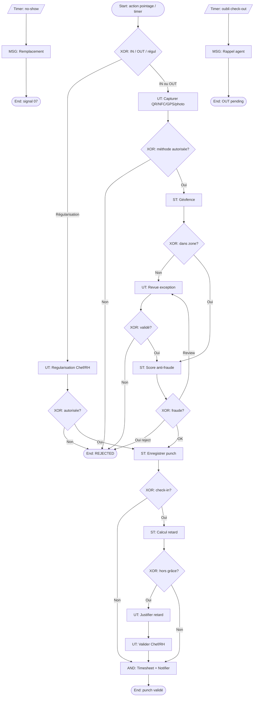

# 09 – Pointage présence

**ID workflow :** `ops.pointage-presence.v1`  
**Pool :** Agence de sécurité privée  
**Version :** 1.0  
**Domaine :** Opérations / Paie / Conformité

---

## 1. Nom du processus

Pointage présence (check-in / check-out, géofence, photo, anti-fraude, retards)

## 2. Objectif

Enregistrer de façon fiable les heures de présence des agents (arrivée et départ), détecter retards et absences de pointage, prévenir la fraude (pointage hors site, proxys), et fournir une base auditable pour la paie, le reporting client et le déclenchement des remplacements.

## 3. Déclencheur

| Type | Description |
|------|-------------|
| **Message / User** | Agent initie check-in ou check-out via app (QR/NFC/GPS/bouton) |
| **Timer** | Contrôle automatique à l’heure planifiée + seuils de retard |
| **Signal** | Fin de prise de service réussie → check-in automatique corrélé |
| **Manuel** | Regularisation par Chef de site / RH (avec audit) |

**Start Event :** `MessageStart` (action agent) ou `TimerStart` (surveillance shift).

## 4. Acteurs (Lanes)

| Lane | Responsabilités |
|------|-----------------|
| **Agent de sécurité** | Check-in / check-out, photo, justification retard |
| **Chef de site** | Validation exceptions, regularisations terrain |
| **RH / Paie** | Regularisation administrative, impact bulletin |
| **Opérations / Dispatch** | Suivi retards multi-sites, déclenchement remplacement |
| **Système** | Géofence, scoring fraude, timers, calcul retards, notifications |

## 5. Préconditions

- Agent authentifié ; shift du jour connu ou mode « pointage libre » désactivé par défaut.
- Paramètres site : géofence, méthodes autorisées (QR, NFC, GPS, Wi-Fi), photo obligatoire oui/non.
- Politique retards : grâce (ex. 5 min), paliers (alerte, warning RH, retenue).
- Lien optionnel avec PDS (08) : check-in ne vaut service que si PDS complète selon config.

## 6. Description détaillée

1. **Initiation** : l’agent sélectionne Check-in ou Check-out ; le Système charge le shift attendu.
2. **Collecte preuves** : scan QR/NFC et/ou GPS + précision ; photo de présence si exigée.
3. **Contrôles Service** : validité tag, géofence, anti-rejeu, device trust, score fraude.
4. **Décision** : ACCEPTÉ, ACCEPTÉ_AVEC_RESERVE (hors grâce), REJETÉ, PENDING_REVIEW.
5. **Calcul retard** : si check-in après `plannedStart + grace` → enregistrement retard + notification.
6. **Check-out** : contrôles symétriques ; durée de service ; alerte si oubli (Timer fin de shift + delta).
7. **Regularisation** : flux exception Chef de site / RH avec pièces et motif.
8. **Propagation** : événements vers paie, dashboard, et si no-show → Remplacement (07).

## 7. Tableau des activités

| N° | Activité | Responsable | Type BPMN | Entrées | Sorties |
|----|----------|-------------|-----------|---------|---------|
| 1 | Initier check-in / out | Agent | User Task | Type pointage, shift | Demande pointage |
| 2 | Capturer QR/NFC/GPS/photo | Agent / Système | User Task / Service Task | Capteurs device | Preuves brutes |
| 3 | Valider géofence | Système | Service Task | Coords, fence | inside / outside |
| 4 | Scorer anti-fraude | Système | Service Task | Preuves, historique | fraudScore, flags |
| 5 | Enregistrer pointage | Système | Service Task | Preuves + décision | `AttendancePunch` |
| 6 | Calculer retard | Système | Service Task | planned vs actual | `LatenessRecord` |
| 7 | Justifier retard | Agent | User Task | Motif, pièce | Justification |
| 8 | Valider exception | Chef de site / RH | User Task | Dossier | APPROVED / REJECTED |
| 9 | Relancer oubli check-out | Système | Intermediate Timer | Fin shift + délai | Rappel agent |
| 10 | Détecter no-show | Système | Intermediate Timer | H+seuil sans check-in | Signal remplacement |
| 11 | Regulariser manuellement | Chef de site / RH | User Task | Motif, preuves | Punch MANUAL |
| 12 | Publier vers paie | Système | Service Task / Message | Punches validés | Timesheet events |

## 8. Décisions (Gateways)

| Gateway | Type | Condition | Sorties |
|---------|------|-----------|---------|
| GW1 – Type opération | XOR | check-in / check-out / regularisation | Branches |
| GW2 – Méthode autorisée ? | XOR | Méthode ∈ config site | OK / refus méthode |
| GW3 – Géofence OK ? | XOR | insideFence | OK / hors zone |
| GW4 – Fraude ? | XOR | fraudScore ≥ seuil | Review / reject / accept |
| GW5 – Dans tolérance horaire ? | XOR | |onTime - planned| ≤ grace | On-time / retard / trop tôt |
| GW6 – Justification requise ? | XOR | retard > seuil2 | Demande motif / auto-log |
| GW7 – Check-out oublié ? | XOR | Timer expiré sans out | Rappel / clôture forcée pending |
| GW8 – Regularisation autorisée ? | XOR | Rôle + motif valide | Accept / refuse |

**AND :** après check-in accepté → mettre à jour présence **et** notifier dashboard Dispatch.

## 9. Gestion des exceptions

| Exception | Traitement |
|-----------|------------|
| Hors géofence | Rejet ou PENDING_REVIEW ; possibilité justification + photo environnement |
| GPS spoofing suspect | Flag fraude ; blocage temporaire ; revue |
| Double check-in | Idempotence ; second ignoré ou corrigé |
| Check-out avant durée min | Warning + confirmation agent |
| Batterie / app crash | Reprise offline queue ; horodatage device + serveur |
| Agent pointe mauvais site | Rejet ; suggestion site affecté |
| Contestations paie | Processus regularisation avec audit immuable |

## 10. Données manipulées

| Data Object | Description |
|-------------|-------------|
| `AttendancePunch` | id, agentId, shiftId, type IN/OUT, method, at, source |
| `GeoEvidence` | lat, lng, accuracy, provider |
| `PhotoEvidence` | url, hash, capturedAt |
| `FraudSignal` | type, weight, score |
| `LatenessRecord` | minutes, palier, justification |
| `TimesheetDay` | agrégation paie |
| `DeviceTrust` | deviceId, lastSeen, risk |

## 11. Notifications

| Destinataire | Canal | Moment | Contenu |
|--------------|-------|--------|---------|
| Agent | Push / SMS | Rappel avant shift ; oubli out | Lien pointage |
| Agent | WhatsApp | Retard enregistré | Minutes + demande motif |
| Chef de site | Push | Hors zone / fraude | Dossier review |
| Dispatch | WhatsApp / Push | No-show | Déclencher remplacement |
| RH | Email | Synthèse retards semaine | Export |
| Client | Email / WhatsApp | Si reporting présence prévu | Taux présence site |

## 12. KPI

| KPI | Cible | Mesure |
|-----|-------|--------|
| Taux pointages automatiques valides | ≥ 97 % | ACCEPT sans review |
| Retard moyen (min) | ↓ mois | Sum lateness / check-ins |
| Taux no-show | < 1 % | No-show / shifts |
| Taux regularisations manuelles | < 3 % | MANUAL / total |
| Faux positifs fraude | Suivi | Reviews annulées |
| Complétude check-out | ≥ 99 % | OUT présents |

## 13. Recommandations d’amélioration

- Pointage NFC + QR hybride selon environnement (indoor/outdoor).
- Grace periods différenciés par type de site / trafic urbain.
- Gamification positive (série de ponctualité) plutôt que seule pénalité.
- Détection IA des patterns de fraude collaboratifs (binômes).
- Export paie standardisé (CSV/API) par pays.

## 14. Diagramme BPMN ASCII

```
POOL: Agence de sécurité
═══════════════════════════════════════════════════════════════════
Lane AGENT
  (o)──►[UT Check-in/out]──►[UT Capturer preuves QR/NFC/GPS/Photo]
              │
Lane SYSTÈME  ▼
        [ST Valider méthode]──◇ GW2
              │OK
        [ST Géofence]──◇ GW3──hors──►[ST Flag]──►◇ Review?
              │OK                              │
        [ST Score fraude]──◇ GW4               │
              │OK / reserve                    │
        [ST Enregistrer punch]                 │
              │                                │
         ◇ GW1 type=IN?                        │
           │oui                                │
        [ST Calcul retard]──◇ GW5              │
           │retard                             │
Lane AGENT [UT Justifier]──►Lane CHEF/RH [UT Valider]──◇ GW8
           │                                   │
           ▼                                   ▼
     ┌── AND ──┐                         (accept/reject)
     ▼         ▼
 [ST Timesheet] [MSG Dashboard]
     │
    (●) Punch clos

Parallèle surveillance:
  ⏱ H+seuil sans IN ──►[MSG No-show]──► processus 07
  ⏱ Fin shift sans OUT ──►[MSG Rappel]──►◇ GW7──► regularisation / pending
```

## 15. Diagramme Mermaid flowchart TB



---

## Compléments conception SaaS

### Règles métier

- Check-in avant check-out ; pas de double IN sans OUT (sauf multi-postes explicitement autorisés).
- Horodatage de référence = serveur ; device time stocké pour audit écart.
- Retard : paliers configurables (grace → alerte → impact disciplinaire/paie).
- Corrélation PDS : paramètre `requireServiceTakeoverBeforePunch`.

### Validations

- Preuves obligatoires selon site policy.
- Hash photo + anti-rejeu token scan (nonce + TTL).
- Agent doit appartenir à `companyId` du site (multi-tenant).

### Contrôles automatiques

- Jobs timers no-show / oubli OUT.
- Détection vitesse impossible (téléportation GPS entre deux punches).
- Blacklist devices à risque.

### Risques

| Risque | Mitigation |
|--------|------------|
| Buddy punching | Selfie + liveness + NFC personnel |
| Fake GPS | Play Integrity / Attestation + score |
| Contestations | Audit immuable + preuves |
| Zones blanches | Offline queue + SMS fallback code one-time |

### Automatisation

- Calcul automatique heures majeures / nuit / férié (moteur règles pays).
- Alerte prédictive retard (trafic / historique) via IA.

### Intégrations

| Intégration | Usage |
|-------------|-------|
| **QR / NFC** | Preuve présence point de contrôle |
| **GPS** | Géofence in/out |
| **WhatsApp / SMS / Push** | Rappels, retards, no-show |
| **Email** | Rapports RH / client |
| **API paie** | Export timesheets |
| **IA** | Scoring fraude, prédiction absences/retards |
| **API cartes** | Visualisation positions punches |
