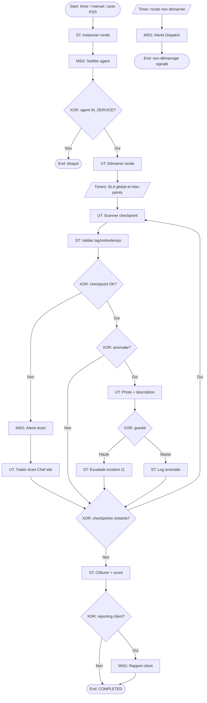

# 10 – Gestion des rondes

**ID workflow :** `ops.gestion-rondes.v1`  
**Pool :** Agence de sécurité privée  
**Version :** 1.0  
**Domaine :** Opérations terrain / Qualité de service

---

## 1. Nom du processus

Gestion des rondes (planification, checkpoints QR/NFC, timers, écarts, anomalies)

## 2. Objectif

Planifier, exécuter et contrôler les rondes de surveillance sur site : respect des itinéraires et fréquences, preuve de passage aux checkpoints (QR/NFC/GPS), détection des retards et écarts, capture photo des anomalies, et restitution d’un journal de ronde exploitable pour le client et l’audit.

## 3. Déclencheur

| Type | Description |
|------|-------------|
| **Timer** | Fréquence planifiée (ex. toutes les 60 min pendant le shift) |
| **Message** | Déclenchement manuel Chef de site / consignes exceptionnelles |
| **Signal** | Post-prise de service : première ronde obligatoire |
| **Conditonnel** | Après incident : ronde renforcée |

**Start Event :** `TimerStart` (planning ronde) ou `ManualStart`.

## 4. Acteurs (Lanes)

| Lane | Responsabilités |
|------|-----------------|
| **Opérations / Dispatch** | Définir modèles de rondes, fréquences, SLA |
| **Chef de site** | Adapter rondes du jour, valider écarts, traiter anomalies |
| **Agent de sécurité** | Exécuter la ronde, scanner checkpoints, signaler anomalies |
| **Client (externe)** | Consultation rapports (message flow reporting) |
| **Système** | Timers checkpoints, géolocalisation, alertes, consolidation |

## 5. Préconditions

- Site avec checkpoints configurés (ordre, QR/NFC IDs, GPS optionnel, temps max inter-points).
- Agent `IN_SERVICE` (PDS 08 effectuée) sauf ronde hors shift autorisée.
- Modèle de ronde (`RoundTemplate`) actif pour le contrat / poste.
- Devices agents capables de scan + photo ; mode offline prévu.

## 6. Description détaillée

1. **Planification** : instanciation d’une `RoundInstance` depuis le template à l’heure prévue ; notification agent.
2. **Démarrage** : l’agent démarre la ronde ; timer global et timers inter-checkpoints s’amorcent.
3. **Parcours checkpoints** : à chaque point, scan QR/NFC (et/ou GPS) ; enregistrement horodaté ; contrôle ordre si ronde séquentielle.
4. **Écarts** : point sauté, ordre inversé, délai dépassé → flag + alerte Chef de site.
5. **Anomalies** : l’agent peut déclarer une anomalie (porte ouverte, fuite, individu) avec photo/vidéo → lien possible Incident (11).
6. **Fin de ronde** : tous points requis OK ou clôture avec écarts documentés ; score conformité.
7. **Reporting** : synthèse push/email client selon contrat ; archivage.

## 7. Tableau des activités

| N° | Activité | Responsable | Type BPMN | Entrées | Sorties |
|----|----------|-------------|-----------|---------|---------|
| 1 | Planifier / instancier ronde | Système / Dispatch | Service Task / User Task | Template, shift | `RoundInstance` SCHEDULED |
| 2 | Notifier agent | Système | Intermediate Message | Ronde due | Push/WhatsApp |
| 3 | Démarrer ronde | Agent | User Task | RoundId | Status IN_PROGRESS |
| 4 | Amorcer timers | Système | Intermediate Timer | SLA global / inter-points | Deadlines |
| 5 | Scanner checkpoint | Agent | User Task | QR/NFC/GPS | `CheckpointScan` |
| 6 | Valider scan | Système | Service Task | Tag, ordre, temps | OK / écart |
| 7 | Signaler anomalie | Agent | User Task | Photo, type, note | `RoundAnomaly` |
| 8 | Alerter écart / anomalie | Système | Intermediate Message | Flags | Notif Chef site |
| 9 | Traiter écart | Chef de site | User Task | Dossier écart | Accepté / action corrective |
| 10 | Escalader en incident | Système / Agent | Service Task / User Task | Anomalie grave | Lien processus 11 |
| 11 | Clôturer ronde | Agent / Système | User Task / Service Task | Scans | `COMPLETED` + score |
| 12 | Publier rapport | Système | Service Task / Message | Journal ronde | PDF/lien client |

## 8. Décisions (Gateways)

| Gateway | Type | Condition | Sorties |
|---------|------|-----------|---------|
| GW1 – Agent en service ? | XOR | Shift IN_SERVICE | Démarrer / bloquer |
| GW2 – Type ronde | XOR | Séquentielle / libre / aléatoire IA | Règles validation |
| GW3 – Checkpoint valide ? | XOR | Tag OK + fenêtre temps | OK / écart |
| GW4 – Ordre respecté ? | XOR | (si séquentielle) | OK / out-of-order |
| GW5 – Timer inter-point dépassé ? | XOR | elapsed > max | Alerte retard / OK |
| GW6 – Anomalie déclarée ? | XOR | | Continuer / ouvrir anomaly |
| GW7 – Gravité anomalie | XOR | basse / haute | Log local / escalade incident |
| GW8 – Ronde complète ? | XOR | required checkpoints done | Clôture OK / clôture partielle |
| GW9 – Reporting client ? | XOR | règle contrat | Envoi / archivage seul |

**AND :** à chaque anomalie haute → notifier Chef de site **et** préparer dossier incident.

## 9. Gestion des exceptions

| Exception | Traitement |
|-----------|------------|
| Checkpoint tag HS | Code secours + photo du lieu + validation Chef de site |
| Agent interrompu (urgence) | Pause ronde / reprise ; ou abandon avec motif |
| Offline pendant ronde | Buffer local ; sync ; timers basés horloge device + correction serveur |
| Ronde non démarrée à l’heure | Rappel puis alerte ; impact KPI agent |
| Contournement (scan sans présence) | GPS checkpoint + aléatoire points + audit |
| Multiples écarts | Score conformité bas ; revue obligatoire |

## 10. Données manipulées

| Data Object | Description |
|-------------|-------------|
| `RoundTemplate` | checkpoints[], orderMode, frequency, sla |
| `RoundInstance` | id, siteId, agentId, status, startedAt, endedAt, score |
| `Checkpoint` | id, tagId, geo, maxMinutesFromPrev |
| `CheckpointScan` | checkpointId, at, method, valid |
| `RoundDeviation` | type (SKIP, LATE, OUT_OF_ORDER), details |
| `RoundAnomaly` | media[], severity, linkedIncidentId |
| `RoundReport` | export client |

## 11. Notifications

| Destinataire | Canal | Moment | Contenu |
|--------------|-------|--------|---------|
| Agent | Push | Ronde due / retard inter-point | Prochain checkpoint |
| Chef de site | Push / WhatsApp | Écart ou anomalie | Détail + deep-link |
| Dispatch | WhatsApp | Ronde non démarrée | Site / agent |
| Client | Email / WhatsApp | Fin de période / incident lié | Rapport conformité rondes |
| Direction | Email | KPI hebdo | Taux conformité |

## 12. KPI

| KPI | Cible | Mesure |
|-----|-------|--------|
| Taux de rondes complètes à l’heure | ≥ 95 % | OK / planifiées |
| Taux checkpoints scannés | ≥ 98 % | scans valides / requis |
| Délai moyen inter-checkpoints | ≤ SLA template | Moyenne |
| Taux anomalies traitées < 30 min | ≥ 90 % | Temps prise en charge |
| Score conformité moyen | ≥ 90/100 | Score instance |
| Couverture offline sync | ≥ 99 % | Rondes sync OK |

## 13. Recommandations d’amélioration

- Rondes aléatoires guidées par IA pour éviter routines prévisibles.
- Heatmap des zones à risque basées sur anomalies historiques.
- Checkpoints NFC dissimulés + QR de secours.
- Mode « ronde silencieuse » nuit (vibration only).
- Intégration caméras / alarmes pour corréler passages.

## 14. Diagramme BPMN ASCII

```
POOL: Agence                                    ║ Client
════════════════════════════════════════════════╬════════════
Lane SYSTÈME / DISPATCH                         ║
  (o)⏱──►[ST Instancier ronde]──►[MSG Notifier agent]
              │
Lane AGENT    ▼
        ◇ GW1 EN SERVICE?──non──►(●) Bloqué
              │oui
        [UT Démarrer]──►⏱ Timers SLA
              │
        ┌─────▼───── boucle checkpoints ─────┐
        │ [UT Scan checkpoint]               │
        │         ▼                          │
        │ [ST Valider]──◇ GW3/GW4/GW5        │
        │    OK│     écart│                  │
        │      │          ▼                  │
        │      │   [MSG Alerte]──►[UT Chef]  │
        │      ▼                             │
        │ ◇ GW6 Anomalie?──oui──►[UT Photo]  │
        │      │                   │         │
        │      │              ◇ GW7 gravité  │
        │      │            basse│  haute    │
        │      │              log│  ──►(11)  │
        │      ▼◄────────────────┘           │
        │ ◇ encore points?──oui──┘           │
        └─────────────non────────────────────┘
              ▼
        [ST Clôturer + score]──◇ GW9 rapport?
              │oui                    │non
        [MSG Rapport]══════════►[Consultation]
              │
             (●) COMPLETED
```

## 15. Diagramme Mermaid flowchart TB



---

## Compléments conception SaaS

### Règles métier

- Ordre séquentiel strict optionnel ; mode libre pour grands sites.
- Temps max global et max entre deux points configurables.
- Checkpoints `REQUIRED` vs `OPTIONAL`.
- Ronde renforcée auto après incident ouvert sur le site.

### Validations

- Tag signé ; anti-rejeu nonce.
- Photo anomalie : taille/type MIME ; géotag si dispo.
- Agent affecté au site de la ronde.

### Contrôles automatiques

- Détection skip pattern (toujours le même point omis).
- Alerte si durée ronde anormalement courte (course).
- Recalcul score : pondération checkpoints critiques.

### Risques

| Risque | Mitigation |
|--------|------------|
| Fausse ronde | GPS + temps min + contrôles aléatoires |
| Tag détruit | Secours + maintenance GMAO |
| Surcharge agent | Priorisation / allègement template |
| Données offline perdues | Chiffrement local + retry sync |

### Automatisation

- Génération planning rondes sur durée du contrat.
- Suggestion IA de réordonnancement selon zones à risque.
- Export automatique rapports périodiques.

### Intégrations

| Intégration | Usage |
|-------------|-------|
| **QR / NFC** | Preuve passage checkpoints |
| **GPS** | Corroboration présence / heatmap |
| **WhatsApp / SMS / Push** | Rappels, écarts, anomalies |
| **Email** | Rapports PDF client |
| **API** | Vidéosurveillance, alarmes, GMAO tags |
| **IA** | Rondes aléatoires, détection parcours suspects |
| **Lien Incident** | Escalade automatique anomalies haute gravité |
