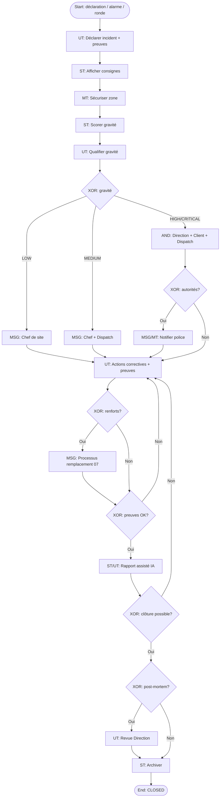

# 11 – Déclaration d’incident

**ID workflow :** `ops.declaration-incident.v1`  
**Pool :** Agence de sécurité privée  
**Version :** 1.0  
**Domaine :** Opérations / Sécurité / Relation client

---

## 1. Nom du processus

Déclaration et gestion d’incident (gravité, escalade, preuves, clôture, notifications)

## 2. Objectif

Permettre la déclaration rapide d’un incident sur site, classer sa gravité, collecter les preuves, orchestrer l’escalade interne et externe (client, police/autorités si requis), suivre le traitement jusqu’à clôture documentée, et produire un dossier exploitable juridiquement et contractuellement.

## 3. Déclencheur

| Type | Description |
|------|-------------|
| **Manuel / User** | Agent, Chef de site ou Dispatch déclare un incident dans l’app |
| **Message** | Escalade depuis ronde (anomalie haute), alarme API, appel client |
| **Signal** | Détection IA / IoT (intrusion, incendie) si intégré |
| **Téléphone** | Saisie ultérieure par Dispatch (incident oral) |

**Start Event :** `MessageStart` / `UserStart` / `SignalStart`.

## 4. Acteurs (Lanes)

| Lane | Responsabilités |
|------|-----------------|
| **Agent de sécurité** | Déclaration initiale, sécurisation, preuves terrain |
| **Chef de site** | Qualification, consignes, validation rapport |
| **Opérations / Dispatch** | Coordination multi-acteurs, suivi SLA, renforts |
| **Direction / Pilotage** | Incidents critiques, communication corporate |
| **Client (pool externe)** | Information, consignes, accusé |
| **Autorités / Police (pool externe)** | Notification / dépôt si requis |
| **Système** | Workflow gravité, timers SLA, IA résumé, archivage |

## 5. Préconditions

- Site et éventuel shift/agent connus (ou déclaration « site seul »).
- Matrice de gravité configurée (LOW / MEDIUM / HIGH / CRITICAL) + règles d’escalade.
- Templates de notification client / autorités par type d’incident.
- Stockage médias sécurisé (photos, audio, vidéo) conforme rétention.
- Droits RBAC : qui voit quels incidents (multi-tenant + need-to-know).

## 6. Description détaillée

1. **Déclaration** : saisie type, description, localisation, personnes impliquées ; capture médias ; GPS auto.
2. **Sécurisation immédiate** : consignes affichées à l’agent (Manual/User) selon type (évacuation, confinement…).
3. **Qualification gravité** : auto-score Système + confirmation Chef de site / Dispatch.
4. **Escalade** : selon gravité — notif Chef, Dispatch, Direction, Client, Police ; demande de renforts.
5. **Investigation / actions** : tâches assignées, journal chronologique, preuves complémentaires.
6. **Rapport** : rédaction / assistance IA ; validation hiérarchique.
7. **Clôture** : critères remplis (actions done, client informé si requis) ; archivage ; éventuelle facturation frais.
8. **Post-mortem** (CRITICAL) : revue Direction + actions préventives.

## 7. Tableau des activités

| N° | Activité | Responsable | Type BPMN | Entrées | Sorties |
|----|----------|-------------|-----------|---------|---------|
| 1 | Déclarer incident | Agent / Chef / Dispatch | User Task | Formulaire, médias, GPS | `Incident` DRAFT→OPEN |
| 2 | Afficher consignes immédiates | Système | Service Task | Type incident | Playbook agent |
| 3 | Sécuriser zone | Agent | Manual Task | Consignes | Statut sécurisation |
| 4 | Scorer gravité | Système | Service Task | Type, impacts, IA | Proposed severity |
| 5 | Qualifier gravité | Chef de site / Dispatch | User Task | Proposition | Severity figée |
| 6 | Notifier escalade | Système | Intermediate Message | Matrice escalade | Accusés canaux |
| 7 | Demander renforts / remplacement | Dispatch | User Task / Message | Besoin effectifs | Lien processus 07 |
| 8 | Informer client | Système / Dispatch | Intermediate Message | Template contrat | Notif client |
| 9 | Notifier autorités | Dispatch / Direction | Intermediate Message / Manual Task | Dossier | Réf. dépôt / PV |
| 10 | Collecter preuves additionnelles | Agent / Chef | User Task | Médias | Evidence pack |
| 11 | Assigner actions correctives | Dispatch / Chef | User Task | Plan d’actions | Tasks ouvertes |
| 12 | Rédiger rapport | Chef / IA assistée | User Task / Service Task | Journal | Rapport PDF |
| 13 | Valider clôture | Dispatch / Direction | User Task | Critères clôture | `CLOSED` |
| 14 | Archiver & analytics | Système | Service Task | Dossier final | Store + KPI |

## 8. Décisions (Gateways)

| Gateway | Type | Condition | Sorties |
|---------|------|-----------|---------|
| GW1 – Source déclaration | XOR | App agent / alarme / client / ronde | Enrichissement contexte |
| GW2 – Gravité | XOR | LOW / MEDIUM / HIGH / CRITICAL | Chemins escalade |
| GW3 – Renforts nécessaires ? | XOR | Effectifs insuffisants | Processus remplacement / non |
| GW4 – Client à informer ? | XOR | Règle contrat + gravité ≥ seuil | Oui / Non |
| GW5 – Autorités requises ? | XOR | Type légal (vol, violence, incendie…) | Oui / Non |
| GW6 – Preuves suffisantes ? | XOR | Checklist evidence | Compléter / poursuivre |
| GW7 – Clôture possible ? | XOR | Actions closed + validations | Boucle / clôturer |
| GW8 – Post-mortem ? | XOR | CRITICAL ou flag | Revue / fin |

**AND (CRITICAL) :** notifier en parallèle Direction + Client + Dispatch (+ Police si GW5).

## 9. Gestion des exceptions

| Exception | Traitement |
|-----------|------------|
| Déclaration incomplète urgence | Mode « SOS » minimal (type + GPS + call) puis complément |
| Médias non uploadés (réseau) | File offline ; incident quand même OPEN |
| Fausse alerte | Requalification ; clôture `FALSE_ALARM` ; pas de blâme excessif |
| Client injoignable | Timer multi-canaux ; log diligence |
| Conflit de gravité | Escalade niveau N+1 décide |
| Fuite d’info sensible | Masquage RBAC ; watermark médias |
| Double déclaration même événement | Fusion incidents (corrélation lieu/temps) |

## 10. Données manipulées

| Data Object | Description |
|-------------|-------------|
| `Incident` | id, siteId, type, severity, status, openedAt, closedAt |
| `IncidentEvidence` | media[], hash, gps, capturedBy |
| `SeverityMatrix` | règles auto |
| `EscalationLog` | destinataires, canaux, timestamps |
| `CorrectiveAction` | assignee, dueAt, status |
| `IncidentReport` | PDF, version, validatedBy |
| `AuthorityNotice` | ref police, attached docs |
| `ClientNotification` | template, ack |

## 11. Notifications

| Destinataire | Canal | Moment | Contenu |
|--------------|-------|--------|---------|
| Chef de site | Push / WhatsApp | Ouverture | Résumé + deep-link |
| Dispatch | Push / WhatsApp / IVR si CRITICAL | Immédiat | Alerte prioritaire |
| Direction | Push / Email / IVR | HIGH+ | Synthèse |
| Client | WhatsApp / SMS / Email / Appel | Selon matrice | Faits, mesures, contact |
| Police / autorités | Appel + Email / dépôt | Si requis | Infos légales |
| Agent | Push | Consignes / MAJ | Instructions |
| Assurance (opt.) | Email | Post-clôture | Dossier sinistre |

## 12. KPI

| KPI | Cible | Mesure |
|-----|-------|--------|
| MTTA (1ʳᵉ prise en charge) | < 5 min HIGH+ | firstAck - openedAt |
| Délai notification client | < 15 min (HIGH+) | clientNotifiedAt - openedAt |
| Taux incidents clos sous SLA | ≥ 90 % | Selon gravité |
| Complétude preuves | ≥ 95 % | checklist OK |
| Taux fausses alertes | Suivi | FALSE_ALARM / total |
| CSAT client post-incident | ≥ 4/5 | Survey |

## 13. Recommandations d’amélioration

- Bouton SOS hardware / widget lockscreen.
- Playbooks par type d’incident et par pays (réglementation).
- Résumé IA + traduction FR/langues locales pour rapports client.
- Corrélation caméras et rondes dans la timeline incident.
- Exercices simulés (tabletop) pour mesurer MTTA.

## 14. Diagramme BPMN ASCII

```
POOL: Agence                         ║ Client          ║ Autorités
═════════════════════════════════════╬═════════════════╬═══════════
Lane AGENT                           ║                 ║
  (o)──►[UT Déclarer + médias]       ║                 ║
         │                           ║                 ║
Lane SYSTÈME                         ║                 ║
         ▼                           ║                 ║
  [ST Playbook]──►[MT Sécuriser]     ║                 ║
         │                           ║                 ║
  [ST Score gravité]──►[UT Qualifier]──◇ GW2
         │ LOW          MEDIUM     HIGH/CRITICAL
         ▼               │              │
  [MSG Chef]        [MSG + Dispatch]    │
         │               │         ┌────┴ AND ────────────┐
         │               │         ▼          ▼           ▼
         │               │   [MSG Direction] [MSG Client]═╪═►[UT/Accusé]
         │               │         │          │      [MSG Police?]═╪═►[Réception]
         │               │         ◇ GW5      │           │
         ▼               ▼         ▼          ▼           ▼
         └───────►[UT Actions + preuves]◄─────┴───────────┘
                        │
                   ◇ GW6 preuves OK?
                        │
                   [ST/UT Rapport IA]
                        │
                   ◇ GW7 clôture?
                     non│    │oui
                   boucle    ▼
                        ◇ GW8 post-mortem?
                          oui│    │non
                    [UT Revue]   │
                          └──►(●) CLOSED
```

## 15. Diagramme Mermaid flowchart TB



---

## Compléments conception SaaS

### Règles métier

- Statuts : `OPEN` → `QUALIFIED` → `IN_PROGRESS` → `PENDING_CLIENT` → `CLOSED` / `FALSE_ALARM` / `CANCELLED`.
- CRITICAL : notification multi-canal obligatoire dans les X minutes (SLA).
- Immutabilité des preuves après hash (append-only).
- Fusion anti-doublons dans une fenêtre spatio-temporelle.

### Validations

- Type incident ∈ catalogue ; severity ∈ enum.
- Médias : antivirus / scan ; taille max ; EXIF strip optionnel.
- Commentaires obligatoires à chaque changement de gravité.

### Contrôles automatiques

- Timers SLA par gravité (escalade si pas d’ack).
- Détection incidents ouverts trop longs.
- IA : suggestion type/gravité + résumé rapport.

### Risques

| Risque | Mitigation |
|--------|------------|
| Sous-déclaration | Formation + UX SOS simple |
| Sur-notification client | Matrice seuils contractualisée |
| Preuves contestées | Hash, horodatage serveur, chaîne de custody |
| Non-conformité légale | Playbooks pays + checklist autorités |

### Automatisation

- Création auto tâches correctives selon type.
- Génération PDF rapport + envoi email.
- Webhook assurance / legal hold.

### Intégrations

| Intégration | Usage |
|-------------|-------|
| **WhatsApp / SMS / Push / IVR** | Escalades temps réel |
| **Email** | Rapports et pièces jointes |
| **GPS** | Localisation incident |
| **QR/NFC** | Contexte checkpoint ronde lié |
| **API** | Alarmes, caméras, cartographie |
| **IA** | Classification, résumé, traduction, détection doublons |
| **API autorités** | Si disponible ; sinon procédure manuelle guidée |
