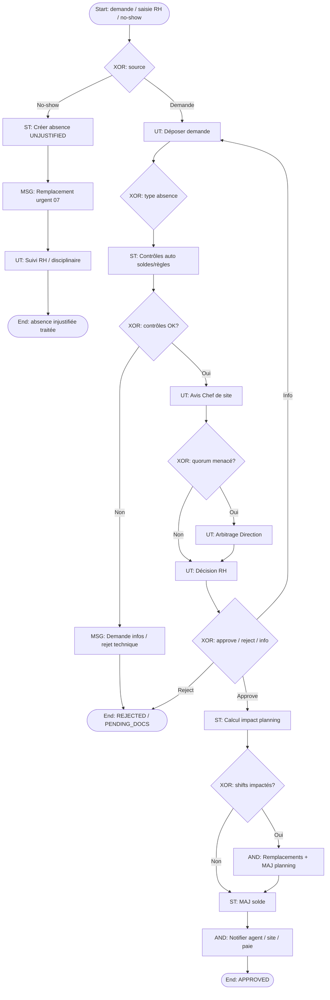

# 12 – Gestion des absences

**ID workflow :** `hr.gestion-absences.v1`  
**Pool :** Agence de sécurité privée  
**Version :** 1.0  
**Domaine :** RH / Opérations / Planning

---

## 1. Nom du processus

Gestion des absences (demande, validation, impact planning, déclenchement remplacement)

## 2. Objectif

Gérer le cycle de vie des absences agents (congés, maladie, permissions, absences injustifiées) : dépôt de demande, validation hiérarchique/RH, analyse d’impact sur le planning, notification des parties, et déclenchement automatique du processus de remplacement lorsque la couverture d’un poste est menacée.

## 3. Déclencheur

| Type | Description |
|------|-------------|
| **User** | Agent dépose une demande d’absence dans l’app / portail |
| **Message** | RH saisit une absence (arrêt maladie papier, appel) |
| **Timer / Signal** | Absence détectée via no-show pointage (09) sans demande préalable |
| **Import** | Synchronisation fichier paie / mutuelle (option) |

**Start Event :** `UserStart` / `MessageStart` / `SignalStart` (no-show).

## 4. Acteurs (Lanes)

| Lane | Responsabilités |
|------|-----------------|
| **Agent de sécurité** | Demande, pièces jointes, suivi statut |
| **Chef de site / Manager ops** | Avis opérationnel (charge site) |
| **RH** | Validation administrative, solde congés, conformité |
| **Opérations / Dispatch** | Impact planning, lancement remplacement |
| **Direction** | Arbitrage conflits / absences longues / pics |
| **Système** | Soldes, chevauchements, notifications, workflow |

## 5. Préconditions

- Fiche agent active avec soldes (congés payés, RTT locaux, permissions).
- Planning des shifts futurs accessible (`shiftId` sur la période).
- Politique d’absence publiée (délais de préavis, documents obligatoires).
- Règles de quorum site (effectif minimum par poste/créneau).
- Chaîne de validation définie (Manager → RH, ou RH seul selon type).

## 6. Description détaillée

1. **Demande** : type, dates/heures, motif, pièces (certificat) ; calcul prévisionnel du solde.
2. **Contrôles auto** : chevauchement absences, solde insuffisant, préavis non respecté, blacklist périodes (événements majeurs).
3. **Avis ops** : Chef de site évalue la criticité couverture.
4. **Validation RH** : décision APPROVED / REJECTED / ASK_INFO.
5. **Impact planning** : identification des shifts orphelins ; pour chacun, événement `replacement.needed`.
6. **Notifications** : agent, planning, paie ; calendrier mis à jour.
7. **Suivi** : prolongation maladie, retour anticipé, annulation ; compensation planning.
8. **Absence non déclarée** : signal no-show → création absence `UNJUSTIFIED` + remplacement urgent + procédure disciplinaire éventuelle.

## 7. Tableau des activités

| N° | Activité | Responsable | Type BPMN | Entrées | Sorties |
|----|----------|-------------|-----------|---------|---------|
| 1 | Déposer demande d’absence | Agent / RH | User Task | Type, période, pièces | `AbsenceRequest` DRAFT |
| 2 | Contrôler éligibilité | Système | Service Task | Soldes, règles, overlaps | OK / anomalies |
| 3 | Compléter pièces | Agent | User Task | Demande docs | Pièces jointes |
| 4 | Donner avis opérationnel | Chef de site | User Task | Charge site | Avis +/- / neutre |
| 5 | Valider / refuser | RH | User Task | Dossier complet | APPROVED / REJECTED |
| 6 | Arbitrer conflit | Direction | User Task | Dossiers concurrents | Décision |
| 7 | Calculer impact planning | Système | Service Task | Shifts période | Liste shifts impactés |
| 8 | Déclencher remplacements | Système | Intermediate Message / Service Task | Shifts orphelins | Processus 07 |
| 9 | Mettre à jour planning & solde | Système | Service Task | Absence approuvée | Calendar + balance |
| 10 | Notifier parties | Système | Intermediate Message | Statut final | WhatsApp/Email/Push |
| 11 | Gérer no-show → absence | Système / RH | Service Task / User Task | Signal pointage | Absence UNJUSTIFIED |
| 12 | Gérer retour / annulation | Agent / RH | User Task | Demande modif | Compensation + cancel remplacements |

## 8. Décisions (Gateways)

| Gateway | Type | Condition | Sorties |
|---------|------|-----------|---------|
| GW1 – Type d’absence | XOR | Congé / Maladie / Permission / Injustifiée | Circuits validation |
| GW2 – Contrôles auto OK ? | XOR | Règles passées | Suite / rejet technique / ASK_INFO |
| GW3 – Préavis respecté ? | XOR | délai ≥ min | OK / exception Direction |
| GW4 – Avis ops bloquant ? | XOR | Quorum menacé | Escalade / validation standard |
| GW5 – Décision RH | XOR | Approve / Reject / Info | Branches |
| GW6 – Shifts impactés ? | XOR | count > 0 | Déclencher 07 / fin simple |
| GW7 – Absence déjà commencée ? | XOR | start ≤ today | Urgent remplacement / planifié |
| GW8 – Annulation possible ? | XOR | Politique + remplacements engagés | OK cancel / refus |

**AND :** après APPROVED → (MAJ solde) **et** (MAJ planning) **et** (notifications) ; remplacements en parallèle par shift.

## 9. Gestion des exceptions

| Exception | Traitement |
|-----------|------------|
| Solde insuffisant | Rejet ou conversion type (congés sans solde) si autorisé |
| Pièce médicale manquante | Statut `PENDING_DOCS` + timer ; suspension paie selon règles |
| Chevauchement demandes | Rejet auto ou fusion |
| Pic d’absences même site | Quota ; file d’attente ; arbitrage Direction |
| Annulation tardive | Frais ops / maintien si remplaçant déjà confirmé |
| Fraude certificat | Revue RH + sanction ; flag agent |
| Erreur no-show (réseau) | Contestation agent liée au pointage ; régularisation |

## 10. Données manipulées

| Data Object | Description |
|-------------|-------------|
| `AbsenceRequest` | id, agentId, type, start, end, status, reason |
| `LeaveBalance` | compteurs par type |
| `AbsencePolicy` | préavis, docs, quotas site |
| `PlanningImpact` | shiftIds[], coverageRisk |
| `ReplacementLink` | absenceId → replacementRequestIds |
| `Attachment` | certificats, justificatifs |
| `DisciplinaryCase` | si injustifiée récurrente |
| `PayrollEvent` | impact paie |

## 11. Notifications

| Destinataire | Canal | Moment | Contenu |
|--------------|-------|--------|---------|
| Agent | Push / WhatsApp | Soumis / décidé | Statut + motif refus |
| Chef de site | Push | Avis requis / absence approuvée | Période + impact |
| RH | Email / Push | File de validation | Dossier |
| Dispatch | WhatsApp / Push | Shifts orphelins | Lien remplacement |
| Remplaçants potentiels | via processus 07 | Après APPROVED / no-show | Propositions |
| Paie | Event / Email | Clôture mois | Absences validées |
| Direction | Email | Conflits / pics | Synthèse |

## 12. KPI

| KPI | Cible | Mesure |
|-----|-------|--------|
| Délai moyen de validation | < 48 h (congés) ; < 4 h (maladie J) | decidedAt - submittedAt |
| Taux absences avec couverture anticipée | ≥ 95 % | remplacements planifiés / shifts impactés |
| Taux absences injustifiées | < 2 % | UNJUSTIFIED / total agent-jours |
| Taux annulations tardives | Suivi | cancel after replacement |
| Respect préavis | ≥ 90 % | demandes conformes |
| Charge RH (backlog) | < N dossiers | File PENDING |

## 13. Recommandations d’amélioration

- Calendrier d’équipe visible (anonymisé) pour auto-régulation des demandes.
- Prédiction IA des pics d’absence (fêtes, pluie, historique).
- Self-service solde en temps réel + simulateur « si je pose ces dates ».
- Intégration arrêt de travail électronique quand disponible.
- Politique « échange de shifts » peer-to-peer supervisé pour limiter les absences.

## 14. Diagramme BPMN ASCII

```
POOL: Agence de sécurité
═══════════════════════════════════════════════════════════════════
Lane AGENT / RH
  (o)──►[UT Demande absence]──►◇ GW1 type
              │
Lane SYSTÈME  ▼
        [ST Contrôles auto]──◇ GW2──KO──►[MSG ASK_INFO / Reject]──►(●)
              │OK
              ▼
Lane CHEF SITE
        [UT Avis ops]──◇ GW4 quorum?
              │                    │menacé
              │                    ▼
Lane DIRECTION              [UT Arbitrage]──┐
              │                             │
              ▼◄────────────────────────────┘
Lane RH
        [UT Décision]──◇ GW5
           reject│         │approve
              ▼            ▼
           (●) REJECT  [ST Impact planning]
                           │
                      ◇ GW6 shifts?
                      non│     │oui
                         │     ▼
                         │  ┌─ AND pour chaque shift ─┐
                         │  ▼                         ▼
                         │ [MSG Remplacement 07]  [ST MAJ planning]
                         │           │
                         └─────►─────┴──►[ST MAJ solde]
                                          │
                                    ┌─── AND notifications ───┐
                                    ▼        ▼         ▼
                              [MSG Agent] [MSG Site] [MSG Paie]
                                    │
                                   (●) APPROVED

Flux parallèle no-show:
  (o) Signal 09 ──►[ST Créer UNJUSTIFIED]──►[MSG Remplacement urgent]──►[UT RH suivi]
```

## 15. Diagramme Mermaid flowchart TB



---

## Compléments conception SaaS

### Règles métier

- Types : `LEAVE`, `SICK`, `PERMISSION`, `UNPAID`, `UNJUSTIFIED`, `TRAINING`.
- Une absence APPROVED bloque la création de nouveaux shifts pour l’agent sur la période (sauf override).
- Maladie J : validation RH accélérée ; pièce sous délai légal local.
- Annulation : si remplacement `CONFIRMED`, compensation ou maintien selon politique.
- Multi-tenant : soldes et politiques par `companyId` / pays.

### Validations

- `end >= start` ; pas de chevauchement avec absence APPROVED.
- Documents obligatoires selon type (PDF/JPEG).
- Préavis : `start - now >= policy.minNotice` sauf exception.

### Contrôles automatiques

- Job nocturne : absences `PENDING_DOCS` expirées → reject / unpaid.
- Détection pics : alertes si taux absence site > seuil J+7.
- Sync bidirectionnelle avec remplacements (cancel si absence annulée avant confirmation).

### Risques

| Risque | Mitigation |
|--------|------------|
| Trou de couverture | Impact planning systématique + processus 07 |
| Abus congés | Quotas + avis ops + historique |
| Erreur solde | Double écriture comptable absences + audit |
| No-show récurrent | Escalade disciplinaire automatisée (seuils) |

### Automatisation

- Déclenchement batch des remplacements à l’approbation.
- Suggestions d’échange de shifts entre agents compatibles.
- Rappels pièces jointes (WhatsApp/SMS).

### Intégrations

| Intégration | Usage |
|-------------|-------|
| **WhatsApp / SMS / Push** | Demandes, décisions, relances docs |
| **Email** | Accusés RH, exports paie |
| **GPS / Pointage** | Détection no-show → absence |
| **QR/NFC** | Indirect via pointage / PDS |
| **API paie / RH** | Soldes, bulletins, arrêts |
| **API calendrier** | Sync planning agents |
| **IA** | Prédiction absences, détection fraude documents, optimisation couverture |
| **Lien processus 07** | Message `replacement.needed` pour chaque shift impacté |
