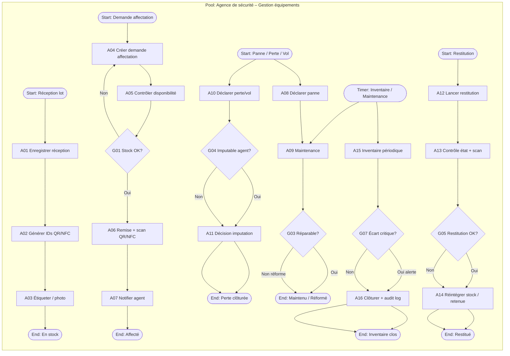

# 13 – Gestion des équipements

| Attribut | Valeur |
|----------|--------|
| **ID workflow** | `ops.gestion-equipements.v1` |
| **Pool** | Agence de sécurité |
| **Version** | 1.0 |
| **Domaine** | Opérations / Logistique |

---

## 1. Nom du processus

**Gestion du cycle de vie des équipements de sécurité** (inventaire, affectation, maintenance, perte/vol, restitution).

---

## 2. Objectif

Assurer la traçabilité complète des équipements (uniformes, talkies, torches, détecteurs, badges, véhicules, kits anti-intrusion) depuis l’entrée en stock jusqu’à la réforme, en garantissant :

- un inventaire fiable multi-sites ;
- une affectation nominative (agent / site / véhicule) ;
- un suivi de maintenance préventive et curative ;
- une gestion des pertes, vols et détériorations ;
- une restitution contrôlée en fin de mission ou de contrat RH ;
- l’identification terrain via **QR Code** et/ou **NFC**.

---

## 3. Déclencheur

| Type BPMN | Événement |
|-----------|-----------|
| **Message Start** | Réception d’un lot fournisseur / bon de livraison |
| **Message Start** | Demande d’affectation (Dispatch, Chef de site, RH) |
| **Timer Start** | Plan de maintenance préventive (hebdo / mensuel) |
| **Message Start** | Déclaration de perte, vol ou panne (Agent / Chef de site) |
| **Message Start** | Demande de restitution (fin de contrat, mutation, fin de vacation) |
| **Signal Start** | Inventaire périodique déclenché par Direction / Système |

---

## 4. Acteurs (Lanes)

| Lane | Responsabilités |
|------|-----------------|
| **Logistique / Magasinier** | Réception, étiquetage QR/NFC, stock, inventaire physique |
| **Opérations / Dispatch** | Demandes d’affectation liées aux missions |
| **Chef de site** | Remise terrain, contrôle restitution site, signalement |
| **Agent de sécurité** | Usage, déclaration panne/perte, scan QR/NFC |
| **Maintenance / Technique** | Diagnostic, réparation, réforme |
| **RH** | Déclenchement restitution en sortie d’effectif |
| **Comptabilité / Finance** | Valorisation stock, retenues sur paie si perte imputable |
| **Direction** | Validation réforme, seuils de perte, audit |
| **Système** | Timers, notifications, géoloc, contrôles auto, IA d’anomalies |

---

## 5. Préconditions

- Agence (`companyId`) et sites actifs paramétrés.
- Catalogue d’équipements (types, catégories, seuils de stock, coût unitaire).
- Agents et sites éligibles à l’affectation.
- Tags **QR** et/ou puces **NFC** provisionnés (ou générés à la réception).
- Politique de responsabilité (retenue, franchise, déclaration police).
- Permissions RBAC : `equipment.read`, `equipment.write`, `equipment.assign`, `equipment.maintain`, `equipment.audit`.

---

## 6. Description détaillée

### 6.1 Réception et mise en stock

1. Le magasinier enregistre le bon de livraison (fournisseur, quantités, numéros de série).
2. Le **Système** génère un identifiant unique par unité et un **QR / NFC**.
3. Étiquetage physique + photo optionnelle.
4. Mise en stock (`AVAILABLE`) sur un magasin / site.

### 6.2 Affectation

1. Dispatch ou Chef de site crée une demande d’affectation (agent, site, période, motif).
2. Contrôle de disponibilité et de compatibilité (taille uniforme, type talkie, etc.).
3. Validation magasinier → scan QR/NFC à la remise → statut `ASSIGNED`.
4. Notification WhatsApp/SMS à l’agent avec la liste des équipements remis.

### 6.3 Suivi d’usage et inventaire

1. Inventaire périodique (timer) : scan QR/NFC ou contrôle manuel.
2. Écarts (manquant / surnuméraire) → ouverture d’un dossier d’écart.
3. Contrôle GPS optionnel pour équipements géolocalisés (véhicules, balises).

### 6.4 Maintenance

1. Timer préventif ou déclaration panne → ticket maintenance.
2. Mise hors service (`IN_MAINTENANCE`), équipement de remplacement si possible.
3. Réparation ou réforme (`SCRAPPED`) après validation Direction si seuil coût atteint.

### 6.5 Perte / vol

1. Déclaration agent/chef de site (lieu, circonstances, photos).
2. Escalade Direction + option déclaration police (référence PV).
3. Décision : imputation agent / prise en charge agence / assurance.
4. Statut `LOST` / `STOLEN` ; éventuelle retenue paie (lien processus 15).

### 6.6 Restitution

1. Déclenchée par fin de vacation, mutation, démission ou fin de contrat site.
2. Scan QR/NFC + contrôle état (grille d’usure).
3. Remise en stock, mise en maintenance, ou retenue si manquant/dégradé.
4. Clôture du dossier d’affectation.

---

## 7. Tableau des activités

| N° | Activité | Responsable | Type BPMN | Entrées | Sorties |
|----|----------|-------------|-----------|---------|---------|
| A01 | Enregistrer réception lot | Magasinier | User Task | Bon livraison, facture fournisseur | Lot `RECEIVED` |
| A02 | Générer IDs + QR/NFC | Système | Service Task | Lot, catalogue | Équipements unitaires étiquetés |
| A03 | Étiqueter et photographier | Magasinier | Manual Task | Tags physiques | Stock `AVAILABLE` |
| A04 | Créer demande d’affectation | Dispatch / Chef de site | User Task | Agent, site, liste équipements | Demande `PENDING` |
| A05 | Contrôler disponibilité | Système | Service Task | Demande, stock | OK / KO + alternatives |
| A06 | Valider et remettre équipements | Magasinier | User Task | Demande OK, scans QR/NFC | Affectation `ASSIGNED` |
| A07 | Notifier agent (liste remise) | Système | Service Task / Message | Affectation | WhatsApp/SMS/Push |
| A08 | Déclarer panne / usure | Agent / Chef de site | User Task | Équipement, description | Ticket `OPEN` |
| A09 | Planifier / exécuter maintenance | Maintenance | User Task | Ticket, historique | Réparé / Réformé |
| A10 | Déclarer perte ou vol | Agent / Chef de site | User Task | Circonstances, preuves | Dossier `LOSS_OPEN` |
| A11 | Décider imputation / assurance | Direction / Finance | User Task | Dossier, politique | Décision + éventuelle retenue |
| A12 | Lancer restitution | RH / Chef de site / Système | User Task / Message | Motif sortie | Dossier restitution |
| A13 | Contrôler état et scanner | Magasinier / Chef de site | User Task | Scans, grille état | PV restitution |
| A14 | Réintégrer stock ou retenue | Système / Finance | Service Task | PV restitution | Stock mis à jour / retenue |
| A15 | Inventaire périodique | Magasinier + Système | User Task + Timer | Liste théorique | Rapport écarts |
| A16 | Clôturer dossier équipement | Système | Service Task | Flux terminé | Audit log + statut final |

---

## 8. Décisions (Gateways)

| ID | Gateway | Type | Question | Branches |
|----|---------|------|----------|----------|
| G01 | XOR | Exclusive | Stock suffisant pour la demande ? | Oui → A06 / Non → alternatives ou rejet |
| G02 | XOR | Exclusive | Remplacement immédiat disponible ? | Oui → affectation temporaire / Non → mission dégradée signalée |
| G03 | XOR | Exclusive | Panne réparable sous seuil coût ? | Oui → réparation / Non → réforme (validation Direction) |
| G04 | XOR | Exclusive | Perte imputable à l’agent ? | Oui → retenue paie / Non → charge agence ou assurance |
| G05 | XOR | Exclusive | Restitution complète et conforme ? | Oui → stock `AVAILABLE` / Non → écart + éventuelle retenue |
| G06 | AND | Parallel | Inventaire multi-sites | Lancer scans parallèles par magasin |
| G07 | XOR | Exclusive | Écart inventaire critique (> seuil) ? | Oui → alerte Direction / Non → régularisation magasin |

---

## 9. Gestion des exceptions

| Exception | Boundary / Event | Traitement |
|-----------|------------------|------------|
| Tag QR/NFC illisible | Error Boundary | Régénération tag + journalisation ; interdiction d’affectation sans re-tag |
| Double affectation détectée | Error | Blocage transaction ; alerte Magasinier |
| Agent refuse de signer la remise | Escalade | Chef de site + RH ; pas d’affectation sans accusé |
| Équipement scanné hors géofence site | Signal | Alerte Dispatch ; investigation |
| Timeout restitution (J+3 après sortie RH) | Timer | Relance WhatsApp/SMS ; escalade RH/Finance |
| Vol avec urgence | Escalade | Notification Direction + modèle déclaration police |
| Sync offline mobile | Compensation | File d’attente locale ; replay à reconnexion |

---

## 10. Données manipulées

| Entité | Attributs clés | Statuts typiques |
|--------|----------------|------------------|
| `EquipmentType` | code, catégorie, seuilMin, coûtUnitaire | ACTIVE |
| `EquipmentItem` | id, serial, qrCode, nfcUid, siteId, status | AVAILABLE, ASSIGNED, IN_MAINTENANCE, LOST, STOLEN, SCRAPPED |
| `EquipmentAssignment` | itemId, agentId, siteId, from, to, signedAt | PENDING, ACTIVE, CLOSED |
| `MaintenanceTicket` | itemId, type (PREVENTIVE/CURATIVE), coût | OPEN, IN_PROGRESS, DONE, CANCELLED |
| `LossReport` | itemId, type, policeRef, decision | OPEN, DECIDED, CLOSED |
| `InventorySession` | siteId, plannedAt, varianceCount | DRAFT, IN_PROGRESS, CLOSED |
| `StockMovement` | type (IN/OUT/TRANSFER), qty, actorId | — |

---

## 11. Notifications

| Événement | Canal | Destinataires |
|-----------|-------|---------------|
| Remise équipements | WhatsApp / SMS / Push | Agent |
| Stock sous seuil | WhatsApp / Email | Magasinier, Direction |
| Ticket maintenance ouvert | Push / WhatsApp | Maintenance, Chef de site |
| Perte / vol déclaré | WhatsApp + Email | Direction, Finance, Dispatch |
| Relance restitution | WhatsApp / SMS | Agent, RH |
| Rapport inventaire | Email (PDF/Excel) | Direction, Magasinier |
| Anomalie GPS / scan hors site | Push + SMS | Dispatch |

---

## 12. KPI

| KPI | Définition | Cible indicative |
|-----|------------|------------------|
| Taux de traçabilité | % items avec QR/NFC valide | ≥ 98 % |
| Délai moyen d’affectation | Demande → remise signée | ≤ 4 h ouvrées |
| Taux d’écarts inventaire | Items manquants / total inventorié | ≤ 2 % |
| MTTR maintenance | Ouverture → remise en service | ≤ 72 h |
| Taux de restitution à temps | Restitutions ≤ J+1 sortie | ≥ 95 % |
| Coût pertes / CA équipements | Valeur LOST+STOLEN / valeur parc | ≤ 1 % / an |
| Couverture inventaire | Sites inventoriés dans le mois | 100 % |

---

## 13. Recommandations d’amélioration

1. **Kit standard par métier** (gardiennage, rondier, chef de poste) pour accélérer les affectations.
2. **Prédiction de panne** (IA) sur historique d’usage et d’âge du matériel.
3. **Réservation anticipée** liée au planning de missions (processus affectation agents).
4. **Mode offline** robuste pour scans QR/NFC en zones à faible couverture.
5. **Tableau de bord parc** par site avec heatmaps de pertes.
6. **Intégration fournisseurs** (API) pour réassort automatique sous seuil.
7. **Signature électronique** de la fiche de remise / restitution (preuve juridique).

---

## 14. Diagramme BPMN ASCII

```
POOL: Agence de sécurité
================================================================================

[Lane: Magasinier]
  (Start: Réception) --> [A01 Enregistrer lot] --> [A03 Étiqueter]
       |                                              |
       v                                              v
  [Lane: Système]
       [A02 Générer QR/NFC] --------------------> (Stock AVAILABLE)
       [A05 Contrôle dispo] <-- demande --+
       [A07 Notify agent] <---------------+
       [A14 MAJ stock/retenue]
       [A16 Clôture + audit]

[Lane: Dispatch / Chef de site]
  (Start: Demande affectation) --> [A04 Créer demande] --> <G01 XOR dispo?>
                                      |                      |oui          |non
                                      |                      v             v
                                      |               [A06 Remise+scan]  [Alternatives/Rejet]
                                      |                      |
                                      |                      v
                                      |               (End: ASSIGNED)

  (Start: Restitution) --> [A12 Lancer restitution] --> [A13 Contrôle+scan]
                                      |                         |
                                      v                         v
                               <G05 XOR conforme?> ----oui--> (Stock AVAILABLE)
                                      |non
                                      v
                               [Écart + retenue] --> (End: Écart clôturé)

[Lane: Agent]
  (Start: Panne) --> [A08 Déclarer panne] --> [A09 Maintenance] --> <G03 XOR réparable?>
  (Start: Perte) --> [A10 Déclarer perte] --> <G04 XOR imputable?> --> [A11 Décision]

[Lane: Direction / Finance]
  [A11 Décision imputation/assurance] --> (End: LOSS_CLOSED)
  <G07 XOR écart critique?> --oui--> [Alerte Direction]

[Lane: Système - Timers]
  (Timer: Inventaire) --> [A15 Inventaire] --> <G06 AND sites> --> <G07>
  (Timer: Maintenance préventive) --> [A09]
  (Timer: Relance restitution J+3) --> [Message WhatsApp/SMS]
```

---

## 15. Diagramme Mermaid



---

## Compléments conception SaaS

### Règles métier

- Un `EquipmentItem` ne peut avoir qu’**une affectation ACTIVE** à la fois.
- Toute remise / restitution **exige** un scan QR ou NFC (sauf dérogation Direction journalisée).
- Seuil de stock minimum par `EquipmentType` et par site.
- Perte déclarée > N jours après dernière vacation → flag « déclaration tardive ».
- Réforme si coût réparation ≥ X % de la valeur résiduelle.
- Transfert inter-sites = mouvement de stock + double scan (sortie / entrée).

### Validations (Zod / API)

- `serial` unique par `companyId`.
- `qrCode` / `nfcUid` uniques et non vides à l’état `AVAILABLE` ou `ASSIGNED`.
- `assignment.from < assignment.to` si date de fin connue.
- Photos perte/vol : MIME autorisés, taille max, EXIF horodatage recommandé.
- Montant retenue ≤ plafond légal / convention collective paramétré.

### Contrôles automatiques

- Détection double scan contradiction (même item affecté à 2 agents).
- Alerte si scan hors géofence du site d’affectation.
- Relance auto restitution liée à l’événement RH `EMPLOYEE_EXIT`.
- Job nocturne : équipements `ASSIGNED` sans pointage agent depuis 7 j → revue.
- IA : scoring anomalie (fréquentes « pertes » par agent / site).

### Risques

| Risque | Mitigation |
|--------|------------|
| Contrefaçon / duplication QR | NFC + secret serveur ; rotation tags |
| Fraude sur déclaration de vol | Workflow Direction + pièce police |
| Dérive inventaire multi-sites | Sessions inventaire verrouillées + écarts obligatoires |
| Offline non synchronisé | Outbox pattern + idempotence scans |
| Données personnelles sur badges | Minimisation + purge à restitution |

### Automatisation

- Génération PDF fiche de remise / restitution.
- Création auto ticket maintenance préventive.
- Propagation retenue vers **processus 15 – Paiement agents**.
- Webhooks `equipment.assigned`, `equipment.lost`, `equipment.returned`.

### Intégrations

| Canal | Usage |
|-------|-------|
| **QR / NFC** | Identification unitaire, inventaire, remise/restitution |
| **GPS** | Véhicules / balises ; contrôle cohérence site |
| **WhatsApp / SMS** | Remise, relances restitution, alertes vol |
| **Email** | Rapports inventaire, PV PDF |
| **API fournisseurs** | Commandes réassort |
| **API RH / Paie** | Déclencheurs restitution, retenues |
| **IA** | Prédiction panne, détection fraude pertes |
| **Stockage objet** | Photos équipements et preuves |

---

*Fin du dossier 13 – Gestion des équipements*
