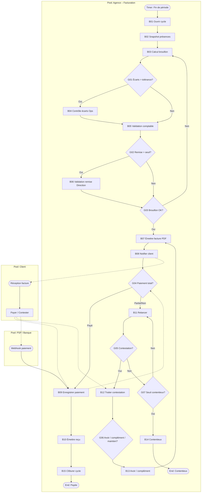

# 14 – Facturation

| Attribut | Valeur |
|----------|--------|
| **ID workflow** | `fin.facturation.v1` |
| **Pool** | Agence de sécurité |
| **Pools externes** | Client, PSP Mobile Money / Banque |
| **Version** | 1.0 |
| **Domaine** | Finance / Commercial |

---

## 1. Nom du processus

**Facturation client des prestations de sécurité** (périodes, points de présence, avenants, émission PDF, encaissement, relances).

---

## 2. Objectif

Produire des factures exactes, auditables et conformes aux contrats clients, en s’appuyant sur :

- la **période de facturation** (mensuelle, quinzaine, à la vacation) ;
- les **points de présence** (sites / postes contractuels) et les heures/présences réalisées ;
- les **avenants** (extension horaires, agents supplémentaires, matériel) ;
- l’émission d’une **facture PDF** numérotée ;
- l’encaissement via **mobile money**, virement bancaire ou espèce encadrée ;
- un cycle de **relances** automatisées jusqu’au contentieux léger.

---

## 3. Déclencheur

| Type BPMN | Événement |
|-----------|-----------|
| **Timer Start** | Clôture de période (ex. J+1 après fin de mois) |
| **Message Start** | Demande de facture intermédiaire (Commercial / Client) |
| **Message Start** | Validation d’un avenant facturable |
| **Message Start** | Signal de clôture des pointages / présences de la période |
| **Manual Start** | Facture de régularisation (avoir, complément) |

---

## 4. Acteurs (Lanes)

| Lane | Responsabilités |
|------|-----------------|
| **Commercial** | Cadre contractuel, avenants, négociation litiges montants |
| **Opérations** | Validation des points de présence et écarts terrain |
| **Comptabilité / Facturation** | Préparation, contrôle, émission, lettrage |
| **Direction** | Validation seuils, remises, passage contentieux |
| **Client** (pool externe) | Réception facture, contestation, paiement |
| **PSP / Banque** (pool externe) | Mobile money, virement, webhooks paiement |
| **Système** | Agrégation présences, calcul TVA, PDF, relances, IA anomalies |

---

## 5. Préconditions

- Contrat client actif (`contractId`) avec grilles tarifaires (poste, heure, forfait).
- Points de présence / sites liés au contrat.
- Pointages, rondes et absences de la période **clos** ou figés (snapshot).
- Avenants approuvés intégrés au périmètre facturable.
- Paramètres fiscaux : TVA, numérotation légale, mentions obligatoires (pays).
- Coordonnées de paiement client (mobile money, RIB) et coordonnées agence.
- Permissions : `invoice.read`, `invoice.draft`, `invoice.issue`, `invoice.collect`, `invoice.credit`.

---

## 6. Description détaillée

### 6.1 Ouverture de période

1. Timer ou déclenchement manuel ouvre un **cycle de facturation** pour `companyId` + `clientId` + période.
2. Le Système fige un snapshot des données opérationnelles (présences, heures, incidents facturables selon contrat).

### 6.2 Calcul du brouillon

1. Agrégation par point de présence : agents prévus vs réalisés, heures normales / majorées, astreintes.
2. Application des avenants (lignes additionnelles).
3. Application remises, pénalités contractuelles, frais de dossier.
4. Génération d’un **brouillon** `DRAFT` avec détail ligne à ligne.

### 6.3 Contrôle métier

1. Comptabilité + Opérations (si écarts) valident le brouillon.
2. Contestation interne → correction ou ouverture d’un litige opérationnel.
3. Remise exceptionnelle → validation Direction si > seuil.

### 6.4 Émission

1. Attribution du numéro légal, génération **PDF**, horodatage.
2. Statut `ISSUED` ; envoi Email + WhatsApp (lien sécurisé) au client.
3. Échéance de paiement calculée (ex. net 15 / 30).

### 6.5 Encaissement

1. Client paie par mobile money (API), virement (rapprochement) ou autre mode autorisé.
2. Webhook / rapprochement bancaire → lettrage partiel ou total (`PARTIALLY_PAID` / `PAID`).
3. Émission éventuelle de reçu PDF.

### 6.6 Relances et litiges

1. Timers J-3, J+1, J+7, J+15 : relances multi-canal.
2. Contestation client → mise en `DISPUTED`, gel des relances, analyse Commercial.
3. Avoir (`CREDIT_NOTE`) ou facture complémentaire si nécessaire.
4. Impayé prolongé → escalade Direction / contentieux.

---

## 7. Tableau des activités

| N° | Activité | Responsable | Type BPMN | Entrées | Sorties |
|----|----------|-------------|-----------|---------|---------|
| B01 | Ouvrir cycle de facturation | Système | Service Task / Timer | Contrat, période | Cycle `OPEN` |
| B02 | Figer snapshot présences | Système | Service Task | Pointages, sites | Snapshot immuable |
| B03 | Calculer lignes brouillon | Système | Service Task | Snapshot, tarifs, avenants | Facture `DRAFT` |
| B04 | Contrôler écarts opérationnels | Opérations | User Task | DRAFT, écarts | OK / corrections |
| B05 | Valider brouillon comptable | Comptabilité | User Task | DRAFT | `PENDING_ISSUE` |
| B06 | Valider remise exceptionnelle | Direction | User Task | Demande remise | Approuvé / Refusé |
| B07 | Émettre facture + PDF | Système | Service Task | PENDING_ISSUE | `ISSUED` + PDF |
| B08 | Notifier client | Système | Message Task | Facture, canaux | Accusés d’envoi |
| B09 | Enregistrer paiement | Système / Comptabilité | Service / User Task | Webhook PSP / relevé | Lettrage |
| B10 | Émettre reçu | Système | Service Task | Paiement | Reçu PDF |
| B11 | Relancer impayé | Système | Timer + Message | Échéance dépassée | Relance N |
| B12 | Traiter contestation | Commercial | User Task | Motifs client | Décision litige |
| B13 | Émettre avoir / complément | Comptabilité | User Task | Décision | CREDIT_NOTE / NEW_INVOICE |
| B14 | Escalader contentieux | Direction | User Task | Impayé âgé | Dossier contentieux |
| B15 | Clôturer cycle | Système | Service Task | PAID / CLOSED | Audit + KPI |

---

## 8. Décisions (Gateways)

| ID | Gateway | Type | Question | Branches |
|----|---------|------|----------|----------|
| G01 | XOR | Exclusive | Écarts opérationnels > tolérance ? | Oui → B04 correction / Non → B05 |
| G02 | XOR | Exclusive | Remise > seuil Direction ? | Oui → B06 / Non → B07 |
| G03 | XOR | Exclusive | Brouillon validé ? | Oui → émission / Non → retour calcul |
| G04 | XOR | Exclusive | Paiement total reçu ? | Oui → PAID / Partiel → PARTIALLY_PAID / Non → relances |
| G05 | XOR | Exclusive | Client conteste ? | Oui → DISPUTED / Non → poursuite relances |
| G06 | XOR | Exclusive | Litige : avoir, complément ou maintien ? | 3 branches B13 |
| G07 | XOR | Exclusive | Âge impayé > seuil contentieux ? | Oui → B14 / Non → prochaine relance |
| G08 | AND | Parallel | Envoi multi-canal facture | Email + WhatsApp (+ SMS fallback) |

---

## 9. Gestion des exceptions

| Exception | Traitement |
|-----------|------------|
| Snapshot incomplet (pointages non clos) | Bloquer émission ; notifier Opérations ; timer de rappel |
| Numérotation fiscale en conflit | Verrou distribué ; retry ; alerte admin |
| Échec génération PDF | Retry + file d’attente ; statut `ISSUE_FAILED` |
| Webhook paiement dupliqué | Idempotence `paymentRef` ; pas de double lettrage |
| Paiement orphelin (sans facture) | Compte d’attente + rapprochement manuel |
| Contestation hors délai contractuel | Rejet motivé + reprise relances |
| Devise / mobile money indisponible | Basculer mode de paiement alternatif |

---

## 10. Données manipulées

| Entité | Attributs clés | Statuts |
|--------|----------------|---------|
| `BillingCycle` | clientId, periodStart, periodEnd | OPEN, CLOSED |
| `Invoice` | number, currency, totalHT, totalTTC, dueDate | DRAFT, ISSUED, PARTIALLY_PAID, PAID, DISPUTED, CANCELLED |
| `InvoiceLine` | siteId, description, qty, unitPrice, avenantId? | — |
| `ContractAmendment` | contractId, effectiveDate, amountImpact | APPROVED |
| `PresenceSnapshot` | cycleId, hash, frozenAt | FROZEN |
| `Payment` | invoiceId, method, amount, pspRef | PENDING, CONFIRMED, FAILED |
| `DunningAction` | invoiceId, level, channel, sentAt | SENT |
| `CreditNote` | invoiceId, amount, reason | ISSUED |

---

## 11. Notifications

| Événement | Canal | Destinataires |
|-----------|-------|---------------|
| Facture émise | Email (PDF) + WhatsApp lien | Client, Commercial |
| Paiement reçu | WhatsApp / Email | Client, Comptabilité |
| Relance J-3 / J+1 / J+7 / J+15 | WhatsApp, SMS, Email | Client |
| Écarts bloquants | Push / WhatsApp | Opérations, Comptabilité |
| Contestation ouverte | Email + WhatsApp | Commercial, Direction |
| Passage contentieux | Email | Direction, Juridique |

---

## 12. KPI

| KPI | Définition | Cible |
|-----|------------|-------|
| Délai d’émission | Fin de période → ISSUED | ≤ 3 j ouvrés |
| Taux de factures sans correction | DRAFT validé sans retour | ≥ 90 % |
| DSO (Days Sales Outstanding) | Délai moyen encaissement | Selon marché local |
| Taux d’impayés > 30 j | Montant / CA facturé | ≤ 5 % |
| Taux de contestation | Factures DISPUTED / émises | ≤ 3 % |
| Taux de lettrage auto | Paiements rapprochés sans manuel | ≥ 85 % |
| Exactitude présences | Écarts valeur / CA | ≤ 1 % |

---

## 13. Recommandations d’amélioration

1. **Pré-facture collaborative** envoyée au client 48 h avant émission pour réduire les litiges.
2. **Tarification dynamique** par avenant avec simulation d’impact.
3. **Rapprochement IA** virements (libellés bancaires hétérogènes Afrique).
4. **Portail client** : téléchargement factures, historique paiements, litiges.
5. **Facturation au prorata** automatique en cas de démarrage/arrêt site en cours de mois.
6. **Multi-devises** et arrondis conformes aux règles BCEAO / locales.
7. **Lien direct** mobile money (Deep link / QR de paiement) dans WhatsApp.

---

## 14. Diagramme BPMN ASCII

```
POOL: Agence                          POOL: Client              POOL: PSP/Banque
================================================================================

(Timer: Fin période)
    |
    v
[B01 Ouvrir cycle] --> [B02 Snapshot] --> [B03 Calcul DRAFT]
    |
    v
 <G01 XOR écarts?> --oui--> [B04 Contrôle Ops] --+
    |non                                         |
    v                                            v
 [B05 Valider Comptabilité] <--------------------+
    |
    v
 <G02 Remise > seuil?> --oui--> [B06 Direction] --+
    |non                                          |
    v                                             v
 <G03 Validé?> --non--> [B03]              [B07 Émettre PDF]
    |oui                                         |
    v                                            v
 [B07] ----------------------------------> <G08 AND envois>
                                              |         |
                                         [Email PDF] [WhatsApp]
                                              |         |
                                              v         v
                                         (Message --> Client reçoit)
                                              |
                                    Client paie ------> (Message PSP)
                                              |
                                              v
                                         [B09 Lettrage] --> <G04 Payé?>
                                              |oui              |non
                                              v                 v
                                         [B10 Reçu]      [B11 Relances Timer]
                                              |                 |
                                              v                 v
                                         [B15 Clôture]   <G05 Conteste?>
                                                              |oui        |non
                                                              v           v
                                                         [B12 Litige] <G07 Contentieux?>
                                                              |              |oui
                                                         <G06 Décision>   [B14]
                                                              |
                                                         [B13 Avoir/Complément]
```

---

## 15. Diagramme Mermaid



---

## Compléments conception SaaS

### Règles métier

- Pas d’émission sans snapshot `FROZEN` pour la période.
- Numérotation **monotone stricte** par société / exercice fiscal.
- Une facture `ISSUED` est immuable ; corrections via **avoir** ou facture complémentaire.
- Avenants : uniquement `APPROVED` et `effectiveDate` dans la période.
- Tolérance d’écart heures configurable par contrat (ex. ±2 %).
- Modes de paiement autorisés par pays / client.

### Validations

- Totaux : `sum(lines) = totalHT` ; TVA cohérente avec régime.
- Devise ISO ; montants ≥ 0 ; avoir ≤ facture d’origine restante.
- `dueDate >= issuedAt`.
- Références PSP uniques (`paymentRef`).
- Mentions légales obligatoires présentes dans le template PDF.

### Contrôles automatiques

- Blocage si pointages période non clos.
- Détection doublon de facturation (même contrat + période).
- Job relances selon scénario `dunningPolicyId`.
- Rapprochement auto mobile money via webhook signé.
- IA : détection lignes anormales vs historique client.

### Risques

| Risque | Mitigation |
|--------|------------|
| Sous-facturation / oubli avenant | Checklist avenants + diff contrat |
| Fraude numérotation | Séquence DB transactionnelle |
| Faux webhooks paiement | Signature HMAC + allowlist IP |
| Litiges récurrents | Pré-facture + portail |
| Non-conformité fiscale | Templates par pays + revue légale |

### Automatisation

- Génération PDF (queue) + stockage objet signé URL.
- Deep link paiement mobile money.
- Recalcul automatique brouillon après correction Ops.
- Export comptable (CSV / API ERP).

### Intégrations

| Canal | Usage |
|-------|-------|
| **Email** | Facture PDF, relances formelles |
| **WhatsApp / SMS** | Notification émission, relances courtes, lien paiement |
| **API Mobile Money** | Initiation + webhook confirmation |
| **API Bancaire** | Relevés / rapprochement virements |
| **GPS / Pointages** | Source des quantités facturables |
| **QR** | QR de paiement sur PDF |
| **IA** | Anomalies de montant, matching libellés |
| **API Contrat** | Tarifs, avenants, pénalités |

---

*Fin du dossier 14 – Facturation*
