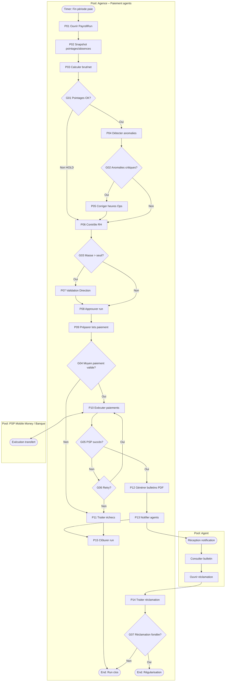

# 15 – Paiement des agents

| Attribut | Valeur |
|----------|--------|
| **ID workflow** | `rh.paiement-agents.v1` |
| **Pool** | Agence de sécurité |
| **Pools externes** | PSP Mobile Money / Banque, Agent (destinataire) |
| **Version** | 1.0 |
| **Domaine** | RH / Paie |

---

## 1. Nom du processus

**Calcul et paiement de la rémunération des agents de sécurité** (heures, absences, primes, retenues, mobile money, bulletin).

---

## 2. Objectif

Garantir une paie juste, transparente et traçable pour les agents, en intégrant :

- les **heures travaillées** (pointages, vacations, heures majoées) ;
- les **absences** (justifiées, injustifiées, congés, maladies) ;
- les **primes** (assiduité, dangerosité, nuit, performance, récupération) ;
- les **retenues** (avances, pertes équipements, amendes disciplinaires encadrées, cotisations) ;
- le versement prioritaire par **mobile money** (et virement si applicable) ;
- l’édition d’un **bulletin de paie PDF** consultable sur mobile.

---

## 3. Déclencheur

| Type BPMN | Événement |
|-----------|-----------|
| **Timer Start** | Clôture période de paie (mensuelle / quinzaine) |
| **Message Start** | Signal « pointages période figés » (Ops) |
| **Message Start** | Demande d’acompte / avance (RH, avec règles) |
| **Message Start** | Retenue équipement validée (processus 13) |
| **Manual Start** | Paie de régularisation / rappel |

---

## 4. Acteurs (Lanes)

| Lane | Responsabilités |
|------|-----------------|
| **RH / Paie** | Préparation, contrôle, validation, bulletins |
| **Opérations** | Validation heures / absences terrain |
| **Chef de site** | Confirmation présences locales, incidents |
| **Finance** | Trésorerie, ordre de paiement, rapprochement |
| **Direction** | Validation masse salariale / exceptions |
| **Agent** | Consultation bulletin, signalement anomalie |
| **PSP / Banque** | Exécution mobile money / virement |
| **Système** | Agrégation, calcul barèmes, PDF, notifications, IA |

---

## 5. Préconditions

- Agents actifs avec contrat RH, catégorie, site(s), IBAN ou numéro mobile money vérifié.
- Barèmes salariaux, primes, cotisations et plafonds de retenues paramétrés par pays.
- Pointages / plannings de la période **clos** (snapshot).
- Absences saisies et validées (ou défaut = absence injustifiée selon politique).
- Retenues équipement / avances en attente intégrables.
- Solde de trésorerie suffisant ou validation Direction pour déficit.
- Permissions : `payroll.read`, `payroll.prepare`, `payroll.validate`, `payroll.pay`, `payroll.self_read`.

---

## 6. Description détaillée

### 6.1 Ouverture de la période de paie

1. Timer ouvre un `PayrollRun` pour la société / période.
2. Snapshot des pointages, absences, primes éligibles, retenues pending.

### 6.2 Calcul brut / net

1. Heures normales, majoées (nuit, dimanche, férié), heures supp selon règles locales.
2. Déduction absences selon type.
3. Ajout primes (règles automatiques + primes manuelles validées).
4. Application retenues (plafonnées).
5. Cotisations / taxes paramétrées → net à payer.
6. Génération lignes agent en `DRAFT`.

### 6.3 Contrôles

1. RH revoit les anomalies (écarts heures, retenues élevées, agents sans RIB/MM).
2. Opérations confirme les cas flaggés.
3. Si masse salariale > seuil → validation Direction.
4. Agents peuvent être mis en `HOLD` (litige) sans bloquer tout le run.

### 6.4 Validation et paiement

1. RH valide le run → `APPROVED`.
2. Finance déclenche lots de paiement mobile money / virement (batches).
3. Webhooks PSP → statut `PAID` / `FAILED` par agent.
4. Retry automatique des échecs (numéro invalide, plafond journalier).

### 6.5 Bulletins et réclamations

1. Génération bulletin PDF par agent ; publication app + WhatsApp lien sécurisé.
2. Fenêtre de réclamation (ex. 7 jours) → ticket RH.
3. Régularisation sur période suivante ou paie corrective.
4. Clôture du `PayrollRun`.

---

## 7. Tableau des activités

| N° | Activité | Responsable | Type BPMN | Entrées | Sorties |
|----|----------|-------------|-----------|---------|---------|
| P01 | Ouvrir run de paie | Système | Timer / Service | Période, companyId | PayrollRun `OPEN` |
| P02 | Figer snapshot RH/Ops | Système | Service Task | Pointages, absences | Snapshot |
| P03 | Calculer brut/net agents | Système | Service Task | Barèmes, primes, retenues | Lignes `DRAFT` |
| P04 | Flag anomalies | Système | Service Task | Règles contrôle | Liste anomalies |
| P05 | Corriger / valider heures | Opérations / Chef de site | User Task | Anomalies | Heures corrigées |
| P06 | Contrôler dossier paie | RH | User Task | DRAFT + anomalies | `PENDING_APPROVAL` |
| P07 | Valider masse salariale | Direction | User Task | Totaux | Approuvé / Ajustements |
| P08 | Approuver run | RH / Finance | User Task | PENDING_APPROVAL | `APPROVED` |
| P09 | Préparer lots paiement | Système | Service Task | Nets, moyens paiement | PaymentBatch |
| P10 | Exécuter paiements PSP | Système / Finance | Service / Message | Batch | Résultats PSP |
| P11 | Traiter échecs / retry | Finance / Système | User / Service | FAILED | Retry ou HOLD |
| P12 | Générer bulletins PDF | Système | Service Task | Lignes PAID | PDF stockés |
| P13 | Notifier agents | Système | Message Task | Lien bulletin | Accusés |
| P14 | Traiter réclamation | RH | User Task | Ticket agent | Régularisation |
| P15 | Clôturer run | Système | Service Task | Run complet | `CLOSED` + audit |

---

## 8. Décisions (Gateways)

| ID | Gateway | Type | Question | Branches |
|----|---------|------|----------|----------|
| G01 | XOR | Exclusive | Pointages complets pour l’agent ? | Oui → calcul / Non → HOLD ou estimation réglementée |
| G02 | XOR | Exclusive | Anomalies critiques présentes ? | Oui → P05 / Non → P06 |
| G03 | XOR | Exclusive | Masse > seuil Direction ? | Oui → P07 / Non → P08 |
| G04 | XOR | Exclusive | Moyen de paiement valide ? | Oui → lot MM/virement / Non → HOLD + alerte RH |
| G05 | XOR | Exclusive | Paiement PSP succès ? | Oui → PAID / Non → retry / échec définitif |
| G06 | XOR | Exclusive | Retry autorisé ? | Oui → P10 / Non → paiement manuel |
| G07 | XOR | Exclusive | Réclamation fondée ? | Oui → régularisation / Non → clôture motivée |
| G08 | AND | Parallel | Paiements multi-PSP / multi-lots | Lots parallèles puis synchro |

---

## 9. Gestion des exceptions

| Exception | Traitement |
|-----------|------------|
| Agent sans numéro MM / RIB | HOLD + notification RH/Agent ; exclus du batch |
| Plafond mobile money journalier | Découpage auto en plusieurs transferts ou report J+1 |
| Double paiement | Idempotence `payrollLineId` + `idempotencyKey` PSP |
| Contestation heures post-clôture | Régularisation période suivante uniquement (sauf fraude) |
| Retenue > plafond légal | Cap automatique + alerte Direction |
| Échec génération bulletin | Retry queue ; paiement non annulé |
| Trésorerie insuffisante | Blocage P10 ; escalade Direction |
| Sync offline pointages tardifs | Interdire après freeze sauf override journalisé |

---

## 10. Données manipulées

| Entité | Attributs clés | Statuts |
|--------|----------------|---------|
| `PayrollRun` | periodStart, periodEnd, totalNet | OPEN, APPROVED, PAYING, CLOSED |
| `PayrollLine` | agentId, hours, gross, net, holdReason | DRAFT, APPROVED, PAID, FAILED, HOLD |
| `PayComponent` | type (BASE, OVERTIME, BONUS, DEDUCTION…) | — |
| `Absence` | type, days/hours, justified | VALIDATED |
| `Advance` | amount, balance | OPEN, RECOVERED |
| `EquipmentDeduction` | lossReportId, amount | PENDING, APPLIED |
| `PaymentBatch` | provider, total, itemCount | PENDING, SENT, DONE |
| `Payslip` | payrollLineId, pdfUrl | PUBLISHED |
| `PayrollClaim` | agentId, reason | OPEN, ACCEPTED, REJECTED |

---

## 11. Notifications

| Événement | Canal | Destinataires |
|-----------|-------|---------------|
| Anomalies heures | Push / WhatsApp | Ops, Chef de site, RH |
| Run prêt à valider | Email / Push | RH, Direction |
| Paiement effectué | WhatsApp / SMS | Agent |
| Échec paiement | WhatsApp / SMS | Agent, RH, Finance |
| Bulletin disponible | WhatsApp lien + Push | Agent |
| Réclamation reçue / tranchée | Push / SMS | Agent, RH |
| HOLD agent | WhatsApp | Agent + RH |

---

## 12. KPI

| KPI | Définition | Cible |
|-----|------------|-------|
| Ponctualité paie | % agents payés à la date promise | ≥ 98 % |
| Taux de réussite MM | Paiements OK / tentés | ≥ 97 % |
| Délai run | Ouverture → CLOSED | ≤ 5 j ouvrés |
| Taux de réclamations | Claims / bulletins | ≤ 4 % |
| Taux de régularisation | Claims acceptés | Suivi tendance ↓ |
| Exactitude heures | Écart post-paie / heures payées | ≤ 1 % |
| Agents en HOLD | % lignes HOLD à J paiement | ≤ 2 % |

---

## 13. Recommandations d’amélioration

1. **Simulation de bulletin** mid-période pour transparence agent.
2. **Primes automatiques** liées aux KPI terrain (ponctualité rondes, zéro incident).
3. **Self-service** mise à jour numéro mobile money avec OTP.
4. **Prévision trésorerie paie** 7 j avant run.
5. **IA** détection pointages aberrants avant freeze.
6. **Paiement instantané** des acomptes plafonnés (micro-avance).
7. **Export déclarations sociales** par pays (formats locaux).

---

## 14. Diagramme BPMN ASCII

```
POOL: Agence                         POOL: PSP              POOL: Agent
================================================================================

(Timer: Clôture paie)
    |
    v
[P01 Ouvrir run] --> [P02 Snapshot] --> [P03 Calcul DRAFT] --> [P04 Flag anomalies]
    |
    v
 <G02 Anomalies?> --oui--> [P05 Corriger Ops] --+
    |non                                        |
    v                                           v
 [P06 Contrôle RH] <----------------------------+
    |
    v
 <G03 Masse > seuil?> --oui--> [P07 Direction] --+
    |non                                         |
    v                                            v
 [P08 Approuver] ----------------------------> [P09 Lots]
    |
    v
 <G08 AND lots parallèles> --> [P10 Paiement PSP] <----> (API PSP)
    |
    v
 <G05 Succès?> --oui--> [P12 Bulletins] --> [P13 Notify] --> (Agent reçoit)
    |non
    v
 <G06 Retry?> --oui--> [P10]
    |non
    v
 [P11 HOLD / manuel] --> [P15 Clôture partielle]

(Message: Réclamation agent) --> [P14 Traiter] --> <G07 Fondée?> --> régul / rejet
```

---

## 15. Diagramme Mermaid



---

## Compléments conception SaaS

### Règles métier

- Freeze pointages **avant** calcul ; toute modification post-freeze = override audité.
- Net à payer ≥ 0 ; si retenues > brut → étalement automatique sur N périodes.
- Un agent `HOLD` n’entre pas dans les batches tant que le motif n’est pas levé.
- Primes manuelles : double validation si > seuil.
- Un seul `PayrollRun` `OPEN` par société et type de période.
- Bulletin : conservation légale N années (paramètre pays).

### Validations

- Numéro MM : format pays + OTP de vérification à l’enrollment.
- Composantes : types enumérés ; somme cohérente brut → net.
- Absences sans chevauchement ; types compatibles au contrat.
- `idempotencyKey` unique par `payrollLineId` + tentative.

### Contrôles automatiques

- Comparaison heures planifiées vs pointées (écart %).
- Détection agents payés sans vacation (fraude inverse).
- Plafonds cotisations / retenues légales.
- Vérification solde trésorerie pré-batch.
- IA : outliers (heures, primes) avant approbation RH.

### Risques

| Risque | Mitigation |
|--------|------------|
| Paiement au mauvais numéro | OTP + historique + confirmation agent |
| Fraude collusion RH/Ops | Séparation des tâches + audit |
| Fuite bulletins | URL signée TTL court + auth app |
| Échecs MM massifs jour de paie | Multi-PSP + files + fenêtres horaires |
| Non-conformité sociale | Packs règles par pays versionnés |

### Automatisation

- Calcul barèmes, majorations, cotisations.
- Batches PSP + retries exponentiels.
- Publication bulletins + notifications.
- Propagation `EquipmentDeduction` depuis processus 13.
- Export comptable charges salariales.

### Intégrations

| Canal | Usage |
|-------|-------|
| **Mobile Money API** | Paiement net agents |
| **WhatsApp / SMS** | Notif paiement, bulletin, HOLD |
| **Email** | Synthèse run RH/Direction, export |
| **GPS / Pointage / QR/NFC** | Source heures travaillées |
| **API RH** | Contrats, absences, sorties |
| **API Équipements** | Retenues pertes |
| **IA** | Anomalies pointage / paie |
| **Stockage objet** | PDF bulletins chiffrés |

---

*Fin du dossier 15 – Paiement des agents*
