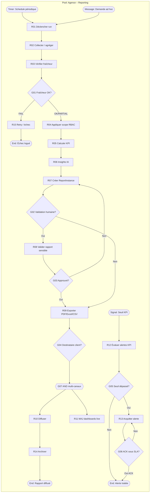

# 16 – Reporting

| Attribut | Valeur |
|----------|--------|
| **ID workflow** | `pilotage.reporting.v1` |
| **Pool** | Agence de sécurité |
| **Version** | 1.0 |
| **Domaine** | Pilotage / BI opérationnelle |

---

## 1. Nom du processus

**Production et diffusion des rapports et tableaux de bord** (opérationnel, commercial, RH, finance) avec export et envoi périodique.

---

## 2. Objectif

Fournir aux décideurs et opérationnels une vision fiable et à jour de l’activité de l’agence :

- **Dashboards opérationnels** : couverture sites, pointages, incidents, rondes, équipements ;
- **Dashboards commerciaux** : pipeline, contrats, avenants, satisfaction, renouvellements ;
- **Dashboards RH** : effectifs, absences, turnover, formations, paie ;
- **Dashboards finance** : CA facturé, encaissements, DSO, masse salariale, rentabilité site ;
- **Exports** (PDF, Excel, CSV) et **envois périodiques** multi-canal (Email, WhatsApp).

---

## 3. Déclencheur

| Type BPMN | Événement |
|-----------|-----------|
| **Timer Start** | Planifications (quotidien 06:00, hebdo lundi, mensuel J+1) |
| **Message Start** | Demande ad hoc (Direction, Manager, Client selon droits) |
| **Signal Start** | Seuil KPI franchi (alerte temps réel) |
| **Message Start** | Fin de processus métier (ex. clôture facturation / paie) pour rapport de cycle |
| **Manual Start** | Rapport client contractuel (SLA reporting) |

---

## 4. Acteurs (Lanes)

| Lane | Responsabilités |
|------|-----------------|
| **Direction / Pilotage** | Définition KPI, validation rapports stratégiques |
| **Opérations** | Exploitation dashboards terrain, commentaires écarts |
| **Commercial** | Rapports portefeuille clients / pipeline |
| **RH** | Rapports effectifs, absences, paie agrégée |
| **Finance** | Rapports CA, trésorerie, rentabilité |
| **Manager de site / Chef de site** | Consultation périmètre site |
| **Client** (optionnel) | Réception rapport contractuel anonymisé / agrégé |
| **Système** | ETL, agrégations, rendu, exports, diffusion, IA insights |

---

## 5. Préconditions

- Données sources disponibles via API / entrepôt (leads, sites, agents, incidents, factures, paie, équipements).
- Rôles et **scopes** définis (société, site, équipe) — alignés RBAC multi-entreprises si groupe.
- Catalogue de rapports (`ReportTemplate`) versionnés.
- Planifications (`ReportSchedule`) et listes de diffusion.
- Templates PDF/Email localisés (FR) et fuseau horaire agence.
- Permissions : `report.view.*`, `report.export`, `report.schedule`, `report.share_client`.

---

## 6. Description détaillée

### 6.1 Collecte et agrégation

1. Jobs ETL incrémentaux alimentent des vues matérialisées / cubes par domaine.
2. Contrôle de fraîcheur (`dataFreshness`) : si données trop anciennes → watermark « données partielles ».

### 6.2 Génération dashboard / rapport

1. Sélection du template + filtres (période, site, client, société).
2. Calcul KPI + séries temporelles + tableaux de détail.
3. Insights IA optionnels (résumé textuel, anomalies).
4. Persistance d’un `ReportInstance` (snapshot) pour audit de diffusion.

### 6.3 Contrôle et validation (rapports sensibles)

1. Rapports finance / client : validation humaine si configuré.
2. Masquage PII selon destinataire (agent vs direction vs client).

### 6.4 Export et diffusion

1. Export PDF / XLSX / CSV à la demande ou planifié.
2. Envoi Email (pièce jointe ou lien sécurisé) ; résumé WhatsApp ; Push in-app.
3. Accusé de lecture optionnel pour rapports clients SLA.

### 6.5 Alerting KPI

1. Règles de seuil → notification immédiate + lien deep-link dashboard.
2. Escalade si non acquittement sous délai.

---

## 7. Tableau des activités

| N° | Activité | Responsable | Type BPMN | Entrées | Sorties |
|----|----------|-------------|-----------|---------|---------|
| R01 | Déclencher run reporting | Système | Timer / Message | Schedule / demande | Job `QUEUED` |
| R02 | Collecter / agréger données | Système | Service Task | Sources métier | Dataset |
| R03 | Vérifier fraîcheur données | Système | Service Task | Watermarks | OK / PARTIAL / FAIL |
| R04 | Appliquer filtres & scope RBAC | Système | Service Task | User/role, filtres | Dataset scopé |
| R05 | Calculer KPI & visualisations | Système | Service Task | Dataset | ReportPayload |
| R06 | Générer insights IA | Système | Service Task | Payload | Texte insights |
| R07 | Créer instance rapport | Système | Service Task | Payload | ReportInstance `DRAFT` |
| R08 | Valider rapport sensible | Direction / Finance | User Task | DRAFT | `APPROVED` / rejet |
| R09 | Exporter PDF/Excel/CSV | Système | Service Task | Instance | Fichiers |
| R10 | Diffuser aux destinataires | Système | Message Task | Fichiers, canaux | Accusés |
| R11 | Mettre à jour dashboards live | Système | Service Task | Cubes | UI temps réel |
| R12 | Évaluer règles d’alerte KPI | Système | Service Task | Seuils | Alertes |
| R13 | Acquitter alerte | Manager / Direction | User Task | Alerte | ACK |
| R14 | Archiver instance | Système | Service Task | Instance | Archive + rétention |
| R15 | Traiter échec / retry | Système | Service Task | Erreur | Retry ou `FAILED` |

---

## 8. Décisions (Gateways)

| ID | Gateway | Type | Question | Branches |
|----|---------|------|----------|----------|
| G01 | XOR | Exclusive | Données assez fraîches ? | OK → suite / PARTIAL → watermark / FAIL → R15 |
| G02 | XOR | Exclusive | Rapport nécessite validation humaine ? | Oui → R08 / Non → R09 |
| G03 | XOR | Exclusive | Validation OK ? | Oui → diffusion / Non → correction filtres ou annulation |
| G04 | XOR | Exclusive | Destinataire client externe ? | Oui → masquage PII renforcé / Non → diffusion interne |
| G05 | XOR | Exclusive | Seuil KPI dépassé ? | Oui → alerte / Non → fin monitoring |
| G06 | XOR | Exclusive | Alerte non ACK sous SLA ? | Oui → escalade / Non → clôture |
| G07 | AND | Parallel | Multi-formats / multi-canaux | PDF+Excel et Email+WhatsApp en parallèle |
| G08 | XOR | Exclusive | Échec export/diffusion ? | Retry / Dead letter + notif admin |

---

## 9. Gestion des exceptions

| Exception | Traitement |
|-----------|------------|
| Source API indisponible | Retry backoff ; rapport PARTIAL si politique l’autorise |
| Timeout agrégation | Découpage par site ; cache dernière version + bandeau |
| Destinataire Email bounce | Fallback SMS/WhatsApp ; purge liste |
| Lien sécurisé expiré | Régénération sur demande authentifiée |
| Fuite scope (accès hors périmètre) | Blocage + audit sécurité |
| Surcharge lundi matin (tous schedules) | File priorisée ; staggered cron |
| Insights IA indisponibles | Rapport sans bloc IA ; pas de blocage |

---

## 10. Données manipulées

| Entité | Attributs clés | Statuts |
|--------|----------------|---------|
| `ReportTemplate` | domain (OPS/COM/RH/FIN), version, querySpec | ACTIVE |
| `ReportSchedule` | cron, channels, recipients, timezone | ACTIVE, PAUSED |
| `ReportInstance` | templateId, period, scope, freshness | DRAFT, APPROVED, SENT, FAILED |
| `ReportExport` | format, url, expiresAt | READY, EXPIRED |
| `KpiDefinition` | code, formula, thresholds | ACTIVE |
| `KpiAlert` | kpiCode, value, level | OPEN, ACKED, ESCALATED |
| `DashboardWidget` | layout, dataSource | — |
| `DataFreshness` | source, lastSuccessAt | — |

---

## 11. Notifications

| Événement | Canal | Destinataires |
|-----------|-------|---------------|
| Rapport périodique prêt | Email (+ PDF) | Liste de diffusion |
| Résumé exécutif | WhatsApp | Direction |
| Alerte KPI critique | SMS + Push + WhatsApp | Managers, Direction |
| Escalade non-ACK | Appel IVR / SMS | Direction |
| Échec génération | Email / Push | Admin plateforme, owner schedule |
| Rapport client SLA | Email | Client + Commercial en copie |

---

## 12. KPI

| KPI | Définition | Cible |
|-----|------------|-------|
| Taux de succès schedules | Runs SENT / planifiés | ≥ 99 % |
| Fraîcheur moyenne | Délai source → dashboard | ≤ 15 min (ops), ≤ 1 h (finance) |
| Temps de génération | P50 / P95 run | P95 ≤ 2 min |
| Taux d’ouverture Email | Opens / envoyés | Suivi |
| Délai ACK alertes critiques | Médiane | ≤ 30 min |
| Adoption dashboards | Users actifs / users éligibles / sem. | ≥ 70 % |
| Incidents scope/PII | Violations détectées | 0 |

---

## 13. Recommandations d’amélioration

1. **Cockpit Direction** une page : 8 KPI max, drill-down.
2. **Comparaison multi-sites / multi-filiales** pour rôles groupe.
3. **Rapports narratifs IA** (bullet points actionnables, pas de jargon).
4. **Subscriptions self-service** par manager (choix KPI + canal).
5. **Mode basse connectivité** : PDF léger + résumé SMS.
6. **Benchmark anonymisé** inter-agences (option SaaS, opt-in).
7. **Qualité des données** score visible sur chaque rapport.

---

## 14. Diagramme BPMN ASCII

```
POOL: Agence de sécurité – Reporting
================================================================================

(Timer: Quotidien/Hebdo/Mensuel) ----+
(Message: Demande ad hoc) -----------+--> [R01 Run] --> [R02 Agrégation]
(Signal: Seuil KPI) -----------------+         |
                                               v
                                        [R03 Fraîcheur] --> <G01 XOR>
                                            |OK/PARTIAL          |FAIL
                                            v                    v
                                     [R04 Scope RBAC]         [R15 Retry]
                                            |
                                            v
                                     [R05 Calcul KPI] --> [R06 Insights IA]
                                            |
                                            v
                                     [R07 Instance DRAFT] --> <G02 Valid. humaine?>
                                            |non                      |oui
                                            v                         v
                                     [R09 Export] <-------------- [R08 Valider]
                                            |
                                            v
                                     <G04 Client externe?> --> masquage PII
                                            |
                                            v
                                     <G07 AND canaux> --> [R10 Diffuser] --> [R14 Archiver]
                                            |
                                            +--> Email PDF
                                            +--> WhatsApp résumé
                                            +--> [R11 Dashboards live]

[R12 Règles alerte] --> <G05 Seuil?> --oui--> (Alerte) --> [R13 ACK]
                                              |                    |
                                              |                    v
                                              |             <G06 Timeout?> --oui--> Escalade
```

---

## 15. Diagramme Mermaid



---

## Compléments conception SaaS

### Règles métier

- Tout rapport est généré dans le **périmètre RBAC** de l’utilisateur / du schedule (impersonation interdite sans audit).
- Rapports clients : uniquement données contractuelles autorisées + anonymisation agents si requis.
- Snapshot : les instances `SENT` sont immuables (rejouables pour audit).
- Fuseau et calendrier férié de l’agence pour les périodes « mois civil ».
- Rétention : ex. 24 mois instances, 90 j exports fichiers.

### Validations

- `cron` valide ; max N destinataires par schedule.
- Formats export whitelist ; taille max pièce jointe Email → bascule lien signé.
- Filtres période : `from <= to` ; max span configurable (ex. 366 j).
- KPI codes existants ; seuils min < max.

### Contrôles automatiques

- Tests de fraîcheur par source avant diffusion.
- Détection dérive KPI (variation > X % j/j) → insight.
- Sandbox query : timeout + limite lignes.
- Scan PII sur exports clients (emails agents, téléphones).
- Rate limit exports lourds par utilisateur.

### Risques

| Risque | Mitigation |
|--------|------------|
| Fuite multi-tenant | `companyId` obligatoire + tests isolation |
| Surcharge DB prod | Cubes / réplicas lecture |
| Décision sur données partielles | Watermark visible + politique blocage finance |
| Spam WhatsApp | Agrégation digests, opt-out |
| Manipulation manuelle chiffres | Snapshots signés hash |

### Automatisation

- Cron schedules + file workers.
- Génération PDF/XLSX asynchrone.
- Alerting temps réel sur stream KPI.
- Digests WhatsApp matinal Direction.
- Invalidation cache dashboards sur événements métier.

### Intégrations

| Canal | Usage |
|-------|-------|
| **Email** | Rapports PDF/Excel, digests |
| **WhatsApp / SMS** | Résumés KPI, alertes |
| **Push** | Alertes mobile managers |
| **GPS / Ops APIs** | Couverture, ponctualité, incidents |
| **API Finance / Paie / RH / Commercial** | Sources dashboards |
| **IA** | Résumés, anomalies, prévisions absences/CA |
| **Stockage objet** | Exports et archives |
| **Webhooks** | Push rapports vers ERP / BI client |

### Domaines de dashboards (contenu minimal)

| Domaine | Exemples de widgets |
|---------|---------------------|
| Opérations | Taux de couverture postes, incidents ouverts, rondes complètes, équipements critiques |
| Commercial | Contrats à renouveler 90 j, marge par client, avenants du mois |
| RH | Absenteïsme, agents sans affectation, formations échues |
| Finance | CA vs objectif, DSO, ratio masse salariale / CA, rentabilité par site |

---

*Fin du dossier 16 – Reporting*
