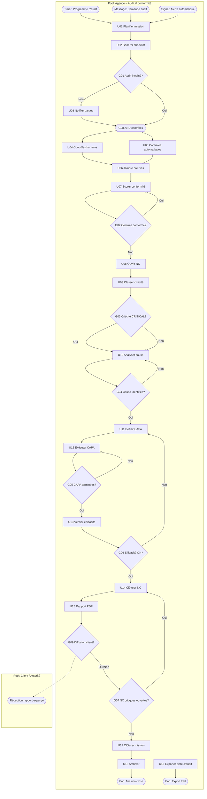

# 17 – Audit

| Attribut | Valeur |
|----------|--------|
| **ID workflow** | `conformite.audit.v1` |
| **Pool** | Agence de sécurité |
| **Pools externes** | Auditeur externe / Autorité (optionnel) |
| **Version** | 1.0 |
| **Domaine** | Conformité / Qualité / Sécurité de l’information |

---

## 1. Nom du processus

**Audit et conformité opérationnelle** (contrôles, piste d’audit, non-conformités, plans d’actions).

---

## 2. Objectif

Assurer que l’agence respecte ses obligations légales, contractuelles et internes, en permettant :

- des **contrôles de conformité** planifiés ou inopinés (sites, RH, équipements, facturation, paie) ;
- une **piste d’audit** immuable des actions utilisateurs et automatismes ;
- la gestion des **non-conformités** (NC) de la détection au bouclage ;
- un **plan d’actions** priorisé avec responsables, échéances et preuves ;
- des preuves exportables pour audits clients, assureurs ou autorités de tutelle (marché africain de la sécurité privée).

---

## 3. Déclencheur

| Type BPMN | Événement |
|-----------|-----------|
| **Timer Start** | Programme d’audit interne (mensuel / trimestriel) |
| **Message Start** | Demande Direction / Client / Autorité |
| **Signal Start** | Alerte automatique (fraude pointage, écart inventaire, incident grave) |
| **Message Start** | Non-conformité déclarée terrain (Chef de site, Agent, RH) |
| **Manual Start** | Audit inopiné |

---

## 4. Acteurs (Lanes)

| Lane | Responsabilités |
|------|-----------------|
| **Direction / Conformité** | Pilotage audits, validation NC majeures, clôture |
| **Auditeur interne** | Exécution contrôles, constats, scoring |
| **Chef de site / Ops** | Accueil audit terrain, preuves, actions correctives |
| **RH / Finance / Magasinier** | Réponses contrôles de leur domaine |
| **Responsable d’action** | Exécution CAPA (Corrective / Preventive Action) |
| **Auditeur externe / Client** | Revue preuves (lecture limitée) |
| **Système** | Collecte logs, checklists, timers SLA, notifications, IA scoring |

---

## 5. Préconditions

- Référentiel de contrôles (`ControlCatalog`) : exigences légales locales, clauses clients, SOP internes.
- Checklists par type d’audit (site, RH, finance, IT/sécurité, équipements).
- Piste d’audit applicative active (append-only) sur mutations sensibles.
- Matrice de criticité NC (mineure / majeure / critique).
- Workflow CAPA avec SLA par criticité.
- Permissions : `audit.plan`, `audit.execute`, `audit.read`, `nc.manage`, `capa.manage`, `audit.export`.

---

## 6. Description détaillée

### 6.1 Planification

1. Création d’une mission d’audit (`AuditMission`) : périmètre, sites, période, auditeurs.
2. Génération automatique de la checklist à partir du catalogue + risques site.
3. Notification des parties prenantes (sauf audit inopiné : notification limitée).

### 6.2 Exécution des contrôles

1. Auditeur renseigne chaque contrôle : conforme / non conforme / N/A + preuves (photos, docs, scans QR équipements, extrait logs).
2. Contrôles automatiques système (échantillons) : pointages GPS incohérents, factures sans snapshot, agents sans formation obligatoire, etc.
3. Score de conformité mission calculé en continu.

### 6.3 Non-conformités

1. Chaque écart ouvre une `NonConformity` liée au contrôle.
2. Classification criticité ; confinement immédiat si critique (ex. agent sans agrément sur site sensible).
3. Analyse de cause (5 pourquoi / Ishikawa simplifié dans l’UI).

### 6.4 Plan d’actions (CAPA)

1. Actions correctives et préventives avec owner, échéance, preuves attendues.
2. Suivi timers ; relances ; escalade Direction si dépassement.
3. Vérification d’efficacité (re-contrôle) avant clôture NC.

### 6.5 Piste d’audit & rapport

1. Consultation / export de l’audit trail filtré (utilisateur, entité, période).
2. Rapport d’audit PDF : synthèse, NC, CAPA, annexes preuves.
3. Clôture mission ; archivage ; éventuelle diffusion Client (version expurgée).

---

## 7. Tableau des activités

| N° | Activité | Responsable | Type BPMN | Entrées | Sorties |
|----|----------|-------------|-----------|---------|---------|
| U01 | Planifier mission d’audit | Conformité / Direction | User Task | Périmètre, calendrier | Mission `PLANNED` |
| U02 | Générer checklist | Système | Service Task | ControlCatalog, risques | Checklist items |
| U03 | Notifier parties prenantes | Système | Message Task | Mission | Accusés |
| U04 | Exécuter contrôles terrain/UI | Auditeur | User Task | Checklist | Constats |
| U05 | Exécuter contrôles auto | Système | Service Task | Échantillons data | Constats auto |
| U06 | Joindre preuves | Auditeur / Ops | User Task | Photos, docs, logs | Evidence pack |
| U07 | Scorer conformité | Système | Service Task | Constats | Score % |
| U08 | Ouvrir non-conformité | Auditeur / Système | User / Service | Écart | NC `OPEN` |
| U09 | Classer criticité | Auditeur / Conformité | User Task | NC | MINOR/MAJOR/CRITICAL |
| U10 | Analyser cause | Responsable / Auditeur | User Task | NC | Cause racine |
| U11 | Définir plan CAPA | Conformité | User Task | NC, cause | Actions `TODO` |
| U12 | Exécuter action CAPA | Owner | User Task | Action | Preuve + `DONE` |
| U13 | Vérifier efficacité | Auditeur | User Task | Preuves | OK / KO |
| U14 | Clôturer NC | Conformité | User Task | Vérif OK | NC `CLOSED` |
| U15 | Générer rapport audit PDF | Système | Service Task | Mission | Rapport |
| U16 | Exporter piste d’audit | Système / Conformité | Service / User | Filtres | Export signé |
| U17 | Clôturer mission | Direction | User Task | Rapport, NC | Mission `CLOSED` |
| U18 | Archiver | Système | Service Task | Mission | Archive légale |

---

## 8. Décisions (Gateways)

| ID | Gateway | Type | Question | Branches |
|----|---------|------|----------|----------|
| G01 | XOR | Exclusive | Audit inopiné ? | Oui → notification minimale / Non → U03 complet |
| G02 | XOR | Exclusive | Contrôle conforme ? | Oui → item OK / Non → U08 NC |
| G03 | XOR | Exclusive | Criticité CRITICAL ? | Oui → confinement immédiat + alerte Direction / Non → flux standard |
| G04 | XOR | Exclusive | Cause racine identifiée ? | Oui → CAPA / Non → investigation prolongée |
| G05 | XOR | Exclusive | Toutes actions CAPA terminées ? | Oui → U13 / Non → suivi + relances |
| G06 | XOR | Exclusive | Efficacité vérifiée ? | Oui → clôture NC / Non → nouvelle action |
| G07 | XOR | Exclusive | NC critiques encore ouvertes ? | Oui → mission non closable / Non → U17 |
| G08 | AND | Parallel | Contrôles humains + auto | U04 et U05 en parallèle puis synchro |
| G09 | XOR | Exclusive | Diffusion rapport client ? | Oui → version expurgée / Non → archive interne |

---

## 9. Gestion des exceptions

| Exception | Traitement |
|-----------|------------|
| Refus d’accès site | NC majeure process ; escalade Direction / Client |
| Preuves manquantes / corrompues | Rejet item ; délai de fourniture ; sinon NC |
| Altération suspecte de logs | Alerte sécu ; verrouillage export ; investigation IT |
| CAPA en retard | Relances J-2, J+0, J+3 ; escalade ; statut `OVERDUE` |
| Conflit d’intérêt auditeur | Recusation ; réassignation obligatoire |
| Demande autorité urgente | Circuit accéléré ; export prioritaire chiffré |
| Perte connectivité terrain | Mode offline checklist ; sync différée idempotente |

---

## 10. Données manipulées

| Entité | Attributs clés | Statuts |
|--------|----------------|---------|
| `AuditMission` | scope, sites[], plannedAt, score | PLANNED, IN_PROGRESS, CLOSED, CANCELLED |
| `ControlItem` | code, requirement, result | PENDING, PASS, FAIL, NA |
| `NonConformity` | severity, controlId, rootCause | OPEN, IN_PROGRESS, CLOSED |
| `CapaAction` | type CORRECTIVE/PREVENTIVE, ownerId, dueAt | TODO, DONE, OVERDUE, CANCELLED |
| `Evidence` | uri, hash, capturedAt, source | — |
| `AuditTrailEvent` | actorId, action, entity, before/after, ts | APPEND-ONLY |
| `AuditReport` | missionId, pdfUrl, clientSafe | GENERATED |
| `ConfinementOrder` | ncId, measures | ACTIVE, LIFTED |

---

## 11. Notifications

| Événement | Canal | Destinataires |
|-----------|-------|---------------|
| Mission planifiée | Email / Push | Auditeurs, Managers sites |
| NC critique ouverte | SMS + WhatsApp + Push | Direction, Ops |
| CAPA assignée | WhatsApp / Push | Owner |
| CAPA en retard | SMS / Email | Owner, Conformité |
| Rapport disponible | Email PDF | Direction (± Client) |
| Demande preuves | WhatsApp | Chef de site |
| Alerte intégrité audit trail | Email + SMS | Admin sécu, Direction |

---

## 12. KPI

| KPI | Définition | Cible |
|-----|------------|-------|
| Taux de réalisation du plan d’audit | Missions closes / planifiées | ≥ 95 % |
| Score moyen de conformité | Moyenne scores missions | Tendance ↑ / seuil interne |
| Délai moyen clôture NC | Ouverture → CLOSED | Critique ≤ 7 j ; Majeure ≤ 30 j |
| Taux CAPA à l’heure | DONE avant dueAt | ≥ 90 % |
| Taux de récurrence NC | NC similaires / 12 mois | ↓ |
| Couverture contrôles auto | % items auto / checklist | ≥ 40 % |
| Intégrité piste d’audit | Échecs de vérification hash | 0 |

---

## 13. Recommandations d’amélioration

1. **Risk-based auditing** : fréquence selon score de risque site / client.
2. **Bibliothèque CAPA** réutilisable (actions types par famille de NC).
3. **Preuves terrain QR/NFC** : scanner équipements et checkpoints pendant l’audit.
4. **Tableau Kanban NC/CAPA** pour Conformité.
5. **IA** : suggestion de criticité et de causes à partir de l’historique.
6. **Pack conformité pays** (agréments agents, registres obligatoires).
7. **Export scellé** (hash + horodatage) pour autorités.

---

## 14. Diagramme BPMN ASCII

```
POOL: Agence                              POOL: Externe (Client/Autorité)
================================================================================

(Timer: Programme audit) --+
(Message: Demande) --------+--> [U01 Planifier] --> [U02 Checklist]
(Signal: Alerte fraude) ---+          |
                                      v
                               <G01 Inopiné?> --non--> [U03 Notifier]
                                      |oui
                                      v
                               <G08 AND> ----+--> [U04 Contrôles humains]
                                             +--> [U05 Contrôles auto]
                                                      |
                                                      v
                                               [U06 Preuves] --> [U07 Score]
                                                      |
                                                      v
                                               <G02 Conforme?> --oui--> (Item PASS)
                                                      |non
                                                      v
                                               [U08 Ouvrir NC] --> [U09 Criticité]
                                                      |
                                                      v
                                               <G03 CRITICAL?> --oui--> [Confinement + Alerte]
                                                      |
                                                      v
                                               [U10 Cause] --> <G04 Cause OK?>
                                                      |oui
                                                      v
                                               [U11 Plan CAPA] --> [U12 Exécuter]
                                                      |
                                                      v
                                               <G05 Toutes DONE?> --non--> (Timer relances)
                                                      |oui
                                                      v
                                               [U13 Vérif efficacité] --> <G06 OK?>
                                                      |oui              |non
                                                      v                 v
                                               [U14 Clôturer NC]    [U11 nouvelle action]
                                                      |
                                                      v
                                               [U15 Rapport PDF] --> <G09 Client?>
                                                      |                    |oui --> (Message Client)
                                                      v
                                               <G07 NC critiques ouvertes?> --oui--> (Bloqué)
                                                      |non
                                                      v
                                               [U17 Clôturer mission] --> [U18 Archiver]
                                                      |
                                                      +--> [U16 Export audit trail] (à la demande)
```

---

## 15. Diagramme Mermaid



---

## Compléments conception SaaS

### Règles métier

- **Audit trail append-only** : pas d’UPDATE/DELETE fonctionnel ; corrections = nouveaux événements.
- Une mission ne peut passer `CLOSED` s’il reste une NC `CRITICAL` ouverte.
- Séparation des tâches : l’owner CAPA ≠ seul validateur d’efficacité pour NC majeures/critiques.
- Preuves : hash fichier stocké ; URL signée ; horodatage serveur.
- Rétention légale des missions / trails paramétrable par pays.
- Visibilité multi-filiales réservée aux rôles groupe / ADMIN.

### Validations

- Checklist : au moins 1 item ; résultats enumérés.
- NC : sévérité obligatoire ; lien `controlId` ou `signalId`.
- CAPA : `dueAt` > `createdAt` ; owner actif ; preuve obligatoire pour `DONE` si criticité ≥ MAJOR.
- Export trail : période max, filtres obligatoires `companyId`.

### Contrôles automatiques (échantillons)

- Pointages hors géofence / QR checkpoint manquants.
- Agents affectés sans document d’agrément valide.
- Équipements `ASSIGNED` sans scan depuis N jours.
- Factures émises sans snapshot ; paiements non lettrés âgés.
- Accès RBAC suspects (élévation de privilèges, exports massifs).
- IA : clustering d’incidents / absences pour cibler audits.

### Risques

| Risque | Mitigation |
|--------|------------|
| Audit « de complaisance » | Contrôles auto + échantillonnage aléatoire |
| Destruction de preuves | WORM storage / versioning objet |
| Fuite rapport client | Templates expurgés + revue Conformité |
| Surcharge CAPA | Priorisation criticité + capacité owners |
| Contestation juridique | Rapport hashé + trail exportable |

### Automatisation

- Génération checklists risk-based.
- Ouverture NC depuis alertes (signal) sans saisie manuelle.
- Relances CAPA et escalades SLA.
- Rapport PDF + packaging preuves ZIP chiffré.
- Dashboard conformité (processus 16).

### Intégrations

| Canal | Usage |
|-------|-------|
| **WhatsApp / SMS / Email** | Convocations, NC critiques, relances CAPA, rapports |
| **GPS** | Preuves de présence auditeur / contrôles géofence |
| **QR / NFC** | Vérification équipements et checkpoints en audit |
| **API métier** | Échantillonnage Ops, RH, Finance, Équipements |
| **IA** | Scoring risque, suggestion criticité/causes, détection anomalies logs |
| **Stockage objet** | Preuves et archives scellées |
| **API Autorité / Client** | Partage sécurisé de rapports (option) |
| **SIEM** (option enterprise) | Flux audit trail sécurité |

### Matrice criticité NC (indicatif)

| Niveau | Exemple | Confinement | SLA clôture |
|--------|---------|-------------|-------------|
| Mineure | Affichage consignes manquant | Non | 60 j |
| Majeure | Registre de rondes incomplet | Partiel | 30 j |
| Critique | Agent non agréé sur site bancaire | Immédiat | 7 j |

---

*Fin du dossier 17 – Audit*
